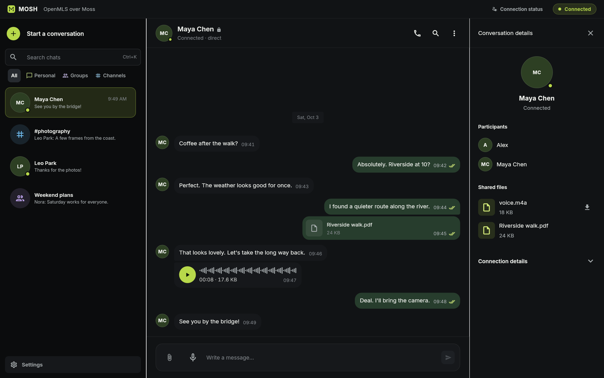
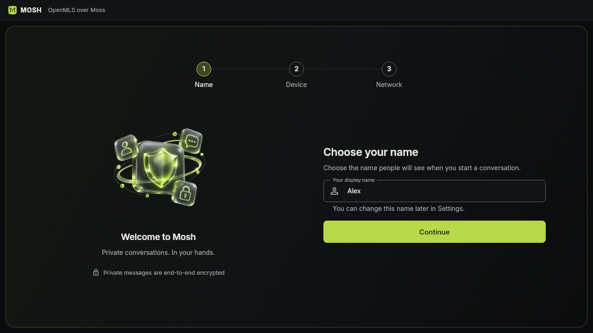

<p align="center">
  
</p>

<h1 align="center">Mosh</h1>

<p align="center">
  Private chats, groups and calls over a peer-to-peer network.<br>
  Built for the desktop. Open source.
</p>

<p align="center">
  <a href="https://github.com/redstone-md/mosh-flutter/releases/latest"></a>
  <a href="LICENSE"></a>
</p>

<p align="center">
  <a href="#download">Download</a> ·
  <a href="#get-started">Get started</a> ·
  <a href="CHANGELOG.md">What's new</a> ·
  <a href="#privacy">Privacy</a>
</p>



<p align="center"><sub>Desktop preview with sample data.</sub></p>

## Download

Open the [latest release](https://github.com/redstone-md/mosh-flutter/releases/latest)
and choose the file for your platform.

| Download | Installation |
| --- | --- |
| [Windows x64 · .exe](https://github.com/redstone-md/mosh-flutter/releases/latest) | Run the installer. |
| [macOS 12+ · .dmg](https://github.com/redstone-md/mosh-flutter/releases/latest) | Drag Mosh to Applications. |

Windows installs without admin access. The macOS build supports Apple Silicon
and Intel.

Windows and macOS packages are available. Android supports linked text chats
while the app is open; Android packages are not published yet.

<details>
<summary>First launch and checksums</summary>

Release files are named `mosh-<version>-setup.exe` and
`Mosh_<version>_universal.dmg`. Each has a matching `.sha256` checksum.

Mosh currently ships without a signature trusted by Windows or macOS. The
macOS app has a self-signed signature and is not notarized. See the
[signing policy](CODE_SIGNING.md).

- Windows SmartScreen: choose **More info**, then **Run anyway**.
- macOS Gatekeeper: try opening the app once, then go to
  **System Settings > Privacy & Security > Open Anyway**.

On Windows, compare this output with the matching `.sha256` file:

```powershell
Get-FileHash .\mosh-*-setup.exe -Algorithm SHA256
```

On macOS, put the DMG and its checksum in the same directory, then run:

```sh
shasum -a 256 -c Mosh_*_universal.dmg.sha256
```

</details>

## Chats, files and calls

Mosh finds other devices automatically through the Moss network. Private
chats and groups use end-to-end encryption. Messages travel without a central
message server.


- Send messages, share files and voice notes, and make one-to-one voice calls.
- Keep personal chats, groups and public channels in one searchable list.
- See participants and shared files beside your chat on a wide window.
- Use English or Russian, with layouts for desktop and smaller screens.

### Add another device

Link a new installation using a trusted device's QR or private link, then
confirm the code. Continue your text chats and recover available history.
Each installation keeps its own keys and encrypted local storage.


[How device linking works](docs/Features/device-linking.md)

## Get started

1. Choose your display name.
2. Select **This is my first device**, or link a device you already use.
   Keep networking automatic unless you need to work around a VPN.
3. Create a private chat and share its invitation. Your contact opens it in
   Mosh to join.

<p align="center">
  
  <br><sub>First-run setup with a sample name.</sub>
</p>

Setup saves your progress. Your name, devices and network preferences remain
available in Settings. Existing installations with conversations or linked
devices skip setup.

[Setup guide](docs/Features/first-run-setup.md) ·
[Private chat guide](docs/Features/private-dm.md)

## Privacy

- Private chats and groups are end-to-end encrypted. Public channels are
  signed, but their messages are not confidential.
- Discovery uses public trackers. Mosh does not provide anonymity, and
  participants can see device associations.
- Message history is encrypted locally. Crash reporting is off by default;
  you can enable it in Privacy settings.

<details>
<summary>How local history keys are stored</summary>

Windows and Linux use the OS credential store for the history key; Android
uses Keystore. On macOS, the key is kept in
a permission-restricted file in the app container. These choices and their
limits are documented in the
[storage and threat model](docs/ADR/0011-secure-storage-and-threat-model.md).

</details>

## Development


The app is Flutter and Riverpod over a Rust core, connected by
`flutter_rust_bridge`. The core owns OpenMLS, Moss transport, persistence and
voice calls.

<details>
<summary>Build from source and repository map</summary>

Use the toolchain versions from [.github/actions/setup](.github/actions/setup/action.yml)
and [rust-toolchain.toml](rust-toolchain.toml). You also need Node.js and the
native build tools for your platform. Start on Windows or macOS:

```sh
git clone --recursive https://github.com/redstone-md/mosh-flutter.git
cd mosh-flutter
node scripts/moss-prepare.mjs
flutter pub get
```

On macOS, prepare the native audio library before the first build:

```sh
brew install autoconf automake libtool
bash scripts/opus-prepare-macos.sh
```

Then run `flutter run -d windows` or `flutter run -d macos` on the matching
platform. Moss is built from the pinned submodule, including both macOS
architectures.

| Location | Responsibility |
| --- | --- |
| `lib/` | Flutter UI, feature state and generated Dart bindings |
| `mosh-core/` | Rust runtime, encryption, transport and local persistence |
| `moss/` | Pinned Go transport submodule |
| `docs/ADR/` | Architecture decisions |
| `test/support/` | Scripted dependencies shared by widget tests and previews |

The [documentation index](docs/README.md) links to feature guides and decisions.
See [AGENTS.md](AGENTS.md) for checks and contribution constraints, and the
[architecture map](docs/Architecture.md) for runtime boundaries.
The [visual asset notes](docs/assets/README.md) explain how to regenerate the
screenshots and record the logo source and illustration prompts.

</details>

---

[GNU GPL v3](LICENSE). Bundled Inter fonts use the
[SIL Open Font License](assets/fonts/Inter-OFL.txt).

[Report a bug](https://github.com/redstone-md/mosh-flutter/issues) ·
[Architecture](docs/Architecture.md)
