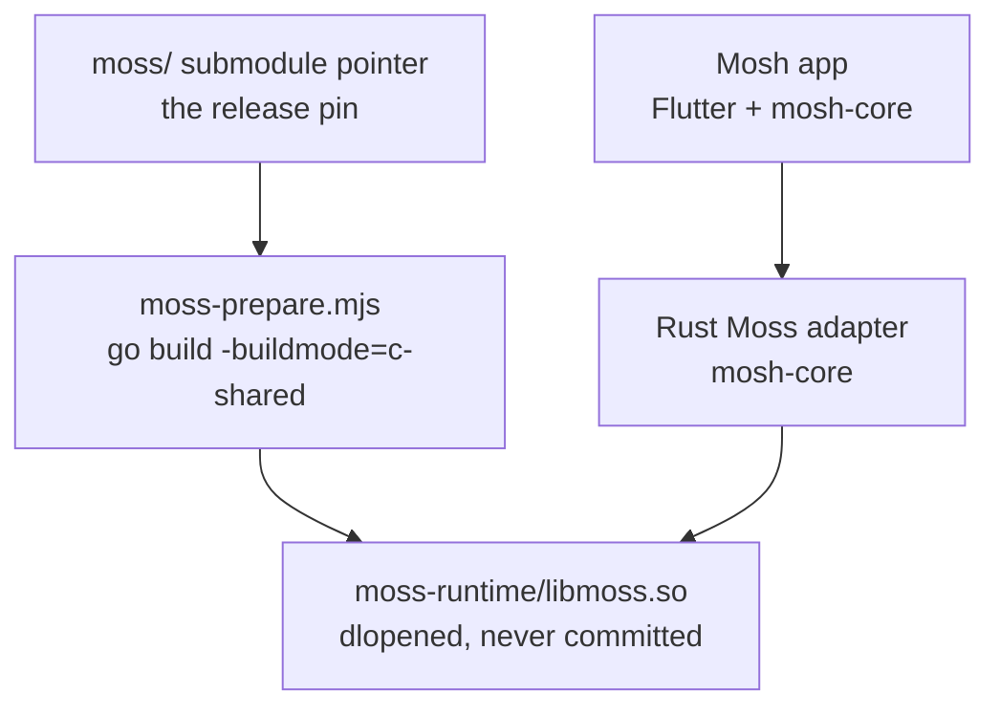

# ADR 0002: Moss dynamic link and release pin

## Status

Accepted

## Context

Mosh consumes the sibling Moss runtime through a native shared library. Development should be fast, while release builds must be reproducible.

## Decision

Dynamically link Moss in v1. CI and release builds use a pinned Moss release version. The pin is the `moss/` submodule's git pointer and nothing else: the version is what the submodule checkout resolves to, and the CI cache keys on the submodule sources (`hashFiles('moss/**')`), so a bump is one gitlink change. The former `moss.config.json` + `moss-update.mjs` flow died with the React app it imported from; both were removed — a second pin that can drift from the submodule is worse than no second pin (it read `v0.8.14` while the submodule sat on `v0.8.19`).

## Build Flow

## Consequences

- Local builds avoid copying Moss source into Mosh.
- Release builds are reproducible by default.
- Native library files are ignored and must not be committed.
- Bumping the pin = moving the submodule to a release tag, then rebuilding
  `moss-runtime/` locally; CI rebuilds only on a cache miss keyed on the
  submodule sources.
