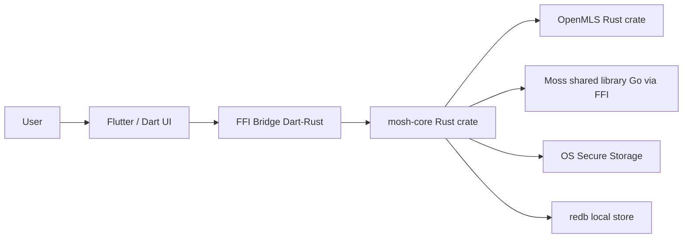

# ADR 0009: Flutter shell replaces Tauri frontend

## Status

Proposed (Flutter fork sandbox)

## Context

Mosh today is a desktop-first Tauri v2 app: React + TypeScript frontend, Rust
desktop shell in `src-tauri/`, Moss Go shared library loaded via FFI, OpenMLS
Rust crate for message-layer E2EE. `AGENTS.md` fixes the platform order as
desktop first, then Android, then iOS.

The native runtime is already Tauri-free. The adapter layer lives in the
`mosh-core` crate ("Tauri-free core adapters"), depended on by the desktop
shell only for command binding. `mosh-core` has zero references to
`tauri`/`webview`/`webkit` and no Tauri types in its public API. Its
dependencies (serde, openmls, redb, keyring, libloading, ed25519-dalek) are
platform-agnostic; only `target.cfg(windows)` carries `windows-sys` for IP
inventory, which is a std-net equivalent.

We want to rewrite the application shell under Flutter, and work on it inside a
fork of `mosh` as a sandbox; if the rewrite proves out, we merge it back into
the upstream product. Flutter lets us ship desktop and mobile from one
codebase, and the mobile UI is already adapted in the React design, so mobile
is no longer a deferred slice.

## Decision

Adopt architecture **A**: Flutter replaces the Tauri + React frontend; the
Rust core (`mosh-core`) is retained and bridged into Dart.

- The fork keeps `mosh-core` as the authoritative native runtime for crypto,
  transport, persistence, and runtimes. It is not rewritten.
- The Flutter app becomes the new application shell. `src-tauri/` is removed
  from the Flutter track (kept on the upstream Tauri branch).
- The React + TypeScript frontend under `src/` is replaced by a Dart + Flutter
  frontend.
- Flutter talks to `mosh-core` through a single FFI bridge (see Q2 decision,
  recorded separately) rather than a sidecar process.
- Desktop (Windows, macOS, Linux) and mobile (Android, iOS) ship from the same
  Flutter codebase. Mobile is no longer a later slice.

## Boundaries

The bridge is the only seam between Dart and Rust. `mosh-core` owns all
secrets, MLS state, persistence, and Moss transport. Flutter owns UI, app
navigation, and ephemeral UI state only.

## Consequences

- The proven Rust crypto/transport layer is reused unchanged, so E2EE and Moss
  integration risk does not have to be re-taken in Dart.
- The Tauri command surface (`src-tauri/src/lib.rs`) is the template for the
  Dart bridge API; each existing Tauri command becomes a bridged function.
- State management rules from `AGENTS.md` (server state vs UI state) carry over
  to Dart under Flutter-equivalent primitives (to be decided in a follow-up
  ADR): no ad-hoc fetching loops, no monolithic store.
- GSAP does not exist in Dart; animation guidance will be re-specified for
  Flutter in a follow-up ADR.
- The fork is a sandbox: upstream Tauri branch keeps living until the merge.
- Existing installers (0.7.4) keep their keychain keys and `mosh://` deep-link
  scheme; the Flutter build must preserve both to allow migration.
- Mobile platform adapters (secure storage on Android Keystore / iOS
  Keychain, notifications, audio capture) must be wired through `mosh-core`
  keyring usage, not reimplemented in Dart.
