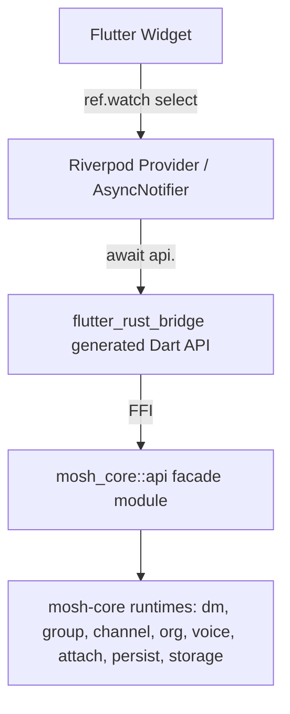

# ADR 0010: flutter_rust_bridge + Riverpod state stack

## Status

Proposed (Flutter fork sandbox)

## Context

ADR 0009 chose architecture A: Flutter shell over the retained
`mosh-core` Rust crate. We need a concrete bridge between Dart and Rust, and a
Flutter state-management stack that preserves the `AGENTS.md` rule of strict
server-state vs UI-state separation (no ad-hoc fetch loops, granular stores
with selectors).

`mosh-core` already exposes its runtimes (private_dm, group, channel, org,
voice, attachment, persistence, secure storage) as plain Rust methods. The
current Tauri shell is a thin RPC facade: each `#[tauri::command]` in
`src-tauri/src/lib.rs` maps to one runtime method, and Tauri `app.emit` is used
to push runtime events to the frontend.

Context7 confirms (High reputation, 1986 snippets for flutter_rust_bridge;
High reputation, Riverpod v3):
- `flutter_rust_bridge` generates typed Dart bindings from Rust signatures,
  supports `crate-type = ["lib","cdylib","staticlib"]` covering desktop,
  Android (`cdylib`) and iOS (`staticlib`), and exposes Rust `StreamSink<T>`
  as a Dart `Stream<T>` (replaces Tauri events).
- Riverpod v3 `AsyncNotifier` models server/async state as
  `AsyncValue<T>` (loading/data/error) — the same semantics as TanStack Query.
  Riverpod docs explicitly say ephemeral widget state must NOT live in
  providers; `flutter_hooks` or `StatefulWidget` is the right home.
- Riverpod `ref.watch(provider.select(...))` gives selector-based reads,
  matching the Zustand selector rule.

## Decision

Adopt `flutter_rust_bridge` as the single Dart-Rust bridge, and Riverpod as
the state layer.

- Bridge. Generate Dart bindings from a new Rust module `mosh_core::api`
  (a thin facade over the existing runtimes). Do not bind the runtimes
  directly; the `api` module is the stable surface and the place where
  platform-specific glue (e.g. secure-storage backend selection) is injected.
  Each current Tauri command maps to one `api` function; each Tauri event
  maps to one `api` function returning `StreamSink<T>`.
- State. Use Riverpod v3:
  - Server / runtime state (sessions, messages, snapshots, diagnostics) lives
    in `AsyncNotifierProvider`s fed by the bridge. UI consumes
    `AsyncValue<T>` with `.when(loading:, error:, data:)`.
  - Ephemeral UI state (open drawer, selected session, composer draft, modal
    visibility) lives in `StatefulWidget` state or `flutter_hooks`, never in
    providers. This is the direct analogue of Zustand-granular-stores vs local
    React state.
  - Reads use `ref.watch(provider.select(...))` so widgets rebuild only on
    the slice they care about.
- Crate types. Set `mosh-core` `Cargo.toml` to
  `[lib] crate-type = ["lib","cdylib","staticlib"]` so one crate serves all
  six targets.
- Animation. GSAP does not exist in Dart. Use Flutter's own animation
  primitives (`AnimationController`, `Tween`, `AnimatedBuilder`) under a
  feature-local helper. Do not pull a GSAP-equivalent third-party animation
  library until a concrete need forces it. (Detail deferred to a follow-up
  ADR if needed.)

## Boundaries

The `api` module is the only Rust surface the bridge sees. Runtimes keep their
current shapes; `api` adapts them to the Dart contract.

## Consequences

- The Tauri command list becomes the verbatim checklist for the `api` module.
  Porting effort is mechanical and reviewable.
- Event flow is preserved: Tauri `app.emit("snapshot", payload)` becomes an
  `api::session_snapshot_events(sink: StreamSink<...>)` Rust function; Dart
  consumes it as `api.sessionSnapshotEvents()` returning a `Stream`.
- No `useEffect+useState` analogue for fetching: Riverpod `AsyncNotifier.build`
  is the single entry point for async state, with `AsyncValue` modeling
  loading/error/data.
- Ephemeral UI state stays out of Riverpod, so navigation history and provider
  lifecycle never accidentally carry widget-local state (per Riverpod docs).
- Crate-type change means desktop builds must link the `cdylib` (already the
  case today via Tauri's dynamic load) and iOS builds link the `staticlib`;
  no runtime behavior change on desktop.
- Generation step is part of `npm run`/flutter build scripts, not manual.
  Drift between Rust signatures and Dart bindings is caught by CI.
## Alternatives considered

- Raw `dart:ffi` by hand: rejected — manual marshalling, no streams, no type
  safety, high drift risk.
- Sidecar Rust process over JSON/IPC: rejected — extra process lifecycle,
  latency, and reimplementation of event streaming that flutter_rust_bridge
  already solves.
- BLoC instead of Riverpod: rejected — more boilerplate, weaker story for
  selector-based rebuilds, no built-in `AsyncValue` analogue.
## Follow-ups

- Decide exact module path for `mosh_core::api` and whether it is feature-gated
  so the desktop-only Tauri shell can keep using direct runtime calls.
- Animation guidance may need its own ADR once a real animation requirement
  appears (e.g. message-list entrance, call overlay).
## References

- Context7: `/fzyzcjy/flutter_rust_bridge` (High reputation, 1986 snippets)
- Context7: `/rrousselgit/riverpod` v3 (High reputation)
## Open questions

- See grilling round 2 in `docs/flutter-fork.grilling.md` once captured.
