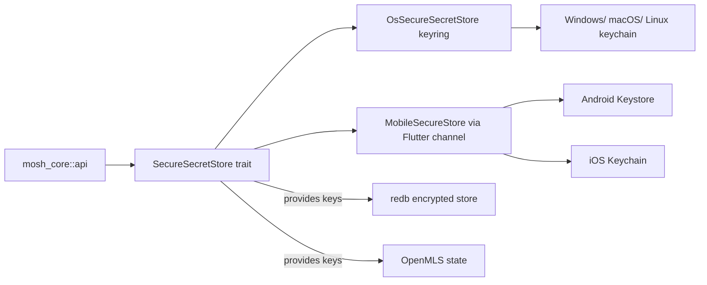
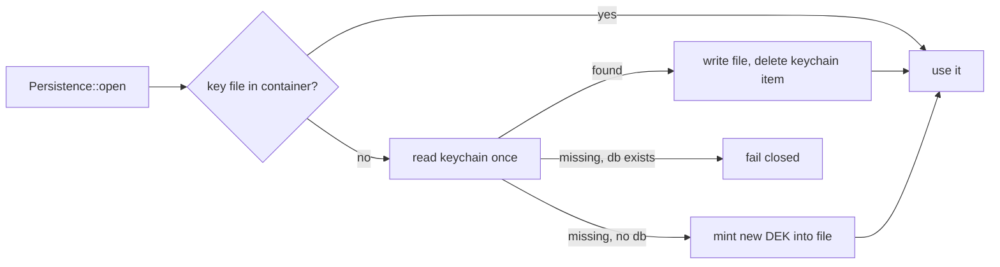

# ADR 0011: Secure storage and threat model

## Status

Proposed (Flutter fork sandbox)

## Context

`AGENTS.md` fixes the rule that private secret material stays in native
secure storage, not browser/disk storage. The current Rust adapter
`mosh-core/src/secure_storage.rs` wraps the `keyring` crate behind a
`SecureSecretStore` trait with a single `OsSecureSecretStore` implementation
using `keyring_core::Entry` under service name `app.mosh.desktop`.

During grilling the user asked why secure storage matters at all, given that
an attacker with physical access can decrypt anything. That intuition is only
true for the weakest option (a plaintext key on disk next to the ciphertext).
Secure storage raises the attack cost and closes the cheapest vectors, but it
is not an absolute wall.

What secure storage actually provides, by platform:

- Mobile (Android Keystore / iOS Secure Enclave-backed Keychain):
  - Key material can be generated and held in a hardware secure element, so
    full filesystem access does not expose the key.
  - Decryption can require biometric / device PIN (user-presence gate).
  - Other apps cannot read mosh secrets through the OS key store.
- Desktop (Windows Credential Manager, macOS Keychain, Linux Secret Service):
  - Software-only store; no hardware root. Protects against other apps and
    against a stolen disk that is not paired with a logged-in session, but a
    logged-in attacker with time can extract secrets.

`mosh-core` already encrypts persistent history at rest (redb, see
`persistence.rs`); the key for that ciphertext must come from secure storage,
not from disk, so that a stolen disk without an unlocked session does not
yield message history.

`keyring 4.0` works on desktop but has weak / absent Android+iOS backends.
We need a mobile path that does not weaken the desktop model.

## Decision

Keep the `SecureSecretStore` trait in `mosh-core` as the single abstraction.
Implement the desktop backend with the existing `keyring`-backed
`OsSecureSecretStore`. For mobile, implement the backend through a
Flutter platform channel that calls Android Keystore / iOS Keychain and
passes secret bytes back into the Rust runtime in-memory; the runtime never
persists raw secrets itself on mobile.

- Secret classification (all stored in secure storage, never in plaintext
  on disk): MLS identity / signature keys, MLS group state keys, the
  redb-at-rest encryption key, org root keys held by an admin.
- redb ciphertext + metadata lives on disk; the redb key lives in secure
  storage. Physical theft of a locked device does not yield history.
- On mobile, user-presence (biometric/PIN) gating is the default for key
  release; the UI must offer it, not silently skip it.
- The bridge exposes secure storage through `mosh_core::api`; the platform
  channel path is hidden behind the same `SecureSecretStore` trait so the
  rest of the runtime is platform-agnostic.

## Boundaries

## Consequences

- Desktop behavior is unchanged from 0.7.4; no migration for existing
  installs.
- Mobile requires a Flutter platform-channel implementation per platform;
  this is one extension point, not a rewrite of crypto or transport.
- User-presence gating on mobile means the first secret access may block on
  biometric/PIN; the UI must handle the prompt and the "locked" state.
- This ADR records the explicit, honest threat-model statement: secure
  storage does not stop a logged-in attacker with physical access and time on
  desktop, and on mobile stops everything below the secure-enclave /
  user-presence boundary. Anything stronger (e.g. passphrase-derived key) is
  a future option, not a v1 requirement.

## Amendment (0.9.6): the macOS DEK moves to a file

Without an Apple Team ID, the macOS keychain ties an item to the exact
build that wrote it (a `cdhash:` partition). Each update is a new build,
so macOS asked for the login password again at every update, twice, and
"Always Allow" never carried over. A self-signed certificate does not
help: only an Apple-issued Team ID gives a stable `teamid:` partition.

So on macOS the history DEK now lives in a 0600 file next to the
database, inside the sandbox container (`file_secret_store.rs`). An
existing install moves its key over once: one last keychain prompt, then
the keychain item is deleted. At rest the key is protected by FileVault,
and on macOS 14+ other apps must ask before they read the container. It
is no longer wrapped by the login password. That is the accepted trade
until Mosh has a Developer ID; with one, the keychain comes back.

## Alternatives considered

- Find a pure-Rust keyring backend for Android/iOS: rejected for v1 —
  immature coverage; platform channels are more reliable.
- Store the redb key in plaintext on disk: rejected — collapses the whole
  at-rest encryption to nothing.
- Passphrase-derived key only (no OS store): rejected for v1 — bad UX on
  mobile, and desktop users expect keychain integration.
## Open questions

- Exact Flutter plugins to use for Keystore/Keychain access (grilling round 2,
  to be rechecked via Context7 before implementation).
## References

- ADR 0003 native secure storage (desktop baseline this builds on)
## Follow-ups

- Add a glossary entry for "secure storage" once the glossary file is created
  in this fork.
