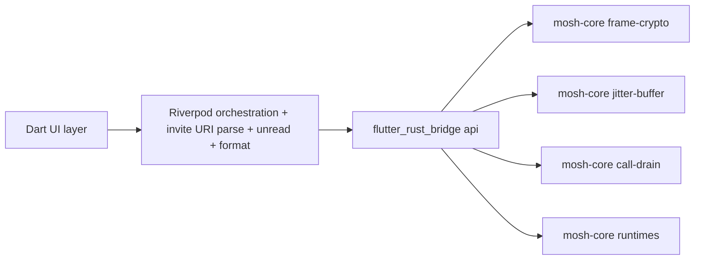

# ADR 0012: Port strategy - what goes to Dart vs mosh-core

## Status

Proposed (Flutter fork sandbox)

## Context

ADR 0009 keeps `mosh-core` as the Rust runtime and replaces the frontend with
Flutter/Dart. The current frontend under `src/features/private-dm/` is not pure
UI: it contains crypto (`frame-crypto.ts`), transport buffers
(`jitter-buffer.ts`, `call-drain.ts`), a call state machine (`call-state.ts`),
URI parsing (`invite-uri.ts`), and UI orchestration hooks. "What must be
rewritten in Flutter" (user's instruction) therefore splits into two
questions: what is rewritten in Dart, and what is moved into `mosh-core` and
dropped from the frontend.

Code inspection of the existing files:
- `frame-crypto.ts` is AES-GCM seal/open over a binary wire frame
  `[seq:u64 BE][ciphertext-with-tag]` with nonce = `[nonce_prefix(4)][seq(8)]`
  and a direction bit in seq. `mosh-core` already depends on `aes-gcm 0.10`,
  so this is a second source of truth for the wire format and belongs in Rust.
- `jitter-buffer.ts` is a pure in-memory reorder buffer over `Uint8Array`/`bigint`
  with no UI. Belongs next to `voice_call_runtime.rs`.
- `call-drain.ts` drains wire frames, decrypts, reorders, feeds playback;
  explicitly "Pure of React/Tauri so it is unit-testable". Transport, not UI.
- `call-state.ts` is a pure phase state machine
  (idle/outgoing/ringing/active/ended) over `CallEvent`. Borderline; treat as
  UI orchestration for now (see Decision).
- `invite-uri.ts` parses the human-facing `mosh://invite?...#fp=...` URI into
  `MoshInvite` / `MoshGroupInvite` with explicit error codes. String/URI
  work for the UI flow. Belongs in Dart.
- `unread.ts`, `format.ts`, `private-dm.content.ts` are UI-facing counts,
  formatting, and display strings. Belong in Dart.

## Decision

Adopt a single boundary rule: Dart owns UI, UI-flow orchestration,
human-readable-string parsing, and display computation. `mosh-core` owns
crypto, binary wire formats, transport buffers, and persistent state.

Move into `mosh-core` (drop from frontend, port to Rust):
- `frame-crypto.ts` -> `mosh-core/src/voice_call_frame_crypto.rs` (AES-GCM
  frame seal/open; reuse the existing `aes-gcm 0.10` dependency).
- `jitter-buffer.ts` -> `mosh-core/src/voice_call_jitter.rs`.
- `call-drain.ts` -> `mosh-core/src/voice_call_drain.rs` (drain loop becomes a
  runtime method, no React/Tauri coupling by design).

Rewrite in Dart (as Flutter widgets and Riverpod providers):
- `invite-uri.ts` -> `lib/.../invite/invite_uri.dart` (1:1 contracts: same
  `MoshInvite`/`MoshGroupInvite` fields, same error codes).
- `invite-detection.ts` -> clipboard-detect via `Clipboard.getData` in a
  Riverpod notifier.
- `unread.ts`, `format.ts`, `private-dm.content.ts` -> Dart UI helpers.
- `use-*-orchestration.ts`, `use-*-snapshots.ts` -> Riverpod `AsyncNotifier`s
  consuming the bridge streams.
- `ringtone.ts` (Web Audio synth) -> Dart audio playback via a platform audio
  plugin; this is UI sound, not transport.

Borderline case, decided explicitly:
- `call-state.ts` (phase state machine) stays in Dart as UI orchestration. It
  has no crypto and no binary I/O; keeping it in Dart lets the call overlay be
  tested as a widget without a Rust round-trip. If it later needs to drive
  runtime transport decisions, it moves to `mosh-core`.

## Boundaries

The Dart side never touches AES-GCM, binary frame layouts, or transport
buffers directly. The bridge is the only crossing.

## Consequences

- The wire format for voice frames has one source of truth (Rust), so a Dart
  bug cannot produce a malformed ciphertext or a wrong nonce.
- `frame-crypto` tests move to `cargo test`; `jitter-buffer` and `call-drain`
  tests move to `cargo test`. Dart widget tests no longer need to cover crypto
  correctness.
- Dart invite-URI tests reuse the same contract types and error codes as the
  TypeScript tests, so behavior is preserved verbatim.
- `call-state` remaining in Dart is an explicit, documented exception: it is
  UI orchestration today and may move to Rust only if it must drive transport.
- This ADR is the exception record under `AGENTS.md` exception_policy for the
  borderline `call-state.ts` placement.
## Alternatives considered

- Rewrite everything in Dart 1:1, including crypto: rejected — re-implements
  AES-GCM frame crypto in a second language and creates a second wire-format
  source of truth, which violates the crypto-hygiene stance.
- Move everything including invite-URI parsing into Rust: rejected — URI
  parsing for a human-facing flow is UI work; putting it in Rust forces a
  round-trip for clipboard handling and weakens the UI test story.
## Follow-ups

- Per-file port checklist to be added to the plan file once the grilling
  concludes.
