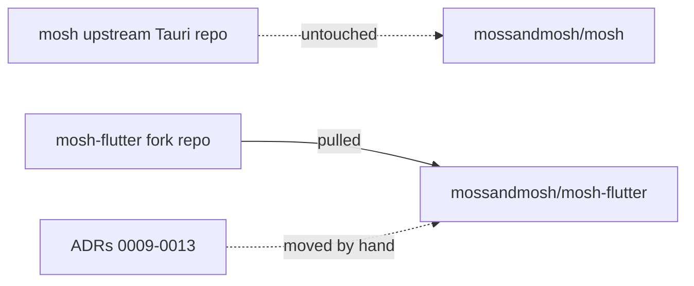
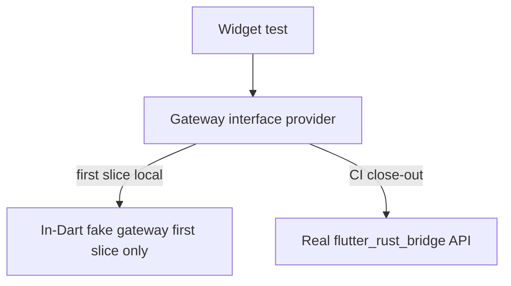

# ADR 0013: Fork topology and temporary fake gateway

## Status

Proposed (Flutter fork sandbox; updated at slice-one close-out — see Final Status below)

## Context

Grilling round 3 settled two mechanical questions.

1. Repository topology. The user wants the fork as a separate Git repository
   pulled locally into a new sibling directory `mossandmosh/mosh-flutter`; the
   upstream Tauri `mosh` keeps living. ADRs produced during grilling are NOT
   committed in the current `mosh` tree; they are carried by hand into the
   fork once it exists.
2. Test strategy. `AGENTS.md` mandates TDD, 80% line / 70% branch coverage, no
   mocks/fakes/stubs, integration tests over real instances. For a Flutter
   widget test this means exercising the real `mosh-core` through the bridge.
   Setting up the Rust bridge inside `flutter test` (no device, no native
   runtime) is itself a non-trivial build task, so a strict no-fake policy on
   the very first vertical slice would block proving the bridge works.

The user explicitly chose to hold the coverage/no-mock bar but accepted a
temporary in-Dart fake gateway for the first slice, with the understanding
that this is an explicit exception, not the steady state.

## Decision

Fork topology:
- Create the fork as a separate Git repository (e.g. under the user's
  account or `redstone-md/mosh-flutter`).
- Pull it locally into `mossandmosh/mosh-flutter`, a sibling of the existing
  `mosh` directory. Do not branch inside `mosh`.
- The existing `mosh` tree and its Tauri branch are untouched and keep
  running upstream.
- ADRs 0009-0013 are moved by hand into `mosh-flutter/docs/ADR/` once the
  fork exists; they are NOT committed in the current `mosh` tree. This ADR
  records that decision so the move is intentional, not lost work.
- Merge back upstream later is done as a clean squash import, not a branch
  merge, because the Flutter-rewrite history (generated bindings, removed
  `src-tauri/`, added `lib/`) is intentionally noisy.

Temporary fake gateway (first vertical slice only):
- The first Flutter slice may use an in-Dart fake that implements the
  `mosh_core::api` surface (the same Rust signatures the bridge will bind),
  so widget tests can run without the Rust runtime.
- The fake is gated behind an interface and a single provider, so swapping it
  for the real `flutter_rust_bridge`-generated API is one provider change,
  not a sweep.
- The fake ships only behind an explicit `--fake-gateway` / debug flag in
  the first slice; it is removed before the slice is declared complete OR
  kept behind the flag with an ADR-extended exception, never as a silent
  default.
- Real Rust-backed integration tests are still required before the slice
  closes; they run via `flutter test` + the actual bridge in a CI step, not
  in the developer's first local widget-test loop.

## Boundaries

## Consequences

- The current `mosh` tree stays clean: no Flutter artifacts, no ADR commits.
- All grilling artifacts (ADRs 0009-0013, glossary) survive the hand-move
  into the fork; this ADR is the receipt.
- The fake gateway is a documented exception under `AGENTS.md`
  exception_policy, scoped to the first slice only, with a removal gate.
- The no-mock / 80% coverage bar still applies to the real Rust-backed path;
  the fake is a developer-loop accelerator, not a replacement for real
  integration tests at slice close-out.
## Alternatives considered

- Branch inside `mosh` instead of a separate repo: rejected by the user;
   noisy rewrite history would pollute the upstream `main` branch.
- Strict no-fake policy from slice one: rejected by the user as
   "neuroslop"-inducing friction that blocks proving the bridge; the fake is
   the compromise that keeps the eventual bar intact.
- Keeping the fake as a silent permanent default: rejected; it is gated and
   time-boxed to the first slice.
## Open questions

- Exact Git remote / repo name for the fork (to be confirmed when creating it).
## Follow-ups

- Before creating the fork: confirm Git remote URL with the user.
- Plan file must list the fake-gateway removal as an explicit done-criteria
  step for slice one.
## Final Status (Slice One Close-Out)

The fake gateway was NOT removed. It is now an explicit opt-in behind the
compile-time flag `-dMOSH_FAKE_GATEWAY=true` (dart-define). Default `false`
selects `RealBridgeGateway` (the real Rust runtime); only the flag selects
`FakeGateway`. This is the ADR's "kept behind the flag with an ADR-extended
exception" path, not the "removed" path, and it is recorded here so the
exception is explicit rather than silent.

The swap is contained to one provider body
(`lib/src/state/gateway_provider.dart`): widgets depend on `gatewayProvider`,
never a concrete `Gateway` impl. The flag rationale:

- Default (no flag, CI `integration-test` job): `RealBridgeGateway` against
  the real `mosh_core.dll` built by cargokit. This is the wired runtime.
- `-dMOSH_FAKE_GATEWAY=true` (CI `flutter-test` job, local widget-test loop):
  `FakeGateway`, so tests run without a built cdylib (`flutter test` has no
  native runtime). Widget tests also override `gatewayProvider` with
  `FakeGateway()` in their `ProviderScope`; the flag is belt-and-suspenders.

The integration test (`integration_test/slice_one_test.dart`) proves the Real
path works end-to-end on a real `mosh_core.dll`: it initializes the bridge,
calls `appDiagnostics`, `nativeRuntimeStatus`, `listSessions`, and
`createInvite` through `RealBridgeGateway`, and degrades gracefully when Moss
is absent (error string, not a crash). This closes the ADR's open question
about fake removal: the real path is proven, and the fake remains a
deliberately-gated developer-loop accelerator, not a default.

Open question resolved: the fork remote exists at
`redstone-md/mosh-flutter` (confirmed during S0). The other open question
(fake removal) is resolved above as "kept behind the flag."

## Removal of the fake gateway

The flag is gone and so is the fake. `lib/src/gateway/fake_gateway.dart` and
its snapshot fixtures no longer exist; `gatewayProvider` always builds
`RealBridgeGateway`, and the `MOSH_FAKE_GATEWAY` dart-define has been dropped
from the provider, from CI, and from AGENTS.md.

Tests get their double from `test/support/scriptable_gateway.dart`
(`ScriptableGateway`), which never ships in the app. It is one configurable
adapter for the whole suite: it records every call, seeds the data a screen
should render, and scripts a call to fail or to hang so a pending state can be
observed. Tests configure it; they do not subclass it. This closes the ADR's
original removal gate on the "removed" path rather than the "kept behind the
flag" path recorded in Final Status above.

### Size exception

`test/support/scriptable_gateway.dart` is ~900 lines. That is one flat
implementation of the 57-method `Gateway` interface plus the recording,
seeding, and scripting helpers: the length comes from the interface width, not
from nesting or branching. Scope: test code only, never shipped. It shrinks on
its own once the Gateway takes the conversation target as a parameter (issue
03), which folds 25 methods into 8. Splitting it before then would buy nothing
but indirection.
