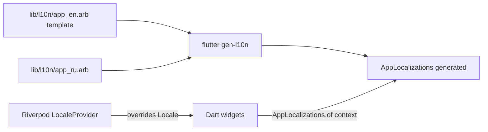

# ADR 0014: i18n ru/en from slice one

## Status

Proposed (Flutter fork sandbox)

## Context

The user requires internationalization (ru/en) to be built in from the start,
not bolted on later. i18n added late is expensive (string hunt across a
finished app); added early it is nearly free.

The current mosh frontend already keeps all UI strings in one place:
`src/features/private-dm/private-dm.content.ts` is a single `as const` object
with ~130 string entries grouped into 8 sections (`shellText`, `setupText`,
`inviteText`, `chatText`, and more). It is a quasi-i18n layer that is
monolingual (English). There is no other `*content*.ts` file in the tree, so
the string inventory for slice one is fully known.

Context7 confirms the standard Flutter i18n path: `flutter_localizations`
+ `intl` packages, `flutter: generate: true` in pubspec, an `l10n.yaml`
pointing at ARB files, `gen-l10n` producing `AppLocalizations`, and
`MaterialApp.localizationsDelegates` + `supportedLocales`. This is the
framework-blessed approach, not a third-party convention.

## Decision

Adopt Flutter `gen-l10n` with ARB files. Seed with `ru` and `en`; English is
the template locale.

- `pubspec.yaml` adds `flutter_localizations` (sdk) and `intl`, and sets
  `flutter: generate: true`.
- `l10n.yaml`:
  `arb-dir: lib/l10n`, `template-arb-file: app_en.arb`,
  `output-localization-file: app_localizations.dart`.
- Two ARB files from slice one: `lib/l10n/app_en.arb` (template) and
  `lib/l10n/app_ru.arb`.
- String keys are derived from the existing `private-dm.content.ts` sections
  and entry names, so the port is mechanical: `shellText.productName` becomes
  `AppLocalizations.of(context).shellProductName` (or a namespaced key like
  `shell_productName`). The 8 sections and ~130 entries map 1:1.
- `MaterialApp` sets `localizationsDelegates` (incl.
  `AppLocalizations.localizationsDelegates`) and `supportedLocales:
  [Locale('en'), Locale('ru')]`.
- Locale resolution follows the device by default; a manual language switch
  is a later UI nicety, not a slice-one requirement, but the provider
  plumbing (a Riverpod `LocaleProvider`) is laid now so adding the switch is
  one widget later.
- No string literals in Dart widget code: all user-facing text goes through
  `AppLocalizations`. This mirrors `AGENTS.md`'s "string literals forbidden in
  implementation code; declare once as named constants".

## Boundaries

## Consequences

- Slice one ships with two locales; adding a third locale later is a new ARB
  file plus one `supportedLocales` entry, nothing else.
- The existing English strings from `private-dm.content.ts` are the
  verbatim source for `app_en.arb`; Russian translation is a one-pass job
  over ~130 keys.
- Locale resolution is automatic; a manual switch is deferred but the
  `LocaleProvider` seam is already there.
- Generated `AppLocalizations` is checked in or generated in CI (to be
  decided in the build/CI step); either way drift is caught by `gen-l10n`.
- This ADR records the explicit choice to NOT use a third-party i18n package
  (e.g. easy_localization): the framework `gen-l10n` path is sufficient for
  two locales and keeps the dependency surface minimal.
## Alternatives considered

- Third-party i18n package (e.g. easy_localization): rejected for two locales;
  adds a dependency for nothing `gen-l10n` does not already do.
- English-only until "later": rejected by the user; late i18n is the
  expensive failure mode this ADR exists to prevent.
## Open questions

- Whether `AppLocalizations` is committed or generated in CI (settled in the
  build/CI step of the plan file).
## Follow-ups

- Plan file must list "translate ~130 keys to ru" as an explicit slice-one
  step, not a stretch goal.
