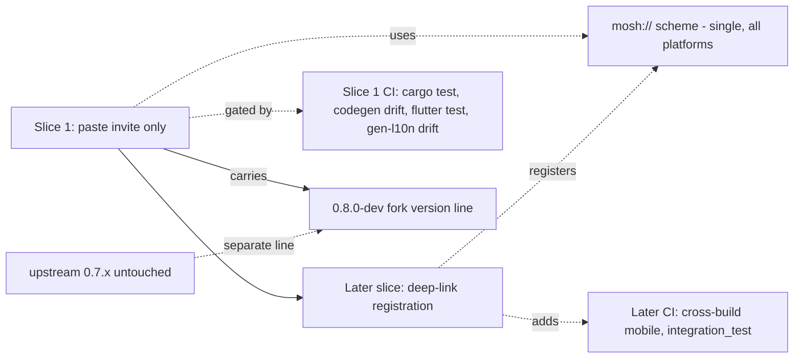

# ADR 0015: Deep-link phasing, scheme, minimal CI, version line

## Status

Accepted (slice two complete)

## Slice two outcome

Slice two (deep-link `mosh://` desktop) shipped and is closed:

- **Route shell:** `go_router` with `/`, `/join`, `/diagnostics`,
  `/dm/:id`; `MoshApp` is `MaterialApp.router`. The slice-one screens are
  now reachable (commit 5be0817).
- **Windows registration:** the `mosh://` scheme is registered under
  `HKCU\Software\Classes\mosh` via the `win32_registry` 3.0.3 Dart package
  (`lib/src/deeplink/mosh_url_scheme_windows.dart`): `URL Protocol` +
  `shell\open\command = "<resolvedExecutable>" "%1"`. HKCU needs no admin
  elevation for a dev build; idempotent; never throws (commit 9d30796).
- **Intake:** `windows/runner/main.cpp` calls `SendAppLinkToInstance()`
  (app_links 7.2.1 Windows C API) at the top of `wWinMain` so a second
  instance forwards the URI to the already-running one. Dart
  `lib/src/deeplink/mosh_deep_link.dart` subscribes
  `AppLinks().uriLinkStream`, gates scheme `== 'mosh'`, and navigates
  `appRouter.go('/join', extra: <uri>)`; a cold-start link is replayed on
  first frame (commit 4af9a27).
- **Single scheme** `mosh://` everywhere; no per-fork variant.
- **Mobile deferred:** Android `intent-filter` and iOS
  `CFBundleURLSchemes` remain a later slice (the mobile Moss cross-build
  + secure-storage platform channels slice). The Dart intake seam
  (`uriLinkStream`) is platform-agnostic, so mobile only needs the OS
  registration, not a new intake.

Tests: 48 Dart (was 42), `cargo test` 215/0/5-ignored (serial), `flutter
analyze` clean.

## Context

Grilling round 4 settled four mechanical questions:
1. Deep-link `mosh://` association is NOT in slice one; manual paste of the
   invite URI is. But deep-link must not be forgotten (user: "ne zabudem pro
   deeplink").
2. The `mosh://` scheme stays single and identical across all platforms
   (user confirmed Q15). No `mosh-flutter://` during the fork.
3. CI starts minimal and grows by platform (user confirmed Q16).
4. Version line for the fork is `0.8.0-dev` (user confirmed Q17), separate
   from upstream `0.7.x`, so the post-Tauri line is visible and the upstream
   merge later is a minor bump.

The current Tauri app registers `mosh://` via OS associations and parses the
URI from launch args/events. In Flutter this maps to `app_links` (mobile) +
desktop launch-arg handling in `main()`, but registration differs per
platform (Android intent-filter, iOS `CFBundleURLSchemes`, Linux `.desktop`,
Windows registry).

## Decision

Deep-link phasing:
- Slice one supports only manual paste of the invite URI into the "Join via
  invite" field. This matches the existing Tauri fallback path and is enough
  to prove the bridge and the invite-flow UI.
- Deep-link association (`mosh://` opens the app and pre-fills the invite
  field) is planned as an explicit later slice, not silently dropped. This
  ADR is the reminder.

Scheme:
- Single scheme `mosh://` everywhere. Android: `intent-filter` with
  `android:scheme="mosh"`. iOS: `CFBundleURLSchemes` = `["mosh"]`. Desktop:
  OS association + launch-arg parsing. No per-fork scheme variant.
- Bundle/application id is `app.mosh` on mobile (Q12) and `app.mosh.desktop`
  service name on desktop (ADR 0009). The scheme `mosh://` is owned by this
  bundle id, so there is no collision with any prior mobile release (none
  exists).

Minimal CI (slice one):
- Build `mosh-core` (desktop targets only for slice one) and run `cargo test`.
- Run `flutter_rust_bridge_codegen` to regenerate bindings; CI fails if the
  committed bindings drift from the Rust signatures.
- Run `flutter test` (unit + widget). With the slice-one fake gateway (ADR
  0013), widget tests run without the Rust runtime; a separate CI job runs
  the real-bridge integration tests at slice close-out.
- Run `flutter gen-l10n` and fail if ARB/generated `AppLocalizations` drift.
- Cross-compilation for Android/iOS and `flutter integration_test` are NOT in
  slice-one CI; they are added when those platforms are approached, each as
  an explicit step.

Version line:
- `mosh-flutter` starts at `0.8.0-dev`. `mosh-core` in the fork tracks the
  same version. Upstream `mosh` stays on its `0.7.x` line.
- The Moss release pin (`moss.config.json`) is inherited unchanged from the
  upstream pin at fork time; bumping the pin is a deliberate later step.

## Boundaries

## Consequences

- Slice one stays focused on bridge + UI + i18n; deep-link is a planned,
  visible later slice, not lost work.
- One scheme `mosh://` means no future migration of invite URIs; existing
  invite URIs keep working across the upstream/fork boundary.
- Minimal CI catches the highest-drift risks (bindings, l10n, tests) from
  day one without the cost of cross-compiling for platforms that slice one
  does not target.
- `0.8.0-dev` makes the post-Tauri line unambiguous in version strings and
  diagnostics; when the fork merges upstream, upstream takes it as a minor.
- Moss pin inheritance means slice one does NOT silently advance the Moss
  release; any bump is deliberate and recorded.
## Alternatives considered

- Deep-link in slice one: rejected by the grilling recommendation; platform
  registration across 6 targets is its own slice and not needed to prove the
  bridge.
- Per-fork `mosh-flutter://` scheme: rejected by the user; would force an
  invite-URI migration later.
- Full CI from commit one: rejected by the user; mobile cross-build and
  integration tests belong with the platforms that need them.
- Resetting version to `0.0.1` in the fork: rejected; loses the continuity
  with `mosh-core` 0.7.x and confuses diagnostics.
## Open questions

- None blocking for slice one.
## Follow-ups

- Plan file must include "deep-link association" as an explicit future-slice
  item, not a buried note.
- Plan file must include the slice-one CI matrix as the ordered final
  validation step.
## References

- ADR 0009 (scheme + bundle id preservation)
- ADR 0013 (fake gateway for slice one tests)
- ADR 0014 (i18n, shares the gen-l10n CI drift check)

## Update 2026-09-02: CI consolidated, release workflow added

- Toolchains, caches and the moss build moved into `.github/actions/setup`;
  every job pins the same Go, Rust and Flutter versions from one place.
- `gen-l10n` runs inside the `flutter-test` job instead of a job of its own.
- The Windows installer is built by the reusable `build-windows.yml`, called
  both by CI on main and by `release.yml`, which a pushed `v*` tag triggers:
  it verifies the tag against `pubspec.yaml` and `CHANGELOG.md`, then publishes
  the installer, its SHA-256 and notes from `scripts/release-notes.sh`.
- Release builds of `mosh-core` use fat LTO, one codegen unit and stripped
  symbols; moss is built with `-trimpath -ldflags="-s -w"`.
