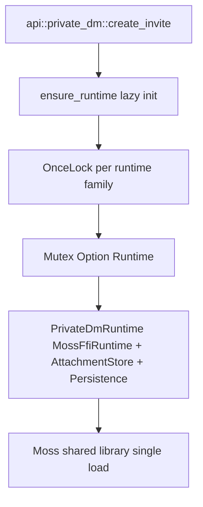

# ADR 0016: api runtime ownership via OnceLock singleton

## Status

Accepted

## Context

S1.3 (api::diagnostics) revealed that the api facade has no Tauri state.
For one-shot diagnostics that was easy: build an honest not-available status.
But the heavier runtimes (PrivateDmRuntime, ChannelRuntime, OrgRuntime,
VoiceCallRuntime) are different: they hold a live MossFfiRuntime (the loaded
Moss shared library), an AttachmentStore, and optionally a Persistence
instance. Creating one per api call would start Moss again on every call,
waste the FFI load, and break Moss peer-id identity persistence across
restarts.

In the upstream Tauri shell the runtimes live in `tauri::manage(PrivateDmState)`
as `Mutex<Option<PrivateDmRuntime>>`, initialized once in `setup()` and shared
across all commands. The api facade has no Tauri, so it needs the Tauri-free
equivalent of "one runtime per process, shared across api calls".

ADR 0010 mandates that "each api function maps 1:1 to a former Tauri
command". Tauri commands take no runtime handle parameter (the state is
injected via `tauri::State`). Any api design that adds a handle parameter to
every function would break the 1:1 mapping and force Dart-side handle
plumbing that the React frontend never had.

## Decision

Use a process-global `OnceLock<Mutex<Option<Runtime>>>` per runtime family,
owned inside the `api` module. Each `api::private_dm::*` (and later
`api::channel::*`, `api::org::*`, `api::voice_call::*`) calls a private
`ensure_runtime()` helper that initializes the singleton on first use and
returns a `MutexGuard` or a clear "runtime not started" error.

- Initialization is lazy and happens once per process, on the first api
  call that needs the runtime. This mirrors the Tauri shell's `setup()`
  behavior, just deferred to first use because there is no app bootstrap
  hook in the bridge contract.
- Moss node identity persists because the singleton holds the one
  `MossFfiRuntime` and the `SharedMossNode` it builds; rehydration runs once
  during initialization, not per call.
- All public api signatures stay parameter-light: `pub fn create_invite(req)
  -> Result<InviteCreated, String>` with no handle, exactly mirroring the
  Tauri command shape (ADR 0010 1:1 rule).
- The "runtime not started" error path is honest: if a caller invokes a
  private_dm function before the runtime could initialize (e.g. Moss lib
  missing), the api returns a `Err(String)` describing the failure, which
  the bridge surfaces to Dart as an exception.

## Boundaries

The OnceLock is the only owner of the runtime; the bridge never holds a
runtime handle. Initialization is idempotent under the OnceLock.

## Consequences

- Process-global state: acceptable for mosh, which is a single-process
  desktop/mobile app where "one runtime per process" is true, not a
  shortcut. This matches the Tauri shell's single-managed-state model.
- Tests that exercise api functions either run in one process (sharing the
  singleton, which is fine for read-only diagnostics) or use the runtime's
  own constructors directly for isolated unit tests (the api singleton is
  for the bridge path, not the only way to construct runtimes).
- A future "multi-account" or "background isolate" requirement would
  require revisiting this ADR; it is out of scope for slice one.
- `flutter_rust_bridge` runs api calls on a background isolate by default;
  the OnceLock + Mutex serializes access, which is correct because the
  underlying runtimes are not concurrency-safe (they were not in Tauri
  either - the Mutex existed there for the same reason).

## Alternatives considered

- Handle parameter on every api function: rejected - breaks the ADR 0010
  1:1 mapping with Tauri commands and forces Dart-side handle plumbing.
- Explicit start/stop returning a handle: rejected - same reason, and adds
  a lifecycle the React frontend never had to manage.
- Re-create runtime per call: rejected - reloads Moss shared lib every
  call and destroys Moss peer-id identity persistence.
## Follow-ups

- S1.4 implements `api::private_dm` with this model; `ensure_runtime` lives
  in api::private_dm.
- When S1.5 stubs channel/group/org, they reuse the same pattern with their
  own OnceLock per family, sharing the underlying MossFfiRuntime via the
  existing SharedMossNode mechanism.
