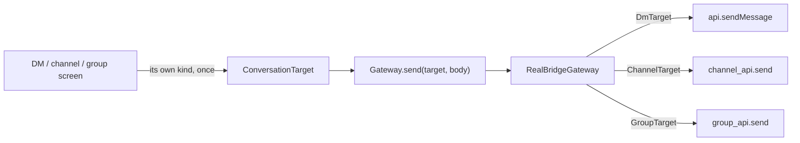
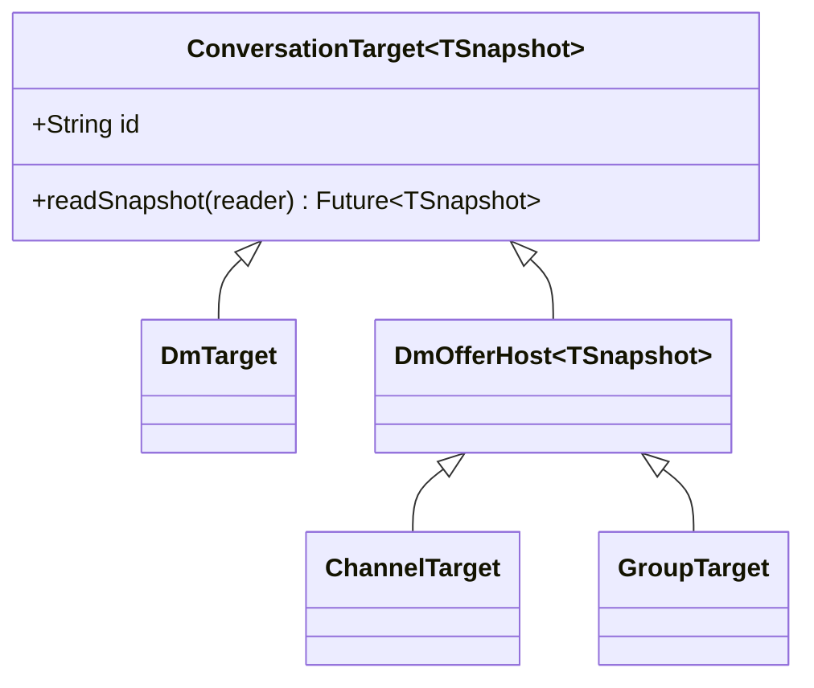

# ADR 0017: the Dart Gateway takes the conversation target

## Status

Accepted. Amends ADR 0010 for the Dart side only.

## Context

ADR 0010 says: "Each current Tauri command maps to one `api` function." That
rule is about the Rust `api` module and the generated frb bindings, and it
still holds.

The Dart `Gateway` had been read as if the same rule applied to it, so it
mirrored the frb functions one for one. Because the Rust side names its
functions per conversation kind (`private_dm_send_message`, `channel_send`,
`private_group_send`), the DM / channel / group split leaked all the way up
to the widgets. 23 of the Gateway's 57 methods were the same eight actions
written three times, and a helper file existed only to pick between them.
Every screen had to know its kind before it could send a message.

The Gateway is not the bridge. It is a Dart seam above it (ADR 0013), and
nothing forces it to keep the frb shape.

## Decision

The Gateway takes the conversation as a parameter. One method per action:

`poll`, `send`, `retry`, `sendAttachment`, `downloadAttachment`,
`cancelAttachment`, `dismissDmOffer`, `leave`.

Each takes a `ConversationTarget` — `DmTarget`, `ChannelTarget` or
`GroupTarget` — and each implementation switches on it once, inside itself.
The frb facade stays 1:1 with `mosh_core::api`; only the seam above it
changes.

Three details make the narrower surface safe:

- `poll` stays typed. `ConversationTarget<TSnapshot>` names the snapshot type
  each kind reads back, and the target picks its own read on a
  `ConversationSnapshotReader` the adapter provides. So `poll(DmTarget(id))`
  still returns a `SessionSnapshot`, with no casts.
- `dismissDmOffer` takes a `DmOfferHost`, the sealed half of the union that
  channels and groups share. A DM has no offer list and cannot reach the call.
- `send`, `retry` and `leave` return nothing. No caller read their results;
  delivery status comes from the next `poll`.

## Consequences

- The Gateway is 42 methods, down from 57. `chat_actions.dart` (206 lines of
  pure dispatch) is deleted, and `sameChatTarget` is plain `==`.
- A new conversation action is written once, not three times. A fourth
  conversation kind adds one target class, not eight methods.
- The frb facade and the Rust `api` module are untouched. ADR 0010's 1:1 rule
  is unchanged for them.
- The three snapshot types are still distinct; folding them into one
  `ConversationSnapshot` view is the next step (issue 04) and does not need
  another seam change.
- The kind now lives in a value, so a wrong-kind call is a compile error
  rather than a wrong method name.

## Alternatives considered

- Keep the 1:1 mirror and leave the dispatch in `chat_actions.dart`: rejected.
  The dispatch is real code that has to stay in sync with three method
  families, and every caller still had to hold a kind.
- One `poll` returning a union snapshot now: rejected for this step. It
  rewrites every screen's read path, which is issue 04's job, and the seam
  change does not need it.
- A generic `poll` with a cast in the adapter: rejected. The double dispatch
  costs about fifteen lines and keeps the seam free of unchecked casts.
