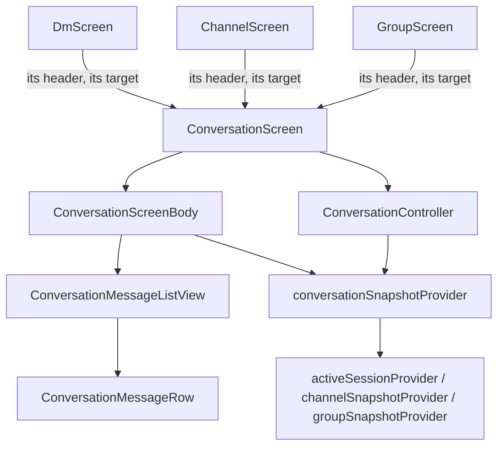
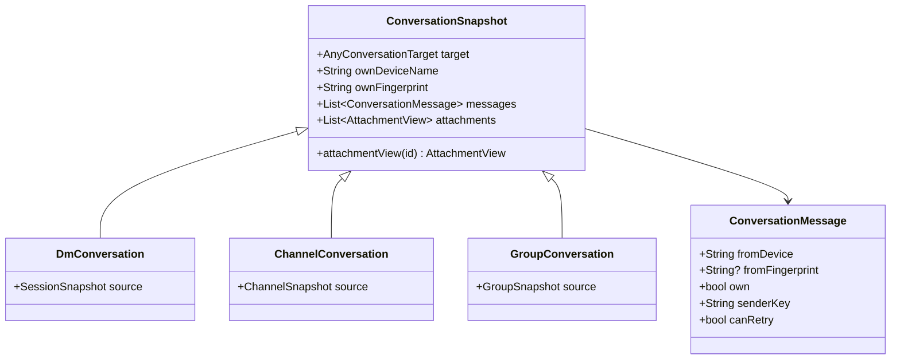

# ADR 0018: one Conversation module for the DM, the channel and the group

## Status

Accepted. Follows ADR 0017, which made the Gateway take the conversation
target.

## Context

ADR 0017 removed the kind from the Gateway, but the UI above it was still
written three times. A DM, a channel and an org group each had their own
controller, screen body, message row and message list view, and the
controllers were 84% the same lines, the bodies 93%, the rows 85%. Every
change to how a conversation behaves — a delivery-status tweak, an attachment
edge case, a rule about when the composer clears — had to be made in three
files and three test suites, and drifted whenever one copy was missed.

The three parts really are one conversation. What differs is small and
nameable:

- a DM shows a crypto footer, can carry a call, and shows delivery ticks;
- a channel says its messages are public and hides the MLS badge;
- a group says its messages are encrypted, can warn that a rejoin is needed,
  and can offer an org admin the members who are missing from it.

## Decision

One Conversation module, driven by the target. It lives in
`lib/src/features/conversation/`.

Each kind supplies its app bar and nothing else. `DmScreen` also keeps the
fingerprints the user has confirmed in person, which no other kind has.

The three generated snapshots map into one view. It is sealed, so each kind
keeps its own source snapshot for the surfaces that genuinely need it — the
peer-status drawer, the group's rejoin flag, the leave dialog's label — and
nothing needs a cast.

Two details make the merge behave:

- `own` is worked out while mapping. A DM compares device names; a channel
  and a group compare fingerprints, because two members can share a display
  name but never a fingerprint.
- `conversationSnapshotProvider` does not poll. It watches the kind provider
  the app already has and maps the result, so there is still one poll per
  conversation and `ref.invalidate(channelSnapshotProvider(name))` and its
  siblings keep working. The sessions list, the headers and the drawer read
  those providers unchanged.

## Consequences

- `channel_controller.dart`, `group_controller.dart`, `dm_screen_actions.dart`,
  the three screen bodies, the three message rows, the three message list
  views and `group_attachment_open.dart` are deleted. The three screens are
  now 70 to 95 lines each and hold no conversation logic.
- Conversation behaviour is tested once and run over all three targets, from
  `test/support/conversation_cases.dart`. Six tripled suites are gone.
- A fourth conversation kind needs a target, a header and a mapper.
- The kind still decides three small things in the shared row and body: the
  fingerprint chip, the MLS badge and the delivery ticks. Those are `switch`
  arms on `ConversationKind`, not separate widgets.
- The Rust side and the frb facade are untouched.

## Alternatives considered

- Keep the three implementations and only share helpers: rejected. That is
  what the code already did, and the copies still drifted.
- One snapshot class with every kind's fields nullable: rejected. Every
  reader would have to know which fields its kind fills, and nothing would
  stop it reading a field that is always null.
- Have `conversationSnapshotProvider` poll the Gateway itself: rejected. It
  would double the polling and split invalidation between two providers.
