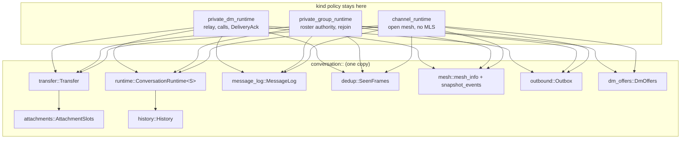
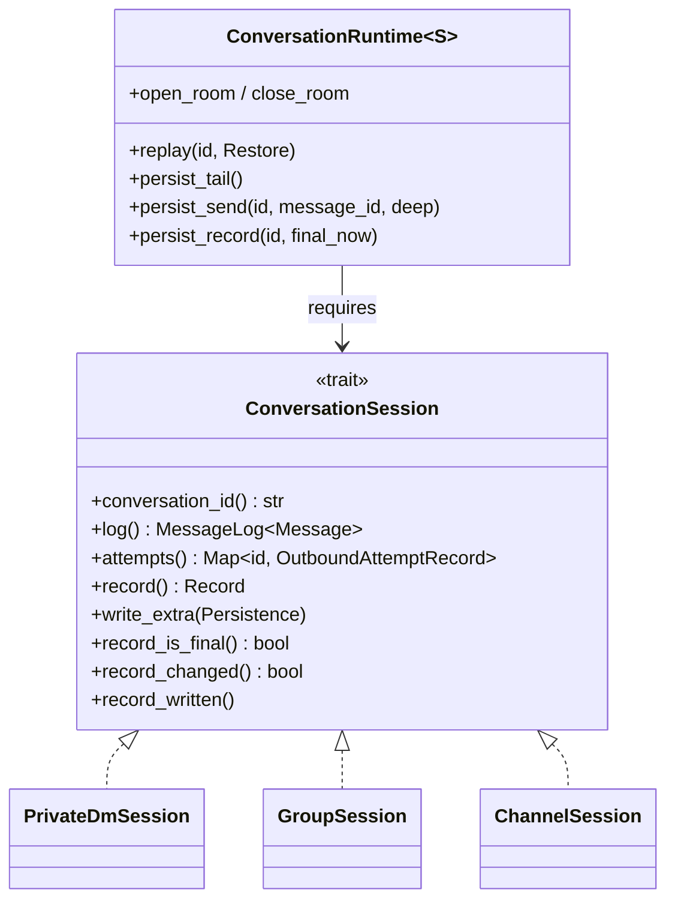
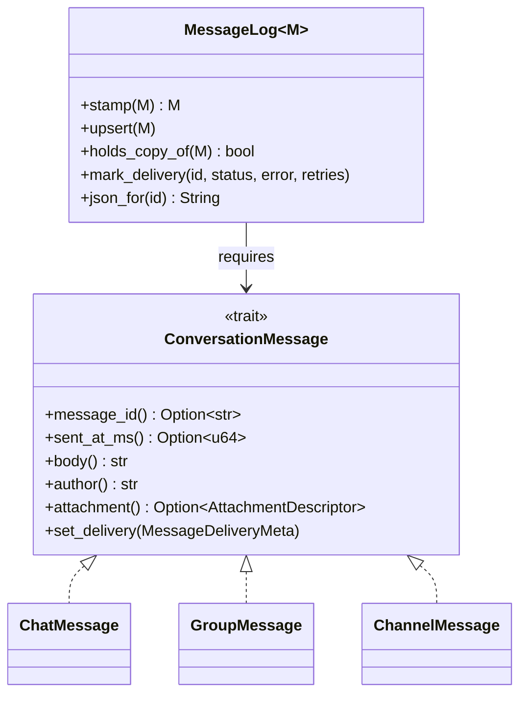

# ADR 0019: shared conversation strata in mosh-core

## Status

Accepted. Follows ADR 0018, which folded the Dart side of the same three
conversations into one module.

## Context

ADR 0018 fixed the UI, but the triplication starts below it. `mosh-core` holds
three runtimes — `private_dm_runtime`, `private_group_runtime`,
`channel_runtime` — and they pour the same layers three times: the attachment
slot table, the message log, the seen-frame ring, the outbound send path, the
history store, the snapshot view.

Test coverage is where that hurts. The DM runtime has by far the most tests;
the group and channel runtimes have a fraction of it for near-identical code.
A delivery-status fix proven in the DM was unproven in the other two, and a
copy that was missed drifted quietly.

The three are not the same everywhere, and the differences are real:

- a DM is two devices, routes through a relay when it cannot go direct, and
  carries calls;
- an org group derives who may commit from a signed roster and can need a
  rejoin;
- a public channel has no MLS layer at all and an open membership.

## Decision

Move each shared layer into `mosh-core/src/conversation/`, one at a time, and
leave the kind holding only its own policy. A runtime holds the shared piece
as a field instead of keeping a copy of its code.

Where a kind genuinely differs, the difference becomes an explicit choice —
a trait method or a step passed in — rather than a fourth near-copy.

The last step turns the leftovers into one runtime behind a kind trait. Each
kind's runtime is now the same shell, `runtime::ConversationRuntime<S>`, with
its own session type inside it. The shell holds the table of conversations, the
room each opens on the shared node, and the two persist loops. The kind answers
what only it can, through `runtime::ConversationSession`.

The one message difference worth naming: `ConversationMessage::author` is the
sender's fingerprint in a channel or a group, and the sender's device name in
a DM, because a DM message has no fingerprint field and only ever has two
participants.

Each stratum lands on its own: the suite is green, `clippy -D warnings` is
clean, no wire format changes and no `api::` signature changes. Only the last
step touches the bridge, and it regenerates the frb bindings — not because a
signature moved, but because the shapes those signatures carry now live in
`conversation::` and generate into `lib/src/rust/conversation/`.

## Consequences

Good:

- One place to fix a bug, and the fix holds for all three kinds.
- The shared code has its own tests, which the copied code never had.
- The differences between kinds are now written down instead of implied.

Costs:

- A runtime now reaches through a small type instead of touching a `Vec` and a
  `HashMap` directly. That is a real indirection, paid for by not writing the
  same twenty lines three times.
- A send now runs in three calls — `open` or `reopen`, publish, `settle` —
  because the runtime persists between them and the transport sits in the
  middle. A single call taking the publish step as a closure would have to hold
  the log and the attempt table borrowed across it, which the persist calls
  rule out.
- The kind trait sits on the session, not on the kind as a whole. A trait that
  also owned the publish would need a method per envelope — twenty-odd of them,
  nearly all with one implementor — and the DM's relay routing, the group's
  roster authority and the channel's open mesh would have to be squeezed
  through it. The four questions the shell genuinely has to ask are cheaper and
  say more.
- The Dart side names three more generated modules. The shapes an app touches —
  `AttachmentView`, `MeshInfo`, `DmOffer` — used to come from the DM's
  contracts file and now come from `lib/src/rust/conversation/`. That is the
  cost of shared code no longer depending on one kind.

Behaviour changes, all deliberate, all from picking one rule where the three
copies had drifted apart:

- Restoring an attachment after a restart keeps the first record. The DM
  already worked that way; the channel and the group kept the last one. It only
  shows when one file is stamped on more than one message, which happens
  because a channel attachment id comes from the file's content — so the same
  bytes sent and later received back share an id. The file on disk is the same
  either way; only the direction label could differ.
- The list of attachments still waiting for chunks is now in id order. It came
  out of a hash map before, so the order changed from run to run.
- A send that was still Pending when the app closed now comes back as a
  retryable failure in all three kinds. The DM already did this; the group and
  the channel left it Pending, which the user saw as a spinner that never
  stopped. Nothing could have settled it: whoever held the send died with the
  process.
- A chunk request for a file this device is not sending answers with nothing in
  all three kinds. The DM returned an error, which its drain logged and
  dropped, so the frame went nowhere either way.
- A conversation's record is written once it is final and not again unless it
  changed. The channel used to rewrite its record on every poll, which
  re-encrypted a record that cannot change after the join.

The history store takes its tables as data. `persistence::HistoryTables` names
the conversation table, the message table and the outbound-attempt scope of one
kind, and `DM_HISTORY`, `GROUP_HISTORY` and `CHANNEL_HISTORY` are the three
values. `Persistence` keeps its per-kind method names as one-line wrappers over
the shared ones, so callers read the same as before. The three
`Persisted*Message` records were field-identical and became one
`history::StoredMessage<M>`; the bytes on disk are unchanged.

DM offers are one list too. A channel and a group each let a member offer
another a private DM, with the same three rules: build the invitation and
publish it at one member, keep an arriving offer only if it names us, drop one
on dismiss. `conversation::dm_offers::DmOffers` holds the list and those rules;
publishing stays with the kind, because a channel sends it in the clear and a
group inside its control envelope. The offer id still comes from the invite
URI, so the same invitation published twice is one offer on the far side.

A DM has no such list. It is where an accepted offer leads — accepting means
taking the invite URI to the DM runtime's normal accept path — not a place
offers are shown.

An org keeps its own offer list, and it stays where it is. It looks alike from
a distance but the rules differ: an org offer names a moss peer-id instead of a
device fingerprint, is dropped unless the sender is in the signed roster, is
accepted once against a set that outlives the list, and is consumed by accept
rather than dismissed. Bending one list to cover both would mean four flags on
it, which is worse than two lists that say what they do.

### The MLS layers the DM and the group were said to share

Ticket 05e asked for a decision on `commit_sequencer` and `ciphertext_store`.
Decided: they stay where they are, and no shared layer is built, because there
is nothing shared to lift.

- `commit_sequencer` has one caller, `private_group_runtime`. A DM is two
  devices, and its epoch moves once, when the second device is added. It never
  orders commits, never buffers a future epoch and never asks for a resync. A
  layer over a single caller would only be a longer name for it.
- `ciphertext_store` had no caller at all: nothing in `mosh-core` appended to
  it or read it, and it was not on the bridge — a leftover of the removed
  React/Tauri app. It was dead code, not shared code, so it is deleted here.
  Its job is already done, and done better, by `conversation::history`: the
  redb store is encrypted whole, key in the OS keystore, while the JSONL file
  left the sender, the time and the conversation id in the clear beside the
  sealed body. And a kept MLS ciphertext cannot be opened again in any case —
  MLS drops the message secret once the message is read, which is the point of
  it.
- The MLS layer the DM and the group really do share is
  `mls_crypto::MlsSessionCrypto`, and they already share it. What sits above it
  is exactly where the two differ: the group resolves who may commit from a
  signed roster and can need a rejoin, the DM has two members and no such
  question.

Rejected: leaving the core alone and only sharing the UI. The UI already reads
one shape; the drift that costs users — delivery status, attachment state,
duplicate messages — is decided below the bridge.

## Follow-up

All of it has landed: 05c (one mesh and event view), 05a (one outbound send
path), 05b (one history store), 05e (DM offers, plus the MLS decision above)
and 05d (one attachment transfer, then one runtime shell behind a kind trait).

The layering debt is cleared with 05d. `AttachmentDescriptor`,
`AttachmentState`, `AttachmentView`, `AttachmentSendResult`, `MeshInfo`,
`PeerDetail`, `SnapshotEvent` and `DmOffer` used to live in
`private_dm_runtime`, so shared code depended on one kind. Each now lives
beside the shared code that builds it, and the DM re-exports them so
`private_dm_runtime::X` still names the same type.

What 05d does not answer: the three kinds each still verify against a real peer
by hand. The test adapter cannot prove a wire format, so a DM, an org group and
a public channel have to be run against a live counterpart before a release —
`node scripts/probe-e2e.mjs --host <user>@<relay-host>` for the DM half.
