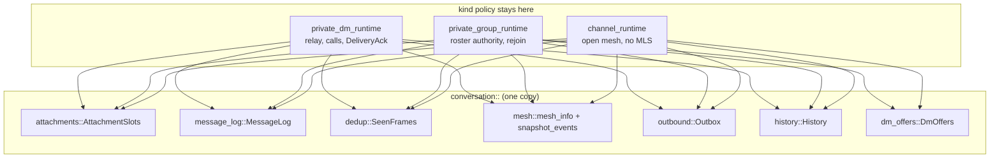
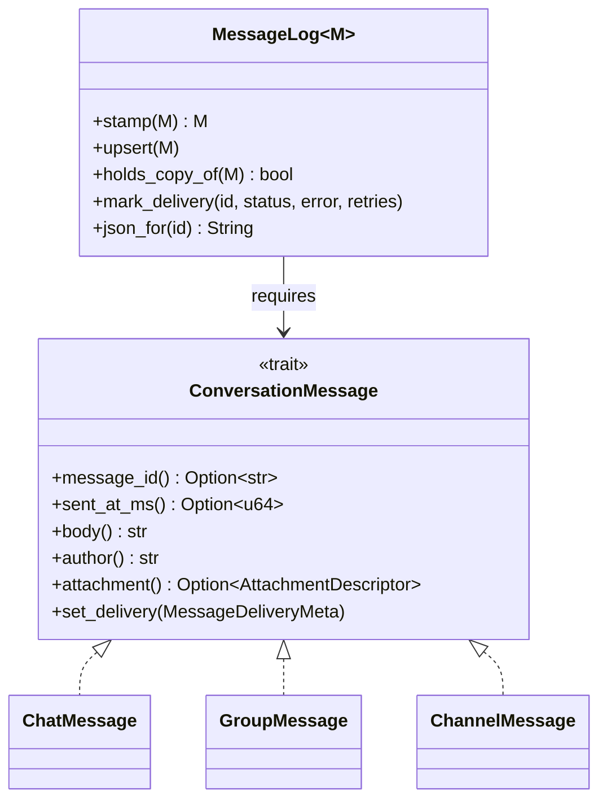

# ADR 0019: shared conversation strata in mosh-core

## Status

Accepted. Follows ADR 0018, which folded the Dart side of the same three
conversations into one module.

## Context

ADR 0018 fixed the UI, but the triplication starts below it. `mosh-core` holds
three runtimes — `private_dm_runtime`, `private_group_runtime`,
`channel_runtime` — and they pour the same layers three times: the attachment
slot table, the message log, the seen-frame ring, the outbound send path, the
history store, the snapshot view.

Test coverage is where that hurts. The DM runtime has by far the most tests;
the group and channel runtimes have a fraction of it for near-identical code.
A delivery-status fix proven in the DM was unproven in the other two, and a
copy that was missed drifted quietly.

The three are not the same everywhere, and the differences are real:

- a DM is two devices, routes through a relay when it cannot go direct, and
  carries calls;
- an org group derives who may commit from a signed roster and can need a
  rejoin;
- a public channel has no MLS layer at all and an open membership.

## Decision

Move each shared layer into `mosh-core/src/conversation/`, one at a time, and
leave the kind holding only its own policy. A runtime holds the shared piece
as a field instead of keeping a copy of its code.

Where a kind genuinely differs, the difference becomes an explicit choice —
a trait method or a step passed in — rather than a fourth near-copy.

The one message difference worth naming: `ConversationMessage::author` is the
sender's fingerprint in a channel or a group, and the sender's device name in
a DM, because a DM message has no fingerprint field and only ever has two
participants.

Each stratum lands on its own: the suite is green, `clippy -D warnings` is
clean, no wire format changes and no `api::` signature changes. Only the last
step — one runtime behind a kind trait — touches the bridge, and it regenerates
the frb bindings.

## Consequences

Good:

- One place to fix a bug, and the fix holds for all three kinds.
- The shared code has its own tests, which the copied code never had.
- The differences between kinds are now written down instead of implied.

Costs:

- A runtime now reaches through a small type instead of touching a `Vec` and a
  `HashMap` directly. That is a real indirection, paid for by not writing the
  same twenty lines three times.
- Until the last step lands, the core is half folded: the shared strata, the
  send path and the history store are out; the runtimes themselves are still
  three.
- A send now runs in three calls — `open` or `reopen`, publish, `settle` —
  because the runtime persists between them and the transport sits in the
  middle. A single call taking the publish step as a closure would have to hold
  the log and the attempt table borrowed across it, which the persist calls
  rule out.

Two small behaviour changes, both deliberate, both from picking one rule where
the three copies had drifted apart:

- Restoring an attachment after a restart keeps the first record. The DM
  already worked that way; the channel and the group kept the last one. It only
  shows when one file is stamped on more than one message, which happens
  because a channel attachment id comes from the file's content — so the same
  bytes sent and later received back share an id. The file on disk is the same
  either way; only the direction label could differ.
- The list of attachments still waiting for chunks is now in id order. It came
  out of a hash map before, so the order changed from run to run.
- A send that was still Pending when the app closed now comes back as a
  retryable failure in all three kinds. The DM already did this; the group and
  the channel left it Pending, which the user saw as a spinner that never
  stopped. Nothing could have settled it: whoever held the send died with the
  process.

The history store takes its tables as data. `persistence::HistoryTables` names
the conversation table, the message table and the outbound-attempt scope of one
kind, and `DM_HISTORY`, `GROUP_HISTORY` and `CHANNEL_HISTORY` are the three
values. `Persistence` keeps its per-kind method names as one-line wrappers over
the shared ones, so callers read the same as before. The three
`Persisted*Message` records were field-identical and became one
`history::StoredMessage<M>`; the bytes on disk are unchanged.

DM offers are one list too. A channel and a group each let a member offer
another a private DM, with the same three rules: build the invitation and
publish it at one member, keep an arriving offer only if it names us, drop one
on dismiss. `conversation::dm_offers::DmOffers` holds the list and those rules;
publishing stays with the kind, because a channel sends it in the clear and a
group inside its control envelope. The offer id still comes from the invite
URI, so the same invitation published twice is one offer on the far side.

A DM has no such list. It is where an accepted offer leads — accepting means
taking the invite URI to the DM runtime's normal accept path — not a place
offers are shown.

An org keeps its own offer list, and it stays where it is. It looks alike from
a distance but the rules differ: an org offer names a moss peer-id instead of a
device fingerprint, is dropped unless the sender is in the signed roster, is
accepted once against a set that outlives the list, and is consumed by accept
rather than dismissed. Bending one list to cover both would mean four flags on
it, which is worse than two lists that say what they do.

### The MLS layers the DM and the group were said to share

Ticket 05e asked for a decision on `commit_sequencer` and `ciphertext_store`.
Decided: they stay where they are, and no shared layer is built, because there
is nothing shared to lift.

- `commit_sequencer` has one caller, `private_group_runtime`. A DM is two
  devices, and its epoch moves once, when the second device is added. It never
  orders commits, never buffers a future epoch and never asks for a resync. A
  layer over a single caller would only be a longer name for it.
- `ciphertext_store` has no caller at all. Nothing in `mosh-core` appends to it
  or reads it, and it is not on the bridge — it is a leftover of the removed
  React/Tauri app. It is dead code, not shared code, so sharing it is not the
  question; whether to delete it or wire it up is, and that is its own ticket.
- The MLS layer the DM and the group really do share is
  `mls_crypto::MlsSessionCrypto`, and they already share it. What sits above it
  is exactly where the two differ: the group resolves who may commit from a
  signed roster and can need a rejoin, the DM has two members and no such
  question.

Rejected: leaving the core alone and only sharing the UI. The UI already reads
one shape; the drift that costs users — delivery status, attachment state,
duplicate messages — is decided below the bridge.

## Follow-up

Landed since: 05c (one mesh and event view), 05a (one outbound send path), 05b
(one history store) and 05e (DM offers, plus the MLS decision above). Still
tracked as 05d (one runtime behind a kind trait), the one that regenerates the
bindings and must be checked against a real peer for all three kinds.

`ciphertext_store` is unused and wants a ticket of its own: delete it, or wire
it to the history the DM already keeps.

One layering debt to clear along the way: the shared code still imports
`AttachmentDescriptor`, `AttachmentState` and `AttachmentView` from
`private_dm_runtime`, where they happen to live. Shared code should not depend
on one kind; those types belong beside the attachment runtime.
