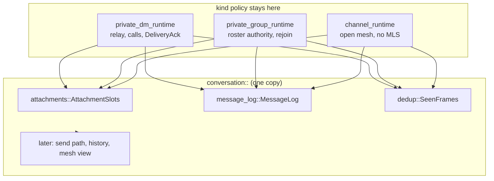
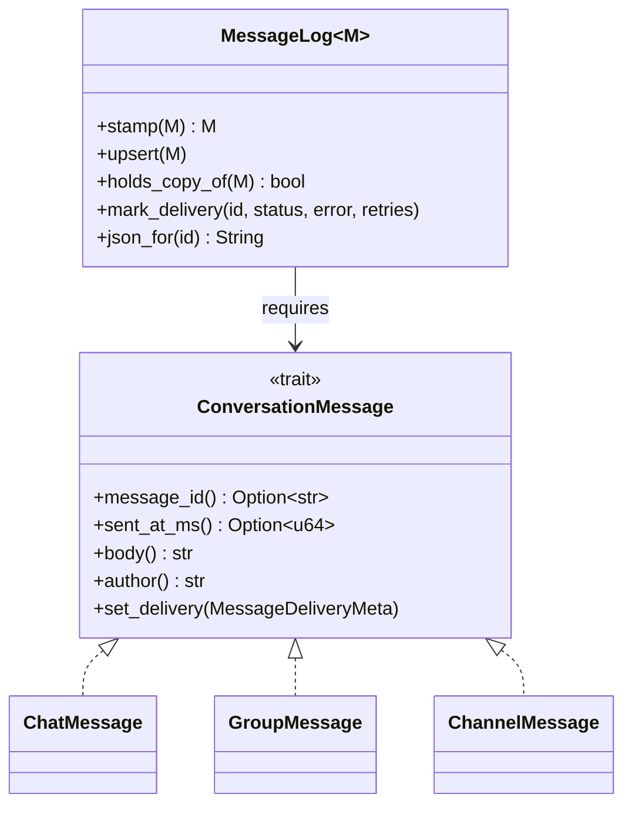

# ADR 0019: shared conversation strata in mosh-core

## Status

Accepted. Follows ADR 0018, which folded the Dart side of the same three
conversations into one module.

## Context

ADR 0018 fixed the UI, but the triplication starts below it. `mosh-core` holds
three runtimes — `private_dm_runtime`, `private_group_runtime`,
`channel_runtime` — and they pour the same layers three times: the attachment
slot table, the message log, the seen-frame ring, the outbound send path, the
history store, the snapshot view.

Test coverage is where that hurts. The DM runtime has by far the most tests;
the group and channel runtimes have a fraction of it for near-identical code.
A delivery-status fix proven in the DM was unproven in the other two, and a
copy that was missed drifted quietly.

The three are not the same everywhere, and the differences are real:

- a DM is two devices, routes through a relay when it cannot go direct, and
  carries calls;
- an org group derives who may commit from a signed roster and can need a
  rejoin;
- a public channel has no MLS layer at all and an open membership.

## Decision

Move each shared layer into `mosh-core/src/conversation/`, one at a time, and
leave the kind holding only its own policy. A runtime holds the shared piece
as a field instead of keeping a copy of its code.

Where a kind genuinely differs, the difference becomes an explicit choice —
a trait method or a step passed in — rather than a fourth near-copy.

The one message difference worth naming: `ConversationMessage::author` is the
sender's fingerprint in a channel or a group, and the sender's device name in
a DM, because a DM message has no fingerprint field and only ever has two
participants.

Each stratum lands on its own: the suite is green, `clippy -D warnings` is
clean, no wire format changes and no `api::` signature changes. Only the last
step — one runtime behind a kind trait — touches the bridge, and it regenerates
the frb bindings.

## Consequences

Good:

- One place to fix a bug, and the fix holds for all three kinds.
- The shared code has its own tests, which the copied code never had.
- The differences between kinds are now written down instead of implied.

Costs:

- A runtime now reaches through a small type instead of touching a `Vec` and a
  `HashMap` directly. That is a real indirection, paid for by not writing the
  same twenty lines three times.
- Until the last step lands, the core is half folded: the shared strata are
  out, the send path and the history store are still triplicated.

Rejected: leaving the core alone and only sharing the UI. The UI already reads
one shape; the drift that costs users — delivery status, attachment state,
duplicate messages — is decided below the bridge.

## Follow-up

Tracked as 05a (one outbound send path), 05b (one history store), 05c (one
mesh and event view) and 05d (one runtime behind a kind trait). 05d is the one
that regenerates the bindings and must be checked against a real peer for all
three kinds.
