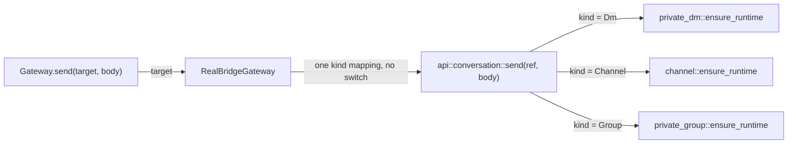

# ADR 0024: the bridge names shared conversation actions

## Status

Accepted. Amends ADR 0010 — the "one Tauri command maps to one `api` function"
clause only, and only for the conversation surface; amends ADR 0010's Decision
and Consequences, not just its Status, so that nobody reads the old rule as
still standing.

ADR 0017's decision is not reopened: the Dart `Gateway` still takes the
conversation as a parameter, and its method list is unchanged. ADR 0017 does
carry a Status pointer, because its Context and Consequences assert that the
Rust `api` module stays untouched and this ADR makes that false.

ADR 0016 is affirmed, not amended: the three `OnceLock` owners stay
independent.

## Context

ADR 0010's mapping rule was a porting device. It made the `api` module a
checklist: walk the Tauri command list, write one function per command, and stop
when the list runs out. That was worth it while the list existed — it bounded
the work and made the port reviewable.

The list no longer exists. ADR 0009 replaced the Tauri shell; `src-tauri/` is
gone from the tree, and `mosh-core/src/api/mod.rs` still describes its own
sub-modules as "Facade for the `private_dm_*` family of Tauri commands" —
a description of a command set that no longer has an author. The rule now maps
onto nothing, and mapping onto nothing costs more than it saves:

- **Three names for one action.** Send, retry, send-attachment,
  download-attachment, cancel-attachment and leave exist once per kind:
  `private_dm::send_message` / `channel::send` / `group::send`, and so on.
  Eighteen functions carry six actions. The naming has already drifted apart —
  DM says `send_message` where channel and group say `send`, and the three
  spell "leave" three ways: `close_session`, `leave`, `close`.
- **Thirty-nine copies of the same four lines.** The three conversation bridge
  files hold 41 public functions, and 39 of them read identically: open with
  `ensure_runtime()?` and `guard.as_mut().expect(...)`, delegate one line, close
  with `.map_err(|error| error.to_string())`. The whole `api` module has 70
  public functions and 68 `map_err(|error| error.to_string())` sites.
- **The kind gets re-decided in Dart, seven times over.** ADR 0017 pushed the
  kind into a value so screens would not have to hold it, and deliberately put
  the resulting dispatch *inside* the adapter — "each implementation switches on
  it once, inside itself". That was correct at the time; there was nowhere else
  to put it. But `real_bridge_gateway.dart` now writes `switch (target)` seven
  times, and six of those seven exist only to pick which of three
  identically-shaped bridge functions to call. The seventh is `dismissDmOffer`,
  which is genuinely narrower — a DM has no offer list — and stays. The other
  six are a dispatch that the Rust side could perform once, on the side of the
  seam that already holds the runtime handles.
- **Three copies of the singleton preamble, and three copies of the dispatch
  that reaches them.** ADR 0016 gave each runtime family its own
  `OnceLock<Mutex<Option<...>>>` plus a `LOAD_ERROR` cell, and ADR 0019 kept
  three runtimes — one `ConversationRuntime<S>` per kind behind the
  `ConversationSession` trait — so three owners is right and stays right. What
  the old rule adds on top is that each of the three bridge files re-states the
  `ensure_runtime` preamble *and* that the choice among the three is re-made at
  every call site in Dart. Unifying the operation names does not merge the
  locks; it moves the choice to the one place that can see all three.

None of this was wrong when the rule was written. It is wrong now because the
thing the rule pointed at was deleted, and a rule with no referent can only be
followed literally.

## Decision

**The bridge exposes one function per shared conversation *operation*, with the
conversation kind carried in the argument** — not one function per conversation
kind.

Six operations are shared by all three kinds today:

`send`, `retry`, `send_attachment`, `download_attachment`,
`cancel_attachment`, `leave`.

Eighteen per-kind functions become six. Each takes a typed
`BridgeConversationRef { kind, id }`; the bridge function is the only place that
decides which runtime lock it addresses.

Six of the seven `switch (target)` blocks in `real_bridge_gateway.dart` collapse
into one dispatch inside Rust, on the side of the seam that already owns the
runtime handles. The seventh is `dismissDmOffer`, which only channels and groups
answer — a DM has no offer list — so it stays exactly where ADR 0017 put it.

**Everything else ADR 0010 said about the bridge still holds.** The `api`
module remains the only Rust surface the bridge sees, it stays a thin facade
that delegates to the runtimes and invents no domain logic, and the argument and
return types stay bridge-friendly so `flutter_rust_bridge` generates the Dart
bindings without manual glue. This ADR changes which names the facade exposes
for six actions. It does not add a second seam, and it does not move logic into
the facade.

**Typed polls stay as they are.** `ConversationTarget<TSnapshot>` and the
existing `poll_session` / `poll` / `readSnapshot` path are not folded into this.
A bridge-wide snapshot union, an optional-field DTO, or a cast in the adapter
would each rewrite every screen's read path for no gain: three distinct snapshot
types is honest, and the typed target already reads them without a cast. Reads
are the part of the surface where the kinds genuinely differ; writes are not.

**A raw `kind:id` string never crosses the bridge.** The ref is a struct. The
key grammar already has more homes than it should: `lib/src/state/
active_conversation_key_provider.dart` parses all three prefixes,
`lib/src/util/unread.dart` reaches for `'channel:'` directly to strip it, and
`lib/src/features/sessions/sessions_screen.dart` writes the grammar inline again
at every row. Ticket 02 gives Dart one owner for it. The bridge is not going to
be the place that adds a further spelling, in Rust.

**Shared operations return `Result<(), ConversationBridgeError>`.** Success
payloads are dropped. The eighteen per-kind wrappers return six distinct DTO
types — `SendMessageResult`, `CloseSessionResult`, `ChannelSendResult`,
`ChannelLeaveResult`, `GroupSendResult`, `GroupLeaveResult` — and not one of
them is referenced anywhere in Dart outside the generated bindings under
`lib/src/rust/`. Production Dart already learns delivery and transfer state from
the next snapshot (ADR 0021, ADR 0022), so a success DTO here is a return value
that duplicates a poll.

**`ConversationBridgeError { kind, message }` is small and actionable.** This
ADR fixes only its shape — a `kind` a caller can branch on, and a `message` for
the human — and the boundary it is mapped at. The variant set itself is ticket
03's to define; the test a variant must pass is "can a caller do something
different because of it", and *not-available* / *retryable-transport* /
*invalid-argument* is closer to the honest answer than a variant per runtime
failure mode. The current runtime error enums (`SlotError`, `LogError`,
`TransferError`, and each kind's own) stay private to their owners. Do not
export the runtime taxonomy across the bridge; a caller that wants to branch on
`SlotError::...` is a caller that wants to be rewritten on the next refactor of
`conversation::attachments`.

**The three runtime locks stay independent.** This ADR is about names and
dispatch at the bridge boundary, not about ownership. `private_dm`, `channel`
and `private_group` keep their own `OnceLock<Mutex<Option<...>>>` and their own
`ensure_runtime()`, per ADR 0016. ADR 0019 did not change that either: it
folded the three runtimes' *shared layers* into `conversation::` and left three
`ConversationRuntime<S>` instances, one per kind behind the
`ConversationSession` trait. Three owners is therefore the current, deliberate
shape — not an accident this ADR declines to clean up. The new facade borrows
those locks and dispatches among them; it does not merge them. Merging them
would be a third runtime-ownership rewrite, and it is not what the duplication
here costs.

**The old per-kind symbols are migration scaffolding, not a compatibility
promise.** They stay internal until the last caller moves, then they are
deleted. Nothing outside this repo binds them; there is no released client to
keep happy. Do not mark them `#[deprecated]` for a release cycle, and do not
write a Dart compatibility shim.

## Consequences

- The Dart adapter switches once instead of seven times. `switch (target)`
  disappears from `real_bridge_gateway.dart` for all six shared actions and
  reappears as one dispatch in Rust; the adapter is left holding only the
  `dismissDmOffer` switch and the `ConversationRef` → `BridgeConversationRef`
  mapping. This narrows what ADR 0017 asked the adapter to do — it no longer
  picks a bridge function per kind — but it does not reverse it: the Gateway
  still takes the conversation as a parameter.
- The 68 `map_err(|error| error.to_string())` sites die in two batches: the
  six shared actions as a side effect of deleting their old wrappers, and the
  rest only if a later ticket touches that file. This ADR does not authorise a
  speculative sweep of the whole module; specialized functions — invites, org
  actions, calls, diagnostics — keep the current shape until something needs
  them to change.
- A new shared conversation action is written once. A fourth conversation kind
  adds one enum variant and one dispatch arm, not six functions and six more
  switch arms spread across the adapter.
- The kind becomes a value on both sides of the bridge. A wrong-kind call is a
  compile error in Dart and a dispatch arm in Rust, never a wrong function name.
- `flutter_rust_bridge` regenerates a smaller surface. The generated Dart
  shrinks by twelve free functions and six result DTO types; the bindings stay
  drift-checked by CI as before.
- The `api` module's module-level doc comment stops describing Tauri command
  families. That comment is the rule's last physical trace in the tree and it
  gets rewritten with the first migrated operation.

## Alternatives considered

- **Keep the rule; accept the duplication.** Rejected. It is not duplication of
  a stable thing — it is duplication that has to be re-synchronised every time
  a shared action changes, in three Rust files and one Dart file, with no test
  that can catch a miss. The `send_message` / `send` drift is the proof that
  the synchronisation is already not happening.
- **Unify every bridge function behind one kind-tagged call.** Rejected as
  overreach. Invites, org operations, voice calls and diagnostics have
  genuinely different arguments and return types, and one of the three kinds
  does not participate in most of them. A generic envelope there would trade
  eighteen small functions for one large untyped one.
- **Fold the polls in too.** Rejected. It rewrites every screen's read path,
  which is a separate job with its own risk, and the typed target already gives
  the property the write side is missing.
- **Delete ADR 0010's rule outright instead of amending it.** Rejected. The
  rule still governs the non-conversation surface, where the "thin facade, no
  new domain logic" half is load-bearing and the mapping half is simply
  finished rather than wrong. Amending keeps the reason on the record; deleting
  it invites a reviewer to reinstate it.
- **Merge the three runtime locks while touching this code.** Rejected as scope
  creep in the dangerous direction. Runtime ownership is ADR 0016's subject and
  has its own tests; bundling it here would make a naming change depend on a
  concurrency change.

## Follow-ups

- Ticket 11 implements the six unified bridge functions; ticket 12 removes the
  six `switch (target)` blocks those actions no longer need; ticket 14 deletes
  the old per-kind symbols and the now-unused result DTO types.
- Ticket 03 defines the error taxonomy concretely; this ADR fixes only its
  shape and its boundary.
- If a fourth conversation kind appears, the six operations are the checklist
  for what it must implement.
