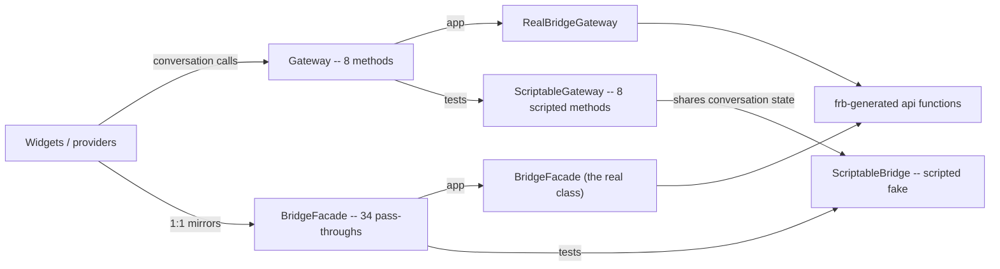

# ADR 0025: The Gateway is the conversation seam; 1:1 mirrors call the bridge facade

Date: 2026-09-02
Status: Accepted

## Context

ADR 0013 declared one `Gateway` interface between the Flutter UI and the
generated bridge, and ADR 0017 parameterized its conversation methods by a
`ConversationTarget`. The interface then kept growing with every slice: by the
end it carried 42 methods, of which 34 -- org, VPN, call, diagnostics, session
setup, the channel/group joins and lists -- did nothing but mirror one
generated `mosh_core::api` function 1:1. Those methods hide no decision: no
target parameter, no kind branch, no shaping. But because they sat on the
interface, the scripted test double had to mirror all 42 of them, and the
double grew to 756 lines -- the third-largest file in the repository.

The interface is only worth its indirection where a test needs to fake a
decision. A pass-through faked wholesale is how the double got wide; the seam
and the test surface should be the same small thing.

## Decision

- `Gateway` keeps exactly the eight conversation methods: the typed `poll`
  plus `send`, `retry`, `sendAttachment`, `downloadAttachment`,
  `cancelAttachment`, `dismissDmOffer` and `leave`. Six are shared by all
  three kinds and dispatch inside the bridge (ADR 0024); `dismissDmOffer` is
  answered by channel and group only, because a DM has no offer list
  (ADR 0017).
- The 34 mirrors leave the interface and move to `BridgeFacade`
  (`lib/src/gateway/bridge_facade.dart`) -- a concrete class, one one-line
  delegation per method, no seam around it. Their callers (org actions and
  providers, the VPN widgets, the voice-call orchestrator and frame transport,
  diagnostics, onboarding steps, the rail accept, the controller's cross-kind
  offer and invite calls) consume it through `bridgeFacadeProvider`.
- `ScriptableGateway` records and scripts only the eight seam methods. A new
  `ScriptableBridge` fakes the facade for the tests that assert its calls;
  both doubles share one `ScriptedConversations` state object, mirroring the
  single Rust runtime the two Dart surfaces are views over.
- The voice-call audio adapters (capture, playback, ringtone) stay outside the
  Gateway and the facade, on their own factory providers. They wrap OS audio
  (record/cpal) and hold no Rust domain state, so there is nothing at the
  bridge to fake or swap.

## Consequences

- The Gateway interface finally is the test surface: eight scripted methods,
  and `ScriptableGateway` drops from 756 to about 190 lines. The bridge fake
  (`ScriptableBridge`) is over the repo size budgets by design -- see the
  documented exception below -- and exists so widget tests can run without
  Rust.
- ADR 0013's "widgets depend on Gateway, never a concrete impl" now holds for
  the conversation seam only. Mirror callers depend on a concrete class; their
  fake<->real swap is still one provider body, but the class has no other
  implementation and needs none.
- A future org screen, VPN surface, or call path calls the facade directly and
  adds nothing to the seam.
- No Rust change: the mirrors keep their generated functions. The deletion of
  the old per-kind shared-action wrappers is ticket 14.

### Size exceptions (documented per exception_policy)

- `BridgeFacade` (type, ~225 LOC over `type_max_loc: 200`) and
  `ScriptableBridge` (type ~470 LOC; file ~560 over `file_max_loc: 400`).
- Reason: both are one flat member per generated bridge function, in the
  facade's own declaration order -- 34 mirrors with no logic to factor out.
  Splitting the facade by area would put five providers where one seam-free
  pass-through reads in one sitting; splitting the fake would break the "one
  fake per provider" contract tests rely on.
- Scope: exactly these two types and their files. Nothing else may lean on
  this exception.
- Removal plan: ticket 14 contracted the bridge surface (the eighteen
  per-kind shared-action wrappers) without touching a mirror -- none of them
  was mirrored here, so the count stays at 34. A future bridge contraction
  that removes mirrors shrinks the two files with it. Revisit the exception
  whenever the mirror count changes.

## References

- ADR 0013 -- fork topology, temporary fake gateway, provider swap.
- ADR 0017 -- the Gateway takes the conversation target.
- ADR 0024 -- the bridge names the shared conversation actions.
