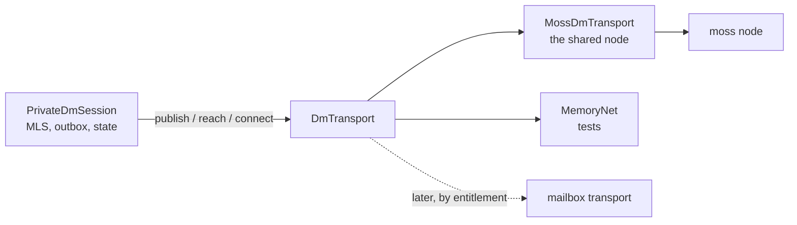
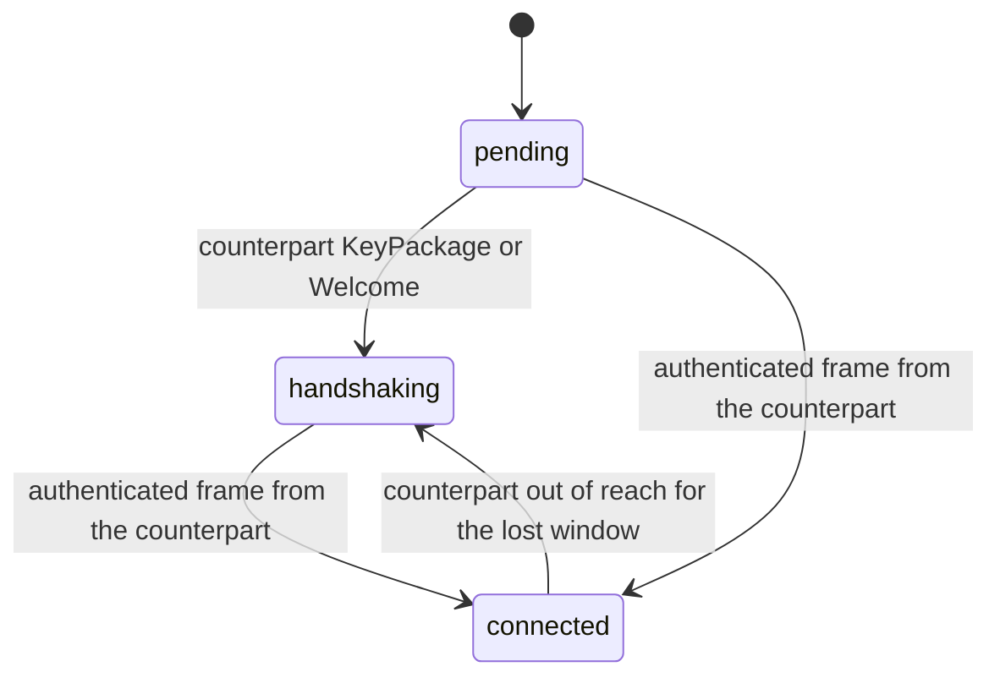

# ADR 0026: one moss node, a DM transport seam, and an outbox that never fails a text

Date: 2026-09-02
Status: Accepted

## Context

The DM runtime ran two moss nodes under one moss peer id: the shared substrate
node every conversation rides, and a second "relay" node started on demand for
peers behind a hard NAT. Both published their address into the overlay under
the same id, so a peer dialing that id reached the wrong node half the time and
the MLS handshake frames never arrived. The relay mesh itself had zero routes
network-wide, so the relay node never delivered anything anyway. Telemetry
showed one peer id interleaving `mosh-dm/1` with `moss-relay/1` and thousands
of `no_relay_peer` failures.

Two more things were wrong at once:

- "Connected" was derived from local flags. It flipped as soon as a handshake
  frame landed and any peer was in the peer list, which on the shared node is
  always true. The diagnostics card could show "Connected" next to "peer
  unknown".
- A text send could fail. A first send on a path that had not formed yet
  settled as `Failed` and reached the user as a sentence and a Retry button, for
  a condition that resolves itself seconds later.

## Decision

**One node per installation.** The relay module, its worker thread, its
results channel and the path hysteresis (`Discover` / `Direct` / `Relayed`, the
fallback and stability timers) are deleted. Reachability is moss's job: the
runtime registers the counterpart's moss peer id as an explicit connect target
once it knows it, and moss decides between direct, hole punch and its own
network relay. The invite, the KeyPackage and the Welcome keep carrying a moss
peer id; it now names the one node, so the wire format does not change.

**Every DM frame crosses one interface.** `DmTransport` (in
`private_dm_runtime/transport.rs`) is the only door: open and close a room,
subscribe a channel, publish a frame, ask to reach a peer, report how a peer is
reachable, drain what arrived. `MossDmTransport` wraps the shared node and never
keeps its handle, so the holder's refcount stays the only thing that decides
when the node stops. `MemoryNet` is the in-memory implementation tests use: two
runtimes joined by links that say how each end reaches the other and which
frames get lost. `publish` answers "the transport took the frame", never "the
peer has it" — the paid mailbox will be a second implementation of the same
trait and must be able to accept a frame for a peer that is offline.

**Session state is proven, not inferred.** The snapshot carries a three-value
enum, moved only by evidence:

An authenticated frame is anything that MLS-decrypts: a message, a delivery
ack, a manifest, a call offer, or the new `Hello` control frame. Each side sends
`Hello` — its own moss peer id, MLS-encrypted — as soon as its side of the
handshake is done, and repeats it on the handshake cadence until the counterpart
answers with anything authenticated. A side that receives a `Hello` answers with
one unless it sent one inside the same cadence, so two connected sides do not
ping-pong. `connected` degrades to `handshaking` when the counterpart has been
out of the transport's reachable set for the whole lost window (5 s), and the
next authenticated frame takes it back. The transport shown next to
`connected` is what moss reports for the counterpart: `direct`, `relayed` or
`none`.

**A text is queued, never failed.** A text send files the message row and its
attempt row as `Queued` in one transaction (ADR 0022) before the transport is
asked anything, with no payload yet. The runtime's tick, and the send itself,
drive the outbox: whenever the counterpart is reachable and our side of the
handshake is done, the oldest queued message is encrypted at the current MLS
epoch, published, and settled `Sent`; a refusal leaves it `Queued` and stops
the pass, so a newer message never overtakes an older one. Encrypting at
dequeue is what lets a text typed before the counterpart joined go out at an
epoch it can read. Replay keeps `Queued` as `Queued` — only `Pending` is
reclassified — so a queued text survives a restart and leaves on the next
connect. The auto-resend of unacknowledged `Sent` messages is unchanged.

`Failed` remains for attachments and for the restart-orphan case ADR 0022
defines. A text never reaches `Failed` from a transport refusal; Retry shows
only for `Failed`, and a manual retry on a text re-queues it.

## Consequences

- One installation is one node. Telemetry shows a peer id with exactly one mesh
  id, and a peer dialing it always reaches the node that holds the session.
- The header says one of three things — waiting for the contact, the contact is
  offline, or connected with the transport next to it — and "connected" means
  the other side answered. The rail badge, the title-bar pill, the diagnostics
  card and the summary say the same thing through `dm_state.dart`.
- The diagnostics card drops the relay row and the relay-ready badge. It shows
  the counterpart's moss peer id (or "not yet known"), the transport, and the
  last connect outcome, so "Connected" and "peer unknown" cannot share a card.
- A text shows a clock while queued, a tick when the transport took it, a
  double tick when the counterpart acknowledged it. It never shows an error and
  never asks to be retried. ADR 0021's presentation rule ("a refusal is red with
  a Retry button") no longer holds for the DM; groups and channels keep it.
- The runtime is testable without a network. `MemoryNet` is a fake — the one
  exception to the "no doubles" testing rule — because the state machine and
  the outbox are about what crosses the seam, and a real mesh cannot be told to
  lose exactly one `Hello`. The moss loopback tests keep proving the real
  transport.
- The mailbox transport (store-and-forward while the counterpart is offline)
  is a second `DmTransport` chosen by entitlement. It gets its own ADR; nothing
  in the session logic has to move for it.
- What is not covered: attachments still need a live path and keep their
  explicit failure and Retry; voice media frames go through the transport but
  are dropped on refusal like before; the memory transport does not model
  delay, only loss and refusal.

### Size exception (documented per exception_policy)

- `mosh-core/src/private_dm_runtime.rs` stays over `file_max_loc: 400` (about
  3 700 lines with its test module, down from 5 147 before this ADR).
- Reason: this change deleted the relay and the path machine and moved the
  transport out; splitting the session itself (handshake, calls, attachments,
  outbox) is a second refactor and doubling the ticket's blast radius was not
  worth it.
- Scope: this one file. `transport.rs`, `transport/memory.rs`, `state_tests.rs`
  and `outbox_tests.rs` are inside the limit.
- Removal plan: pull the voice-call control handling and the attachment
  handling into their own modules behind `PrivateDmSession`, the way
  `transport.rs` was pulled out here; then move the moss loopback tests beside
  the memory-transport tests.

## References

- ADR 0021 — no peers is a refusal, not a Sent (the DM consequence is recorded
  there).
- ADR 0022 — a send is one durable fact.
- Ticket 19 — one moss node, an honest DM status, and an outbox that never
  fails a text.
