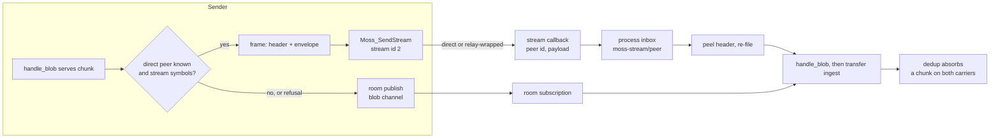

# ADR 0027: attachment chunks ride moss streams on direct DMs

Date: 2026-09-20
Status: Accepted

## Context

Attachment chunks traveled the room wire like every other frame: one
publish per chunk onto a blob channel subscribed by the counterpart. The
room wire was the only carrier, so every chunk paid the mesh's best
effort even when the two peers had a direct transport, and a slow relayed
publish stalled a transfer the same way it stalls a text.

Moss v0.8.30 exposes streams: `Moss_OpenStream`, `Moss_SendStream` and
`Moss_OnStream` (stream id 2 is the first free id; 0 and 1 are reserved
by the transport). A stream is a direct pipe to a known peer id, and a
relayed peer is wrapped by moss itself with an 8-byte `MSs1` header —
the sender does not care which path carried it.

## Decision

**The chunk protocol is unchanged; only the carrier swaps.** Requests,
retry and dedup keep their wire shape byte for byte. What changes is
which door a `BlobEnvelope` leaves through: on a DM whose counterpart's
moss id is known and whose library carries the stream symbols, a served
chunk goes down attachment stream id 2; any stream refusal (a missing
symbol, `RELAY_FAILED`, a gone node) falls back to the room publish, so
a counterpart library without streams receives exactly as before.

**One reserved inbox channel.** A stream frame arrives on a callback
that knows only the sending peer id — no room context. The sender frames
each envelope with a small JSON header naming the destination blob
channel (envelope bytes base64, so the header stays one clean object),
and moss files it under `moss-stream/<peer>` in the process inbox. The
carrier peels the frame open and re-files it under the real blob
channel, where the existing `handle_blob` path takes over unchanged. The
prefix is reserved: no room channel names start with `moss-stream/`, so
a frame nobody claims lands in the unclaimed tail and drops exactly
once instead of masquerading as a room frame.

**Both doors stay open on the receive side.** The receiver never drops
its blob-channel subscription: the room wire remains the fallback for
mixed versions and for transfers in flight across a carrier change, and
dedup absorbs a chunk that arrives on both. The receive-side stream
handler registers once per shared node at start, before any counterpart
streams a chunk at us — "first stream use" only covers the sender.

**Optional symbols degrade.** The five new symbols (`Moss_Version`,
`Moss_PeerRTT`, `Moss_OpenStream`, `Moss_SendStream`, `Moss_OnStream`)
load as `Option`s: a library older than the stream API simply keeps the
room wire everywhere — registration failure is a field-log note, never a
start failure, and a send failure is the declared fallback, never an
error to the caller.

**Scope: DMs only, this slice.** A group or channel has no single direct
peer to stream to; their blob traffic stays on the room wire. A later
slice may fan a group's chunks over per-member streams; the carrier's
`send_chunk` signature already leaves the door open (the stream argument
is an `Option`).

## Consequences

- Mixed versions need no negotiation: a peer that predates streams never
  receives a stream send (the sender falls back on any stream error), so
  the framing is only ever read by a peer running this same code.
- A transfer survives a carrier change mid-flight: both carriers deliver
  into the same ingest, and the per-chunk dedup makes the double arrival
  a no-op.
- Stream events are visible: every fallback and every dropped frame
  lands in the field log under the `stream` kind (see
  [Field log](../Features/field-log.md)), so "why is this transfer slow"
  has an answer.

## Testing posture

The carrier's proof is layered:

- **Seam tests against the real library.** The DM runtime tests dlopen
  the prebuilt `libmoss.so` (`a_stream_delivered_chunk_reaches_handle_blob_through_the_carrier`
  and the fallback-purity test around it) and drive the real framing,
  inbox and `handle_blob` path end to end.
- **Unit tests with a stub transport.** `stream_transport.rs`'s
  `RefusingStreamTransport` exercises the fallback branch on a transport
  whose stream door refuses. This is a letter-vs-spirit deviation from
  the no-stubs testing rule: the unit tests pin the branch logic, and
  the real-library seam tests cover the same path through the real
  dependency. Accepted as written because the seam tests exist; the
  stubs are scaffolding around them, not a replacement.

## Maintainability exceptions

The repo's file limit is 400 lines; the files below exceed it and are
recorded here per the exception policy. They are pre-existing: this
slice did not grow them materially, and the split is separate refactoring
work, not a change this decision requires.

| file | reason |
|---|---|
| `mosh-core/src/private_dm_runtime.rs` (~4.4k lines) | the DM session state machine, handshake, attachments, calls and receipts in one runtime; splitting is a dedicated refactor |
| `mosh-core/src/private_group_runtime.rs` (~3.9k lines) | the same shape for groups |
| `mosh-core/src/private_dm_runtime/state_tests.rs` (~1.1k lines) | one harness file per runtime keeps the test helpers beside the tests they serve |
| `mosh-probe/src/main.rs` (~1.4k lines) | the headless probe carries all three conversation kinds in one binary |
| `mosh-core/src/api/diagnostics.rs` (~400 lines) | at the limit; new panel fields split the file before it grows further |
