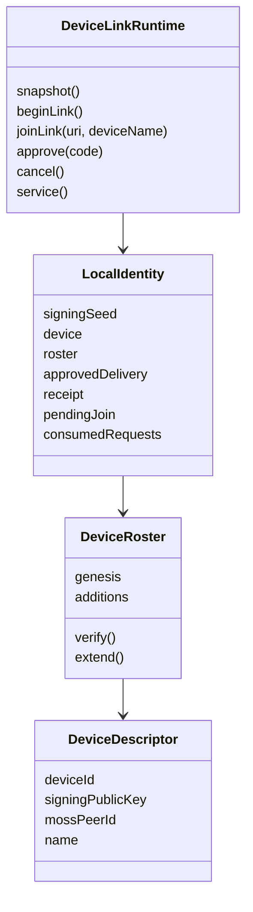
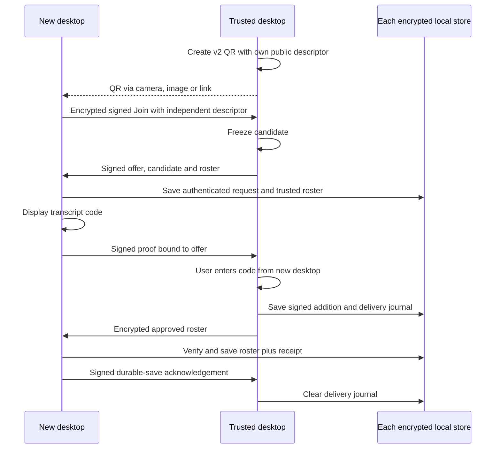
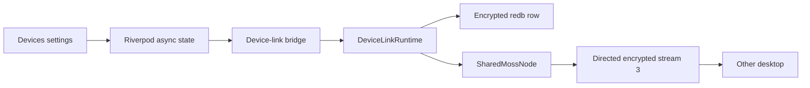

# ADR 0029: private desktop device linking

Date: 2026-09-28
Status: Accepted for issue 23; pairing direction amended 2026-10-02

## Identity and compatibility

A Mosh user is anchored by the first device's Ed25519 public key. A device id
is a domain-separated SHA-256 digest of its independent signing public key.
A Moss peer-id still names the installation's network node. MLS identities
still name conversation clients. Linking changes none of these local keys,
peer-ids or existing org authority. Existing DM records are untouched.

## Authorization

Genesis is signed by its sole device. Every addition signs the protocol
version, parent roster SHA-256 digest, new descriptor and authorizing device
id under a separate roster context. Verify the entire chain with strict
Ed25519 verification. The signer must already be a member; keys, ids and
peer-ids must be unique. Reject a different genesis, a rollback or any
extension other than the one approved in this exchange. A member device can
authorize another device; the root private key is never shared.

This ticket serializes additions through the approving desktop. It does
not provide distributed concurrent roster merging or revocation. A future
update must extend the verified chain or explicitly define fork resolution,
removal and offline rollback rules before it changes membership.

## Pairing

The trusted desktop creates a five-minute v2 QR containing version, random
request id, expiry, its public descriptor and a random 256-bit AES-GCM secret.
The new installation scans it on Android or imports its image/URI. It sends a
signed Join containing its independently generated device descriptor. The
trusted desktop freezes the first valid candidate; another scanner cannot
replace it. The signed Offer echoes the candidate and the trusted roster. Moss stream 3 carries only
encrypted, signed pairing packets to the specific peer-id. The QR, version,
request id, direction and signer are bound to packet authentication. Signing
keys never leave their installation. The roster never enters gossip.

Connecting to a peer-id requests Moss discovery once per target. Sending uses
`SendStream`, which owns stream-reader startup. A separate `OpenStream` lookup
can wait on the public overlay while holding the service lock and is redundant
before `SendStream`. Protocol retries remain responsible for resending while
Moss establishes the path. Commands can still cancel an offline pairing.

QR possession authenticates the initial exchange. The human checks the
intended device by entering the code shown on that desktop. A forged packet
or changed QR field cannot pass both signature and transcript checks.
The v2 transcript code binds both descriptors and the offered roster.
Replacing the whole QR creates a different authorizer, request and code.
Do not approve a code obtained anywhere except the intended desktop.

Unused QR requests die on restart. Once the offer is authenticated, the new
desktop saves the request and resumes it until its five-minute expiry.
Cancellation or expiry clears that pending request. Cancellation sends an
authenticated rejection while the path exists. Packet retries are idempotent.
After approval, the saved delivery journal resends that exact authorization;
a saved receipt answers duplicates after restart. No duplicate creates a new
addition. A connection failure is visible and cannot fabricate success.
Terminal rejection and approval save the consumed request id in the same
encrypted row until its expiry. Reimporting that QR fails even after a restart
or if the other desktop never received the rejection packet.

## Storage and boundaries

One encrypted redb row stores the local device key, verified roster,
authenticated pending request and delivery/receipt state together.
Table creation is additive and does not
rewrite Moss, MLS, history or contact tables. Fail closed on corrupt state.
A new desktop with existing conversations or multiple devices cannot join
another user. It can authorize a fresh desktop instead.
If a conversation starts during a pending join, clear that request and preserve
the valid local identity and conversation. Eligibility is not a storage error.
Send the same signed rejection as cancellation so an online trusted desktop
stops offering approval for the abandoned request.

## Verification

Test public runtime methods and snapshots with real redb and separate Moss
processes. Cover successful approval, outsider refusal, wrong code, malformed
and expired QR, packet tampering/replay, disconnect and restart. Preserve
existing DM history/peer-id and prove ordinary DM messaging still works.
Test the real QR renderer/decoder and Flutter screen with the native bridge.
Implementation commands and verification results are preserved in
[the archived plan](../Archive/desktop-link.plan.md).

## Dart bridge access

The device-link provider calls its five typed generated bridge functions
directly. This is a scoped exception to ADR 0025's shared facade rule.
This feature must prove consent and persistence through the real bridge,
database and independent Moss nodes. It uses no scripted bridge substitute.
Adding its calls to the shared facade would also expand the scripted facade's
contract, without improving this proof or hiding a decision.

Keep these calls in the feature provider. Widgets consume that provider;
Rust owns the identity, approval and storage rules. All existing facade
callers continue to follow ADR 0025. The generated Rust API remains the sole
Dart-to-Rust boundary.

## Maintainability exceptions

- `DeviceLinkRuntime` has more than 200 lines across its small state,
  action, receipt and service files. A single owner serializes consent and
  atomic storage updates; splitting state ownership would weaken that
  boundary. Each operation stays small. If new protocol phases are added,
  move the pure transition rules into a separate state type while retaining
  one runtime owner.
- The existing `Persistence` file exceeds 400 lines. This change adds only
  one table and two encrypted row methods beside the other tables. Splitting
  the whole store is outside issue 23; extract table-specific modules when
  the storage boundary is next changed, keeping one transaction owner.
- The native UI test keeps its complete approval flow in one callback over
  50 lines. It must show that rejection and wrong input never change the
  device list before successful approval. Extract screen-specific actions
  when another UI flow needs them; keep assertions with their user actions.

## v1 upgrade recovery (2026-10-02)

The new bridge replaces `createQr`/`importQr` with `beginLink`/`joinLink` and adds
an optional authorizing/joining role to public snapshots. QR and pairing-wire
formats are v2. The signed roster, device identities and conversation schemas
retain their formats. Pending and delivery records add an optional candidate;
v1 records resolve the candidate from the old QR descriptor.

Fresh v1 imports are rejected. A saved authenticated v1 pending exchange resumes
only its existing pinned authorizer and base until expiry, allowing a previously
committed approval to arrive after upgrade. v1 signing contexts and packet
prefixes remain readable solely through stored exchanges, deliveries and
receipts. Duplicate old approvals acknowledge the durable saved roster; they
cannot add another device or revive a removed installation. An independent
legacy encoder under `cfg(test)` proves recovery without widening persistence
visibility or adding test commands to the production bridge.

Android uses `mobile_scanner` with its bundled model and internal lifecycle.
Camera access starts only on the scan route; image/link import remains available.
Flutter role forms, progress and roster presentation are separate widgets using
existing settings surfaces, QR renderer and confirmation dialog.

The candidate-freezing and v1 migration tests exceed 50 lines because each keeps
the competing installation, positive control or repeated restart assertions in
one end-to-end scenario. The shared test worker dispatch remains one owner of
real installation state; it is not production code. Generated bridge code is
excluded from hand-written file/type budgets.

When another state owner adopts this installation's removal, the linking runtime
reconciles its phase after reload. An authenticated joining exchange survives
only while its pending context is still valid; a new own-removal clears that
context and ends the exchange. A pinned earlier removal can still be followed
by a newly confirmed addition. Approved rosters cannot roll back the locally
saved removal chain, even if a delayed packet arrives after its Add notice.
