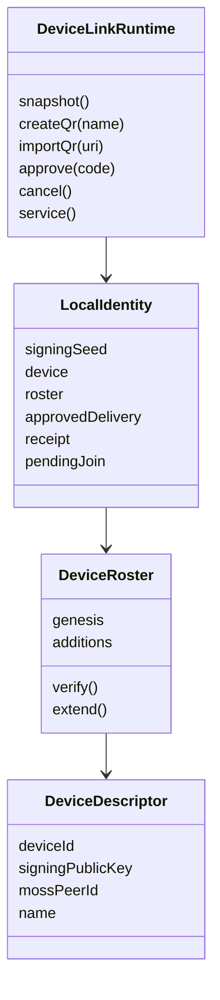
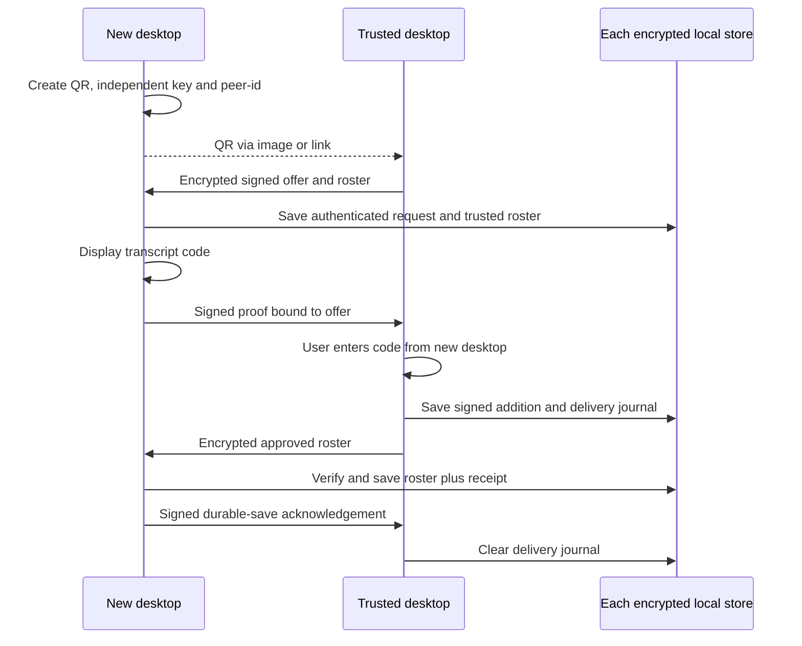
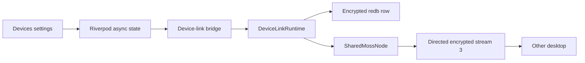

# ADR 0029: private desktop device linking

Date: 2026-09-28
Status: Accepted for issue 23

## Identity and compatibility

A Mosh user is anchored by the first device's Ed25519 public key. A device id
is a domain-separated SHA-256 digest of its independent signing public key.
A Moss peer-id still names the installation's network node. MLS identities
still name conversation clients. Linking changes none of these local keys,
peer-ids or existing org authority. Existing DM records are untouched.

## Authorization

Genesis is signed by its sole device. Every addition signs the protocol
version, parent roster SHA-256 digest, new descriptor and authorizing device
id under a separate roster context. Verify the entire chain with strict
Ed25519 verification. The signer must already be a member; keys, ids and
peer-ids must be unique. Reject a different genesis, a rollback or any
extension other than the one approved in this exchange. A member device can
authorize another device; the root private key is never shared.

This ticket serializes additions through the approving desktop. It does
not provide distributed concurrent roster merging or revocation. A future
update must extend the verified chain or explicitly define fork resolution,
removal and offline rollback rules before it changes membership.

## Pairing

The new desktop creates a five-minute QR containing version, random request
id, expiry, its public descriptor and a random 256-bit AES-GCM secret.
The trusted desktop imports its image or URI. Moss stream 3 carries only
encrypted, signed pairing packets to the specific peer-id. The QR, version,
request id, direction and signer are bound to packet authentication. Signing
keys never leave their installation. The roster never enters gossip.

QR possession authenticates the initial exchange. The human checks the
intended device by entering the code shown on that desktop. A forged packet
or changed QR field cannot pass both signature and transcript checks.
Replacing the whole QR creates a different request and a different code.
Do not approve a code obtained anywhere except the intended desktop.

Unused QR requests die on restart. Once the offer is authenticated, the new
desktop saves the request and resumes it until its five-minute expiry.
Cancellation or expiry clears that pending request. Cancellation sends an
authenticated rejection while the path exists. Packet retries are idempotent.
After approval, the saved delivery journal resends that exact authorization;
a saved receipt answers duplicates after restart. No duplicate creates a new
addition. A connection failure is visible and cannot fabricate success.

## Storage and boundaries

One encrypted redb row stores the local device key, verified roster,
authenticated pending request and delivery/receipt state together.
Table creation is additive and does not
rewrite Moss, MLS, history or contact tables. Fail closed on corrupt state.
A new desktop with existing conversations or multiple devices cannot join
another user. It can authorize a fresh desktop instead.

## Verification

Test public runtime methods and snapshots with real redb and separate Moss
processes. Cover successful approval, outsider refusal, wrong code, malformed
and expired QR, packet tampering/replay, disconnect and restart. Preserve
existing DM history/peer-id and prove ordinary DM messaging still works.
Test the real QR renderer/decoder and Flutter screen with the native bridge.
Commands and quality bars live in desktop-link.plan.md during implementation.

## Maintainability exceptions

- `DeviceLinkRuntime` has more than 200 lines across its small state,
  action, receipt and service files. A single owner serializes consent and
  atomic storage updates; splitting state ownership would weaken that
  boundary. Each operation stays small. If new protocol phases are added,
  move the pure transition rules into a separate state type while retaining
  one runtime owner.
- The existing `Persistence` file exceeds 400 lines. This change adds only
  one table and two encrypted row methods beside the other tables. Splitting
  the whole store is outside issue 23; extract table-specific modules when
  the storage boundary is next changed, keeping one transaction owner.
- The native UI test keeps its complete approval flow in one callback over
  50 lines. It must show that rejection and wrong input never change the
  device list before successful approval. Extract screen-specific actions
  when another UI flow needs them; keep assertions with their user actions.
