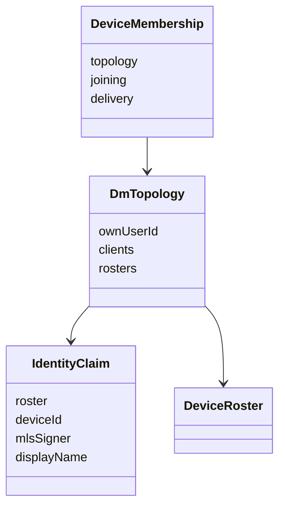
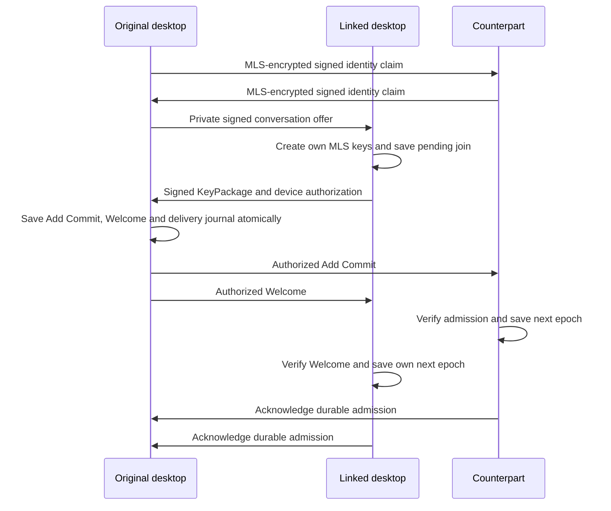
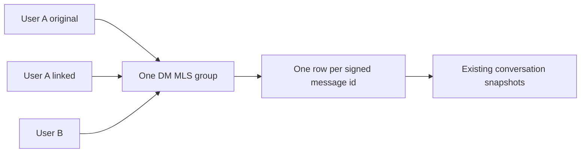

# ADR 0030: linked desktop DM clients

Date: 2026-09-28
Status: Accepted

## Identity and admission

A DM remains a conversation between two Mosh users. Each installation has
its own MLS leaf, signer, sender ratchet and Moss peer-id. The existing invite
URI and creator fingerprint still identify the same conversation. Device
linking follows [ADR 0029](0029-private-desktop-device-linking.md).

The established two-member MLS exchange pins the counterpart's signed user
roster through an encrypted identity claim. The device signature binds the
conversation, public MLS signer, user roster and display name together.
Compare that signer with the actual authenticated MLS sender. Further roster
updates must extend the pinned chain. A new self-signed user cannot replace
the established contact.

## Private exchange and persistence

Reuse the directed, encrypted Moss stream and its existing framing. Offers,
signed KeyPackages, admissions and acknowledgements carry device signatures
bound to the intended receiving peer. They never enter public gossip. Verify
the roster, sender and signature before interpreting a packet.

Apply admission to an independent copy of local MLS state. Check that the
result contains exactly the existing clients and the authorized new signer.
Save the session record, admission state and MLS snapshot in one redb
transaction before installing the transition or sending an acknowledgement.
Retries use the same Commit and Welcome. A pending join keeps its own
KeyPackage secrets across restart; it never restores another client's state.
Pending device joins reject the old unauthenticated Welcome path. Their
Welcome must pass the signed admission checks.

## Live text

Fan out MLS ciphertext to admitted installations through directed streams.
Each leaf encrypts with its own ratchet. A device signature authenticates the
text id, timestamp, ciphertext and author metadata before duplicate handling.
Map the authenticated leaf to its Mosh user. Own-device messages use the same
local author; counterpart-device messages use the same contact name.
Only a counterpart's MLS-authenticated receipt means delivered to that user.
Hello, typing and read receipts share an authenticated-contact check. Activity
on a sibling cannot prove the contact is online or show contact typing.
Verified client rosters own delivery addresses after admission; legacy
plaintext peer announcements cannot replace those addresses.
Retain the send attempt until each admitted recipient acknowledges it, with
the existing bounded retry budget. Remember recent contact receipts so a
sibling can receive the receipt before the text without losing delivery
status. This is live delivery, not offline history synchronization.

The initial two-party exchange uses the same directed stream when the contact
is reachable, with room gossip as fallback. This allows the existing invite
flow to complete through default discovery before device admission.

Old two-party sessions retain their wire and read-only fingerprint behavior.
The encrypted session record gains optional membership fields; table layout
and Flutter bridge signatures stay unchanged. The stream and signing code
belongs to the DM feature, with no new service or database owner.

## Limits and verification

This slice admits a linked device while the existing DM participants can
accept the epoch transition. It covers new live text only. History import is
issue 25; recovery of missed messages and epochs is issue 26; revocation is
issue 27. Participants can see the association between devices. This does
not promise network traffic anonymity.

The public-runtime proof uses three independent processes with real Moss,
OpenMLS and separate encrypted stores. It covers both linked desktops,
own-device echo, the original switched off, simultaneous sends and restart.
Cryptographic refusal tests use real keys and storage. The public bridge also
runs through automatic discovery. CI uses a local real tracker as described
in [ADR 0015](0015-deep-link-and-ci-and-versioning.md); unwrapped Cargo runs
retain the public Moss defaults. Commands, coverage requirements and results
are tracked in [the plan](../../two-desktop-dm.plan.md).

## Maintainability exceptions

The existing DM runtime, session, contracts and persistence files already
exceed root limits. This change keeps device admission in small feature-local
modules and adds only integration fields and calls to those files. The runtime
must retain one serialized conversation owner. Extract its legacy call and
rehydration code when those concerns next change; keep storage transactions
under the existing persistence owner.

The three-installation tests keep their end-to-end sequence in one function
when splitting it would hide restart and message-order assertions. Shared
setup and assertions remain in helpers. Split a flow when it gains a separate
behavior that can be proven independently.
