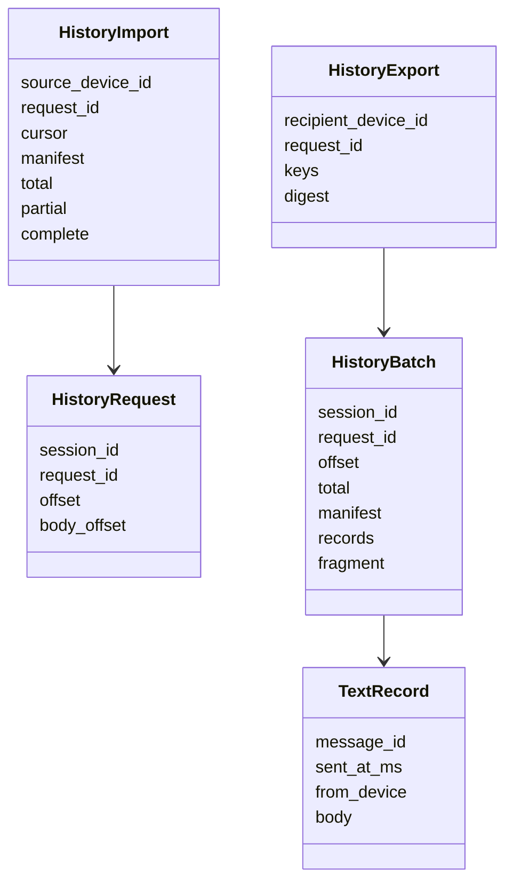
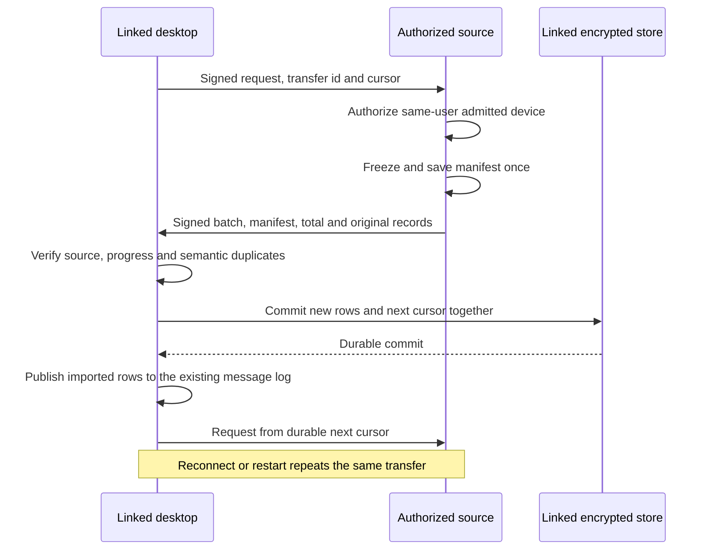

# ADR 0031: linked desktop DM history

Date: 2026-09-28
Status: Accepted for issue 25

## Boundary and format

After [independent MLS admission](0030-linked-desktop-dm-clients.md), a linked
desktop requests existing text from its authorizing device. Transfer uses
signed private device packets on the existing encrypted directed Moss stream.
The runtime owns the transfer inside the DM feature. It adds no dependency,
table, bridge operation, hosted storage, wallet or subscription requirement.

[Signal's linked-device history design](https://signal.org/blog/a-synchronized-start-for-linked-devices/)
uses a transferable message archive and batches local database imports. Mosh
uses semantic records and bounded batches over its existing P2P transport.
It preserves each installation's own encryption sessions and storage key.

`from_device` preserves the existing message author label. Admission already
maps linked devices to the same user label. The archive carries original
message ids and send times. Attachments, call events, local delivery attempts,
private keys, the database key and MLS state never enter these records.
An authorized source attests its saved semantic history. Import does not
recover discarded MLS secrets or create new counterpart delivery receipts.

## Authorization

Verify the device packet's Ed25519 signature, intended recipient and signed
roster before handling a history request or response. Require the exact
current local roster, the same Mosh user and an already admitted MLS client.
Validate the topology against the actual MLS leaf signers. A signed outsider
roster, a counterpart's valid signature or a device listed only in the roster
cannot grant history access. Pending joins cannot serve or import it.

The importer also pins its authorizing source device and transfer id. It
rejects another conversation, source, transfer, cursor, manifest or record
count. Roster rollback and unsanctioned extensions fail closed. No history
packet enters room gossip. Moss encrypts the directed stream, including relay
paths, for the exact destination peer-id bound to the signed device roster.

## Durable progress and replay

The admission request gives the importer a stable history transfer id. On
its first authorized request, the source freezes the ordered ids and times
of its available text. It saves that manifest before sending any batch.
SHA-256 identifies the ordered manifest. Each admitted recipient has at most
one initial export, retained with the conversation for exact restart/retry.
Subsequent live messages cannot change its page boundaries or completion.

Use at most 16 records per batch and check the actual signed, base64-framed
payload against Moss's default 64 KiB application ceiling. A large text uses
UTF-8 fragments. Its byte offset, author, id, time and total byte length must
match the saved partial record. Save partial text with progress; add the
message only when its body is complete. Oversized or escaped text cannot be
silently truncated.

New rows and import progress commit in one redb transaction using the
recipient's existing AES-GCM storage key. Install in-memory progress only
after that commit. A crash therefore resumes from a durable record or byte
cursor. No batch can advance progress without saving its content.

Deduplicate by message id against the existing conversation log. An identical
live copy keeps its local delivery and read state. A conflicting author, time
or body refuses the entire batch. Replayed old cursors, duplicate ids within
a batch and incomplete terminal batches cannot create rows or claim success.
Snapshots display imported and live records in original time/id order; the
underlying log remains append-only for the existing history writer.

## Runtime status and scope

`SessionSnapshot.history_sync` is optional. Existing DM snapshots remain
compatible. A newly admitted installation reports `waiting_for_source`
until it receives valid progress, `importing` while progress is recent and
`complete` only after the frozen manifest ends in a durable commit. Silence
for ten seconds or a restart returns an unfinished import to waiting. The
conversation renders waiting/importing notices in English and Russian and
removes the notice after completion. Messaging continues during import.

Completion covers available text in the source's frozen manifest. Offline
message and missed-epoch recovery is issue 26. Device revocation is issue 27.
Attachments, calls, groups, channels and platform background delivery remain
outside this slice. Transfer cannot finish without its authorized source.

## Verification and maintainability

Three real processes with independent Moss, OpenMLS, device keys and local
storage keys prove pre-link history, live text, source loss, resumed transfer,
repeat delivery and restart. Signed packet tests use real cryptographic keys,
redb and a real Moss node in an isolated worker process. They refuse outsiders,
counterparts, unadmitted devices, changed packets, conflicting records and
stale rosters. Widget tests observe the runtime status notices through
`test/support/`. Results live in [the plan](../../dm-history-transfer.plan.md).

The existing runtime, session, contracts and persistence owners retain the
size exceptions in ADR 0030. History operations live in small feature-local
modules, with one serialized DM owner and one persistence transaction owner.
The end-to-end interruption test exceeds 50 lines to keep its ordered crash,
live-message and resume assertions together. The signed-packet fixture's
startup also exceeds 50 lines to show the independently keyed native resources
in one place. Shared setup remains in helpers.
