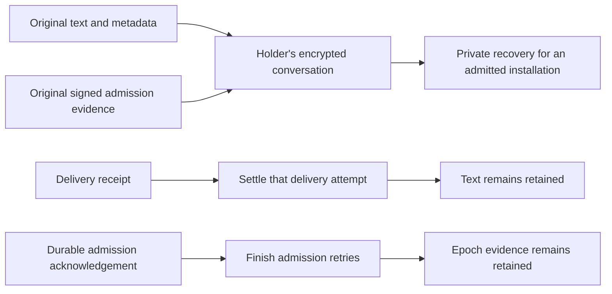
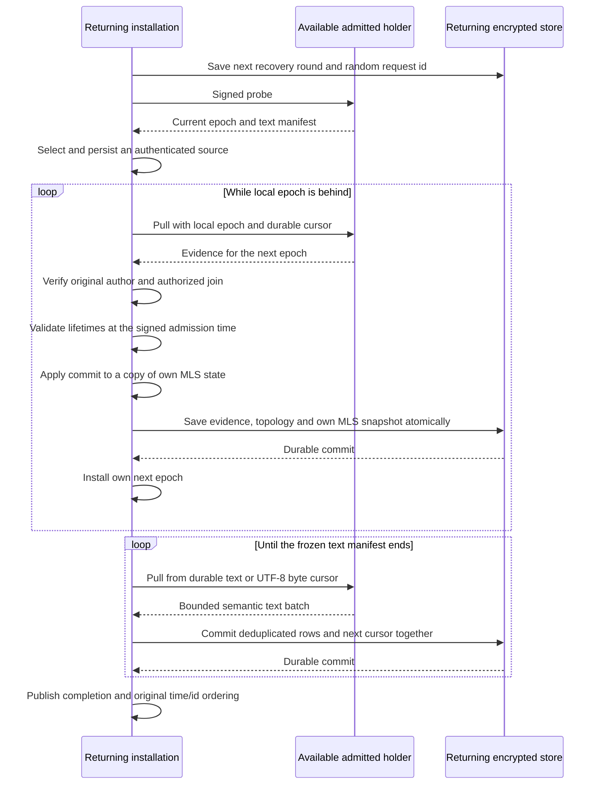

# ADR 0032: DM recovery after an installation returns

Date: 2026-09-28
Status: Accepted for issue 26

## Ownership and retention

An admitted installation recovers an existing text DM from available admitted
participants. Its own device signing key, Moss identity, MLS state and local
storage key remain independent. Recovery lives beside admission and initial
history in the private DM runtime. It reuses the directed encrypted Moss
stream, signed device packets and [semantic history importer](0031-linked-desktop-dm-history.md).
There is no new table or bridge operation. The approved OpenMLS 0.8.1
dependency patch supports authenticated historical lifetime validation.

[Signal Sesame](https://signal.org/docs/specifications/sesame/) separates
per-device sessions and retries. Mosh similarly retains semantic messages
independently of current transport attempts. A delivery receipt acknowledges
the receiving installation; it cannot erase another installation's recovery
data. Text and signed admission evidence stay in each holder's encrypted
conversation record. There is no automatic pruning in this slice.

An admission finishes retries after both the joining client and an existing
client of the other user acknowledge saving it. Waiting for every offline
installation would prevent further admission and live text. Finishing the
retry journal never removes its epoch evidence. Each receiver records the
evidence and its resulting local MLS snapshot in the same durable transition.
An acknowledgement is sent only after that commit.

Evidence carries the original author, frozen signed roster, authorized join
request, public MLS commit, group id, resulting epoch and original admission
time. The author signs
these fields with a recovery-specific context. The frozen authorization
survives later roster extensions and permits another holder to relay it.
It carries no Welcome, tree export, private key or another client's MLS state.

## Private recovery protocol

After initial admission/history completes, probe admitted participants every
five seconds for their current epoch and text manifest. Either a same-user
sibling or the counterpart can serve recovery. Recovery packets have separate
tags; initial same-user history retains its original authorization rules.

Every packet verifies its device signature, intended recipient and signed
roster. Recovery requires a device already admitted in the receiver's locally
verified topology, whose leaf signers match its own MLS group. A valid roster
prefix or extension can authenticate that known device without rolling back
the pinned roster. Unrelated roots, roster-only devices, self-sends and pending
joins cannot grant access. A device may sign a new identity claim using the
newer verified session roster while retaining its existing private key.

[RFC 9420, section 14](https://www.rfc-editor.org/rfc/rfc9420.html#section-14)
requires ordered commits for epoch transitions. Accept only the exact local
epoch plus one, for the same group, from an original author already authorized
in that epoch's topology. Verify the joiner's signed claim and key package.
OpenMLS processes the public commit on a copy of the receiver's own state;
the reconstructed topology must match its actual new leaf signers. Install
the new state only after persistence succeeds. Reject future epochs, replayed
commits, changed groups and forged or unauthorized authors.

The highest advertised required epoch remains durable across source switches.
An older holder can contribute text, but cannot claim epoch completion while
that known transition is missing. If a holder lacks the next commit, wait or
select another available source; never replace local MLS state with its state.

## Text progress and source switching

Use original message ids, authors, send times and bodies from ADR 0031.
Each source freezes its own ordered manifest and persists it before sending.
The current recovery export is bounded to one manifest per recipient. A new
durable round replaces that recipient's previous export, while an older round
cannot replace it. Text packets retain the 16-record bound, actual signed
64 KiB frame check and UTF-8 fragment handling.

The recipient persists the active source, round, request id, manifest, cursor
and partial text. A batch must match all those fields. Save imported rows and
progress together under the recipient's own storage key. Install progress
only after the transaction succeeds. Identical live text keeps its existing
receipt state; conflicting metadata or bodies refuse the entire batch.
Matching live rows participate in that transaction even before the ordinary
history tail writer runs. Observing an equal manifest also saves the matching
visible text before recording it as already received. A crash cannot leave a
durable completion/observation marker ahead of those rows. Initial history and
recovery share one commit/publish helper and one signed-frame ceiling check.

Selecting a source and saving each batch immediately pull the next batch, so
a transfer runs at round-trip speed. The two-second device pump repeats a
pull only when no pull went out during that interval.
After ten seconds without source progress, start a new round and probe again.
A replacement source starts at its own frozen manifest's first record.
Already imported rows remain deduplicated; incomplete fragments from the old
source are discarded. Late packets from an earlier round, request or source
cannot advance the replacement cursor. Restart resumes a persisted source
cursor before giving it the same timeout. Live text continues during recovery.

The existing optional `SessionSnapshot.history_sync` reports waiting,
importing and complete. Missing known epochs or unavailable holders report
waiting. Recent valid transfer progress reports importing. Completion covers
the available frozen manifest and verified required epoch, and orders recovered
and live text by original send time/id, including on an original desktop.
English and Russian notices refer to an available participant.

## Compatibility, future storage and checks

Recovery fields are optional in the encrypted session record; old stores load
without a migration or new key. Older runtimes cannot provide commit evidence
they already discarded. No source can reconstruct deleted text or absent
commits. A receipt on one installation does not change these retention rules.

Unpatched OpenMLS validates Add lifetimes against the current clock, so an
expired joining package would prevent long-offline recovery. The user approved
vendoring the same version with a
[scoped historical-validation patch](../Proposals/openmls-historical-validation.md).
Only after verifying the original author, roster, same group and exact next
epoch does recovery validate at the author-signed admission time. The scope
is synchronous and local to the calling thread; return or panic restores the
previous policy. Zero and implausibly future times are refused. Package/leaf
signatures and lifetime windows remain checked. The shared decoder enforces
OpenMLS's maximum range of 84 days plus its one-hour skew margin. Normal
admission still uses the actual clock. Legacy evidence without an authenticated
time keeps its v1 signature and current-clock policy; its expired package cannot
establish historical validity. Recovery never imports another client's MLS state.

The protocol separates retained epoch evidence from semantic text import.
A future hosted storage adapter can supply those records through this boundary
without owning device keys or replacing the importer. This slice adds no hosted
storage, subscription, wallet, capability or attachment behavior. Revocation
and retention pruning need their own authorization and per-device policy.

Real independent processes cover offline/restart, counterpart-only recovery,
partial import/source replacement, concurrent live text, all holders absent,
and two ordered missed epochs after other clients acknowledged them. Temporary
extra clients generate genuine admission commits; each owns real independent
keys and stores. Signed packet tests cover admitted-device authorization,
prefix rosters, replay/cursor refusals, conflicting records, original-author
proofs, wrong groups, future epochs and restart between epochs. A genuine
100-day-old signed admission covers expired replay, invalid/tampered times,
package/commit signature failures, lifetime limits and continued bidirectional
MLS messages after restart. Public patched-API tests cover nested scopes,
thread isolation and cleanup on panic. Widget tests
observe waiting/importing/completion through `test/support/`.

Results and the exact changed-file inventory live in
[the approved plan](../../dm-offline-recovery.plan.md). Existing runtime/session
size exceptions from ADRs 0030/0031 remain. Ordered native interruption and
two-epoch tests, plus signed-packet scenario helpers, may exceed 50 lines to
keep their durable transitions and caller-visible assertions together. New
production recovery files remain below the repository's file/type limits.
The existing `MlsSessionCrypto` file/type also exceeds those limits; this change
shares package construction and adds its common lifetime-range validation.
Historical signed scenario helpers have the same function-size exception.
Vendored upstream files retain their original structure and are exempt from
Mosh size limits; the local patch is documented beside the dependency.
