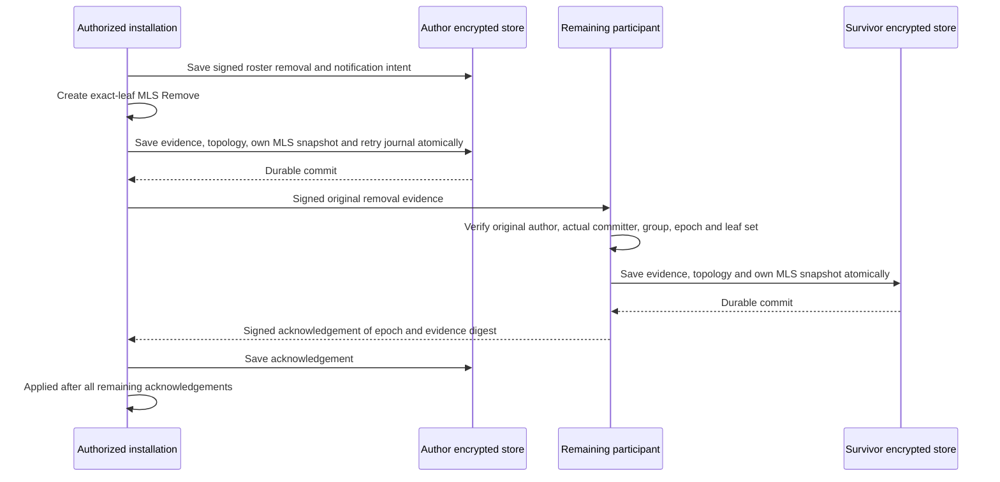

# ADR 0033: Linked installation revocation in text DMs

Date: 2026-09-28
Status: Accepted for issue 27

## Authorization and ownership

Settings, Devices can remove another installation. Self-removal is refused.
The device-link runtime owns the private roster change and its notification
journal; each private DM owns its MLS transition and acknowledgement journal.
Both reuse existing encrypted redb records, directed Moss streams and runtime
owners. No dependency, table, hosted service or Moss source changes are needed.
The user approved the contracts, optional record fields and test boundaries in
[the implementation plan](../../dm-device-revocation.plan.md).

This follows MLS's existing
[Remove proposal rules](https://www.rfc-editor.org/rfc/rfc9420.html#section-12.1.3)
and the per-device ownership used by
[Signal Sesame](https://signal.org/docs/specifications/sesame/).
Every installation keeps its own signing key, Moss identity, MLS state and
storage key. Removal retires one admitted leaf; it never copies a surviving
installation's state or rotates that installation's identity.

Roster additions retain their v1 serialization, signatures and digests. A v2
removal signs the parent digest, exact device descriptor and currently active
author under `mosh-device-roster-remove-v2`. Verification replays the whole
chain to calculate current authorization. A removed signer cannot authorize
new operations. Adopt only extensions of a pinned chain; unrelated roots,
rollback and competing forks fail. Concurrent fork merging remains out of scope.

Roster entries are private and immutable. Cache signature verification and
effective devices for that exact chain in memory. Clones keep the same verified
chain; appending constructs a new chain with a cold cache. The cache is omitted
from serialization, so every decoded packet or stored chain verifies again.
This keeps repeated outbox and snapshot authorization checks from delaying
typing controls and recovery beyond their existing timeouts. Authorization of
an admitted leaf uses one shared predicate for its active exact descriptor and
absence of an intervening removal.

Save the roster and notification intent before sending. Notifications and
acknowledgements use recipient-bound signed packets on private stream 3.
A removed recipient can acknowledge its notification with its historical
identity key; that receipt grants no access. Device-link and DM owners refresh
the encrypted identity row before actions. An update compares the exact bytes
previously read inside the write transaction, preventing a stale owner from
rolling back another owner's roster or pairing state.

## Removal epoch and durable boundary

Only the author of a signed roster removal originates its MLS Remove. Apply
multiple removals in signed roster order rather than topology/leaf order.
For each admitted target, use the first removal after that leaf's admission.
A later roster addition cannot renew a leaf retired by an intervening removal.
Pin newly observed roster authorization separately until the corresponding
MLS transition is applied; never advertise an old MLS topology under a roster
that already removes one of its clients.

Original evidence binds the conversation, group, next epoch, target, author,
frozen removal roster and actual MLS commit with a distinct signature context.
A receiver authenticates the active admitted relay and verifies the original
author against the preceding topology. The roster must authorize that exact
removal. OpenMLS must identify the same author as its commit sender. Accept
only the exact next epoch of the same group, then compare actual leaf signers
with a topology containing every previous client except the target.

Install staged MLS state only after persistence succeeds. Retry original
evidence unchanged until every remaining admitted installation acknowledges
its durable save. The removed installation is excluded. A later removal also
removes that target from earlier waiting cohorts and unfinished admission
delivery, so pending status cannot wait forever for an unauthorized device.
Exact duplicate evidence is acknowledged without applying another epoch.
Evidence remains retained after its retry journal settles.

`DeviceLinkSnapshot.revocations` reports pending while any affected local DM
still contains the retired target leaf or awaits a remaining participant's acknowledgement;
otherwise it reports applied. `SessionSnapshot.device_revocation` separately
reports pending, applied or revoked for that DM. These states survive restart.
Fresh roster permission retains outstanding removal status until the old
transition settles; a new admitted leaf does not keep that old removal pending.
An offline participant cannot acknowledge a transition it has not received.
It can still use its old epoch until it learns the removal. Protection from
future ciphertext starts when honest senders accept the removal epoch; the UI
does not promise instant global removal or remote history erasure.

## Recovery, refusal and fresh permission

Current effective authorization gates live frames, identity claims, history
requests, recovery probes/pulls and new admission. An old correctly signed
roster or request cannot grant a removed client fresh text, Welcome or keys.
After a group returns to two clients, it keeps directed device routing and
recovery rather than falling back to legacy channel publication.

An honest offline survivor applies retained Add and Remove evidence in epoch
order to its own MLS state. An available authorized holder can relay original
evidence when the author is offline. Intermediate historical Add evidence can
reconstruct an old epoch on this correlated recovery path; direct replay of
that same admission after removal is refused. Text import waits for required
epochs and retains the existing semantic ids, metadata, deduplication and
atomic cursor boundary from ADRs 0031/0032. Removing an active source abandons
its incomplete transfer and lets ordinary recovery select an authorized holder.

A removed installation keeps its original identity and locally received text.
Its DM composer and runtime send path are disabled, including after restart.
Request access again creates a fresh QR bound to the same user. The existing
human code approval must extend the post-removal roster; retained history
cannot authorize joining another user. A matching nonce-bound approval can
finish if its signed roster notification arrived first, but a consumed approval
cannot restore a later-removed device.
Service ticks and restart preserve only the matching pending QR/addition until
its nonce-bound approval completes or expires.

Fresh roster permission still requires new independent MLS keys and an ordinary
authenticated Join/Welcome for each old DM. Preserve local semantic history
while replacing only that installation's obsolete membership. Neither an old
QR nor a roster re-addition restores the removed MLS leaf.

## Compatibility and verification

New identity/session fields are optional with defaults; existing encrypted
rows load without migration. New private packet tags require updated peers.
Older runtimes cannot implement removal and must fail closed on unknown roster
operations; mixed-version availability is not promised. Nothing changes
attachment, group, call, wallet or Android foreground behavior.

Real independent installations prove durable pending/restart, surviving text,
removed-client decryption refusal using its own old MLS state, positive-control
sync followed by refusal of old/re-signed/fresh requests, ordered Add/Remove
recovery with the author offline, and fresh same-user permission/history retention.
Signed packet tests cover forgery, wrong author/committer/leaf/group/epoch,
replay, early roster claims, rapid repermission and multiple removal order.
Widget tests use `test/support/`; the actual Devices screen exercises cancel
and confirm, revoked settings and fresh approval through the native bridge
and another Moss process.

Run Moss preparation, Rust format/build/test/strict Clippy, Flutter format/
analysis/tests and bridge codegen with a drift check. Changed handwritten code
coverage combines worker-process profiles and Flutter/native UI coverage.
Generated bindings are checked through native execution and a regeneration
drift check. Linux is the available host; Windows and macOS require their own
runners. Branch coverage depends on toolchain support.

Inherited runtime, session and generated binding size exceptions from ADRs
0030-0032 remain. `DeviceRoster` exceeds 200 aggregate implementation lines
to keep existing signature serialization and append-only verification together;
its file remains below 400 lines. Native multi-step and signed cryptographic
scenario helpers may exceed 50 lines to keep the ordered transitions and
caller-visible assertions together. New production functions remain at most
50 lines and revocation/rejoin modules remain below file limits.
