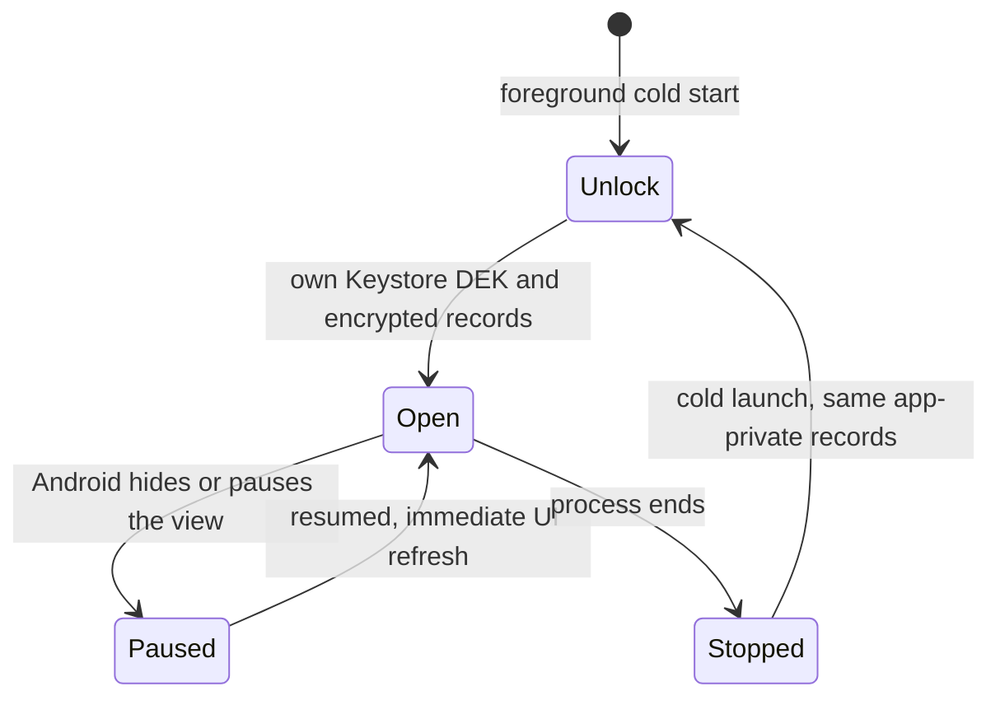
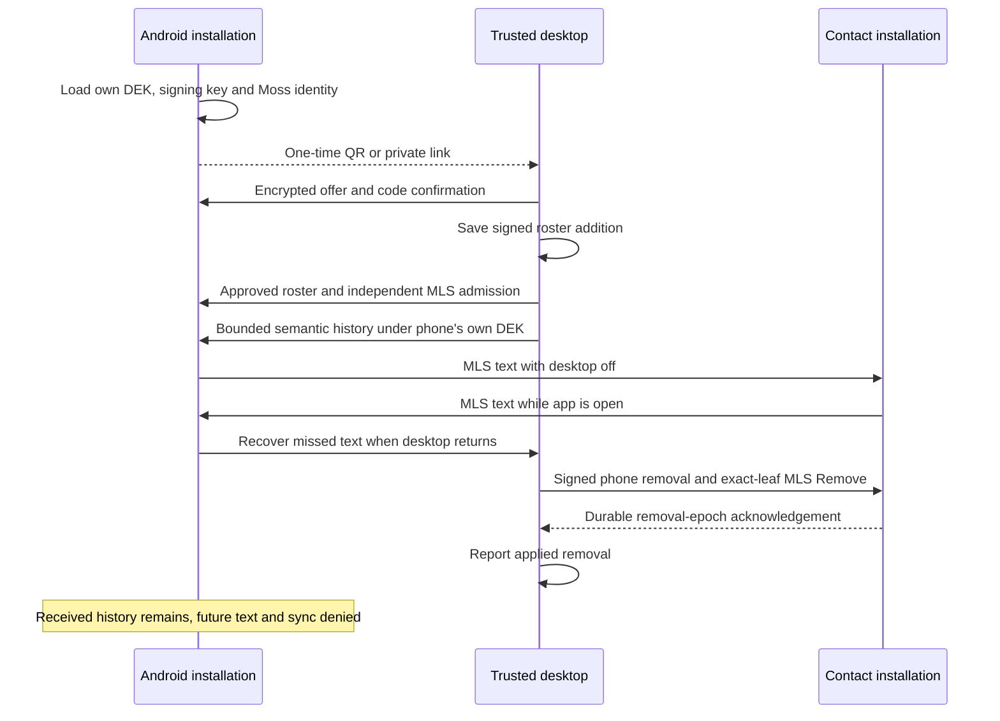

# ADR 0034: Android linked text DM in the foreground

Date: 2026-09-28
Status: Implemented for issue 28; physical-device verification pending

## Installation ownership

Android uses the same signed user roster and independent installation model
as desktops, described in ADRs 0029–0033. Its device signing key, Moss peer-id,
local MLS client and encrypted history restore from its own app-private store.
The DEK is loaded through the existing user-presence-gated Android Keystore
path before any native runtime constructs. A cold start decrypts the existing
records; it does not mint replacement identities or obtain desktop private keys.

Do not back up or transfer the installation using Android system backup.
Restoring the database without its Keystore key would orphan history; copying
installation keys would violate independent device identity. Disable legacy
backup and explicitly exclude every Android storage domain from cloud backup
and device transfer on Android 12+. A new installation uses fresh confirmed
linking. See [Android backup rules](https://developer.android.com/identity/data/autobackup).

The main manifest declares `INTERNET`, including release builds. The existing
arm64 packaging builds real Moss and Rust libraries. Discovery remains automatic.

## Foreground ownership

One `ForegroundPoller` owns each existing UI poll timer and its Flutter
`AppLifecycleListener`. On Android it stops UI reads while hidden or paused and
refreshes immediately after returning to `resumed`. The intermediate `inactive`
state does not resume a previously paused loop. Visible inactive states, such
as file-picker or biometric prompts, do not interrupt an already active loop.
Disposal cancels the timer and removes its observer. Desktop timers retain
their prior behavior, including hidden windows.

The conversation poller preserves its existing per-kind in-flight guards.
A pending read does not gain a duplicate on resume. The Devices controller
retains its action revision guards. Neither timer reconstructs native owners,
injects a new DEK, changes a roster or replaces a Moss node. Native service
threads and recovery journals remain the protocol owners.

## Linking, history and removal

Use the existing Settings, Devices section with device-neutral wording.
The fresh phone displays a QR. The trusted desktop imports its screenshot or
private link, then confirms the code read from that phone. Initial history
requires the authorized source to remain online; subsequent messaging and
missed-history recovery can use the other admitted participant while the
original desktop is off. No wallet, subscription or hosted storage is involved.

Removal uses the existing signed roster and exact-leaf MLS transition.
Protection begins after remaining participants have saved the removal epoch.
An offline honest participant applies the missing transitions before it can
resume current-epoch messaging. Old QR requests do not restore authorization.
Received history remains local, including on the removed phone.

## Verification and limits

The confirmed test boundaries and baseline are in
[the implementation plan](../../android-linked-dm.plan.md).
The host runner uses the existing public-API native installation workers and
the real Flutter bridge. Its authenticated loopback control connection through
`adb reverse` only coordinates assertions; QR, history, MLS and text traffic
use real Moss default discovery. Debug tests have a separate application id.
Two process runs retain the phone's data without clearing it between phases.
The shared scenario mounts the existing DM screen with its production polling
interval, checks rendered incoming text and sends from the composer. Contact
restart interrupts the surviving phone's connection while the original desktop
is off. On Android, Home and Activity return surround that interruption.
The desktop mode runs the same scenario with independent real processes and
explicitly does not claim Android evidence.

The physical runner's `main` exceeds 50 lines so preparation, the two process
phases and owned-resource cleanup stay visible in one orchestration function.
Protocol assertions remain in smaller stage methods; no production size limit
exception is required.

Physical arm64 verification requires a local host attached to the phone. It
cannot run on this server. Commands and the result checklist are in
[the Android feature guide](../Features/android-linked-dm.md).
No background Android delivery guarantee, foreground service, push subsystem,
iOS support, device limit, Mosh+, external storage, other conversation kind,
attachment or call capability is added by this slice.
