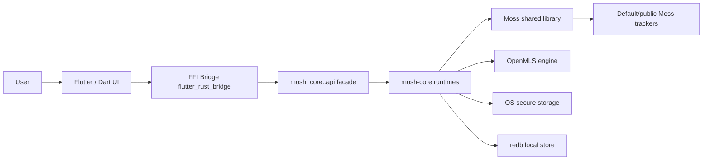
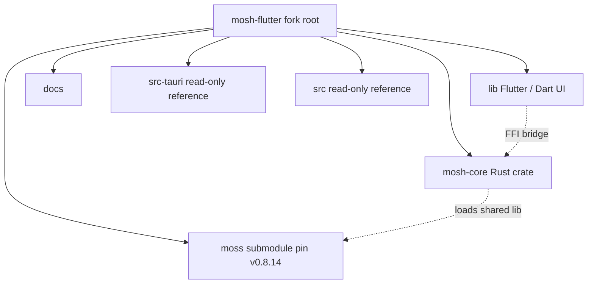
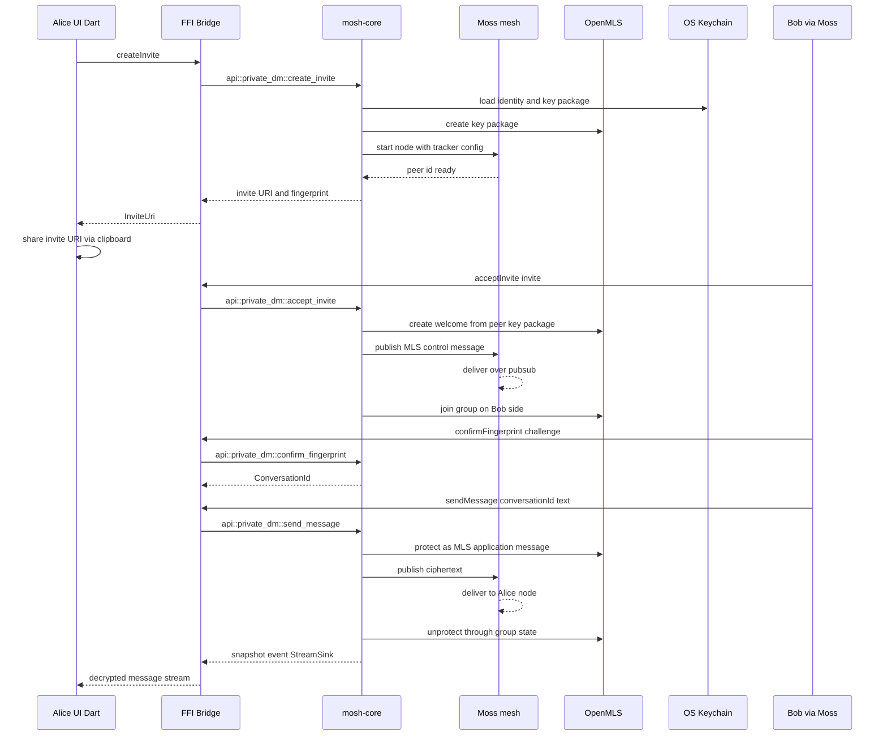
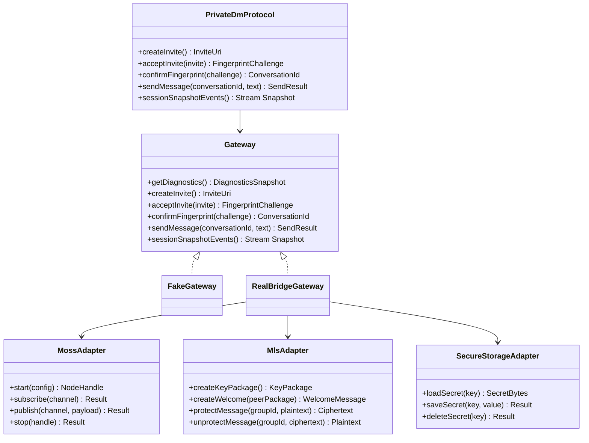

# Mosh Architecture (Flutter fork)

This is the global architecture map for the Flutter-rewrite fork (`mosh-flutter`). It replaces the upstream Tauri + React view. Decisions live in the ADRs referenced below; this document is the assembled picture.

## Purpose

Mosh is a desktop-first decentralized end-to-end-encrypted messenger. In this fork the application shell is a Flutter + Dart UI over the retained `mosh-core` Rust runtime: MLS group secrets live in OpenMLS, transport runs over the Moss mesh, secrets are held in OS secure storage, and message history persists to a local redb store. The shell is desktop-first (Windows, macOS, Linux) with Android and iOS from the same codebase; only the Flutter shell and frontend are rewritten, the Rust core is not.

## System Boundaries

Dart never crosses this seam except through the generated bridge. The `api` module is the only Rust surface the bridge binds; it is a thin facade over the runtimes (private_dm, group, channel, org, voice, attachment, persistence, secure_storage). Secrets, MLS state, Moss transport, and redb persistence all live on the Rust side of the boundary (ADR 0009, ADR 0010).

## Repository Boundaries

`mosh-core/` is the built Rust runtime. `moss/` is the Moss Go shared library, pinned at `v0.8.14` inherited from upstream. `lib/` is the Flutter + Dart frontend. `docs/` holds this map, the ADRs, the glossary, and the plan. `src-tauri/` and `src/` are kept on disk as read-only design reference for the bridge API contract (the Tauri command list is the verbatim checklist for the `api` module) but are NOT built or shipped from this fork (ADR 0013). Do not modify `src-tauri/` or `src/` from this fork; they exist to guide the port and are removed at upstream merge time.

## Private DM Slice

This reuses the invite / fingerprint / send flow already proven in the Tauri frontend; only the seam between UI and runtime changes from Tauri commands to the generated bridge. Snapshot delivery is a `StreamSink<T>` on the Rust side and a Dart `Stream<T>` on the UI side, replacing the old Tauri `app.emit` events (ADR 0009, ADR 0010). The fingerprint confirmation gate blocks `sendMessage` until the user confirms the safety number; this is a UI-side gate enforced by the Dart orchestration layer over the `Gateway` interface.

## Interface Contracts

`Gateway` is the Dart seam declared in slice one (ADR 0013). `FakeGateway` is the temporary in-Dart test double used so widget tests run without the Rust runtime; `RealBridgeGateway` wraps the generated `flutter_rust_bridge` `api` and is the production path. The Rust `api` module owns the `MossAdapter`, `MlsAdapter`, and `SecureStorageAdapter` composition; Dart never instantiates them directly. The `api` surface is the verbatim Tauri command list plus a `StreamSink<T>` function for each former Tauri event (ADR 0010).

## State Ownership

- Server / runtime state (sessions, messages, snapshots, diagnostics, delivery status) comes from `mosh-core` through the bridge and lives in Riverpod `AsyncNotifierProvider`s as `AsyncValue<T>`. UI consumes it with `.when(loading:, error:, data:)`. This is the direct analogue of TanStack Query server state (ADR 0010).
- Ephemeral UI state (open drawer, selected session, composer draft, modal visibility, animation controllers) lives in `StatefulWidget` state or `flutter_hooks`, never in providers. This is the direct analogue of Zustand granular stores vs local React state.
- Reads use `ref.watch(provider.select(...))` so widgets rebuild only on the slice they care about.
- There is no `useEffect + useState` analogue for fetching; `AsyncNotifier.build` is the single entry point for async state.
- Secrets (MLS keys, org root keys, the redb at-rest history key) live in `mosh-core` secure storage, never in Dart. Desktop uses the `keyring`-backed `OsSecureSecretStore`; mobile uses a Flutter platform channel into Android Keystore / iOS Keychain. The at-rest history key never touches disk in plaintext (ADR 0011).
- Private message history stores ciphertext plus minimal metadata in redb; the store is encrypted at rest.

## Port Boundary

What is in Dart vs `mosh-core`, per ADR 0012.

In Dart (UI, UI-flow orchestration, human-readable-string parsing, display computation):

1. `invite_uri.dart` (parse `mosh://invite?...#fp=...` with the same contracts and error codes as `invite-uri.ts`).
2. Clipboard invite detection via `Clipboard.getData` in a Riverpod notifier.
3. `unread.dart`, `format.dart`, content strings (to ARB).
4. Riverpod `AsyncNotifier`s consuming bridge streams; the `call-state` phase state machine as UI orchestration.
5. Ringtone playback via a platform audio plugin (UI sound, not transport).

In `mosh-core` (crypto, binary wire formats, transport buffers, persistent state):

1. `voice_call_frame_crypto.rs` (AES-GCM frame seal/open; one source of truth for the wire format).
2. `voice_call_jitter.rs` (reorder buffer).
3. `voice_call_drain.rs` (drain loop as a runtime method).
4. MLS state, Moss transport, redb persistence, secure storage.

Dart never touches AES-GCM, binary frame layouts, or transport buffers directly. The bridge is the only crossing (ADR 0012).

## Build And Dependency Model

- `mosh-core` `Cargo.toml` sets `[lib] crate-type = ["lib", "cdylib", "staticlib"]` so one crate serves all six targets: desktop links the `cdylib`, Android links `cdylib`, iOS links `staticlib` (ADR 0010).
- `flutter_rust_bridge` generates typed Dart bindings from `mosh_core::api`; `rust_input: crate::api`, `rust_root: mosh-core/`, `dart_output: lib/src/rust`. Codegen runs in the build script and in CI, not manually; a drift job fails if committed bindings desync from Rust signatures (ADR 0010, plan S7).
- The `moss/` submodule stays pinned at `v0.8.14` inherited from upstream. Slice one does NOT bump the pin; any future bump is a deliberate step with its own ADR note (plan, Moss release pin).
- i18n uses Flutter's `gen-l10n`: ARB files under `lib/l10n` (`app_en.arb` template, `app_ru.arb`), `l10n.yaml` config, `AppLocalizations` output. `flutter: generate: true` in `pubspec.yaml`. A `gen-l10n`-drift CI job fails if generated output or ARB desync (ADR 0014, plan S7).
- Animation uses Flutter's own primitives (`AnimationController`, `Tween`, `AnimatedBuilder`) under a feature-local helper; no GSAP-equivalent third-party library until a concrete need forces it (ADR 0010).
- Fork version line is `0.8.0-dev`, separate from upstream `mosh` 0.7.x (ADR 0015).

## Crypto And Privacy Model

This domain context is inherited unchanged from upstream; the Flutter rewrite does not alter it.

- Moss provides P2P delivery, peer discovery, and encrypted transport sessions over the mesh.
- OpenMLS provides private DM message-layer E2EE.
- Public/default trackers are used for v1 discovery, so metadata privacy is limited.
- The UI must say private messages are content-encrypted, not anonymous.
- Public chats are planned as signed/authenticated but non-confidential messages.
- The voice-call wire frame (`[seq:u64 BE][ciphertext-with-tag]`, AES-GCM nonce `[nonce_prefix(4)][seq(8)]`, direction bit in seq) lives in `mosh-core` only, so there is one source of truth (ADR 0012).

## Slice One Scope

Slice one proves the bridge, the state stack, i18n, and the core DM flow on desktop, behind a temporary fake gateway that is removed (or kept flagged) before the slice closes. Reference: `flutter-rewrite.plan.md`.

- Onboarding (display name).
- Invite paste (`mosh://invite?...#fp=...`) parsed via ported `invite_uri.dart`; manual paste only, NO `mosh://` deep-link OS association (ADR 0015).
- Fingerprint confirm gate that blocks `sendMessage` until the safety number is confirmed.
- One DM screen (message list + composer) over the fake gateway.
- Diagnostics screen showing runtime status.
- i18n in `ru` and `en` via `gen-l10n`; `LocaleProvider` seam laid so a manual language switch can be added later as one widget.
- Desktop-only build; no mobile cross-build, no `integration_test` on devices in slice one.
- Fake gateway as the default `Gateway` behind a debug flag; real bridge swapped in at S5 with no widget changes (ADR 0013).
- Port `invite-uri.ts`, `invite-detection.ts`, `unread.ts`, `format.ts`, `private-dm.content.ts` to Dart; move `frame-crypto.ts`, `jitter-buffer.ts`, `call-drain.ts` into `mosh-core` (ADR 0012).

Out of scope for slice one: deep-link `mosh://` OS association, mobile Moss builds and mobile secure-storage platform channels, voice call / org / VPN / channels / private groups Dart UI (runtimes are bound via `api` but the UI is later slices), manual language switch UI.

## References

- docs/ADR/0009-flutter-shell-replaces-tauri-frontend.md - Flutter shell replaces Tauri frontend.
- docs/ADR/0010-flutter-rust-bridge-and-state-stack.md - flutter_rust_bridge + Riverpod state stack.
- docs/ADR/0011 - secure storage and at-rest history key (referenced by glossary).
- docs/ADR/0012-port-strategy-what-goes-to-dart-vs-mosh-core.md - port boundary: Dart vs mosh-core.
- docs/ADR/0013 - temporary fake gateway and read-only reference policy for `src-tauri/` / `src/`.
- docs/ADR/0014 - i18n via `gen-l10n`, `LocaleProvider`.
- docs/ADR/0015 - fork version line `0.8.0-dev`, deep-link deferral.
- docs/flutter-fork-glossary.md - Flutter fork ubiquitous language.
- flutter-rewrite.plan.md - slice scope and ordered implementation steps.
