# Mosh Architecture (Flutter fork)

This is the global architecture map for the Flutter-rewrite fork (`mosh-flutter`). It replaces the upstream Tauri + React view. Decisions live in the ADRs referenced below; this document is the assembled picture.

## Purpose

Mosh is a desktop-first decentralized end-to-end-encrypted messenger. In this fork the application shell is a Flutter + Dart UI over the retained `mosh-core` Rust runtime: MLS group secrets live in OpenMLS, transport runs over the Moss mesh, secrets are held in OS secure storage, and message history persists to a local redb store. The shell is desktop-first (Windows, macOS, Linux) with Android and iOS from the same codebase; only the Flutter shell and frontend are rewritten, the Rust core is not.

## System Boundaries

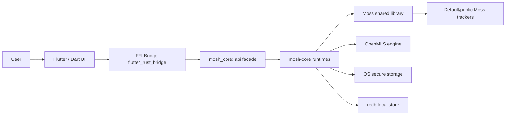

Dart never crosses this seam except through the generated bridge. The `api` module is the only Rust surface the bridge binds; it is a thin facade over the runtimes (private_dm, group, channel, org, voice, attachment, persistence, secure_storage). Secrets, MLS state, Moss transport, and redb persistence all live on the Rust side of the boundary (ADR 0009, ADR 0010).
The Dart side reaches `api` through two surfaces (ADR 0025): the `Gateway`
seam -- `RealBridgeGateway` delegating to the generated free functions in
`lib/src/rust/api/` -- for the conversation methods, and the concrete
`BridgeFacade` for everything that mirrors one bridge call 1:1. The app ships
only the real implementations; tests swap in `ScriptableGateway` and
`ScriptableBridge` (`test/support/`) through the providers. Conversation
callers consume `gatewayProvider`, never a concrete `Gateway` (ADR 0013);
mirror callers consume `bridgeFacadeProvider`. The `api` facade
itself is real for `diagnostics` + `private_dm` (OnceLock singleton, ADR 0016)
and stubbed (`todo!()`) for `channel`, `private_group`, `org`, `network`,
`vpn` — five stubs whose signatures are laid so the bridge generates against
the full command surface before later slices wire them.

## Repository Boundaries

`mosh-core/` is the built Rust runtime. `moss/` is the Moss Go shared library, pinned at `v0.8.14` inherited from upstream. `lib/` is the Flutter + Dart frontend. `docs/` holds this map, the ADRs, the glossary, and the plan. `src-tauri/` and `src/` are kept on disk as read-only design reference for the bridge API contract (the Tauri command list is the verbatim checklist for the `api` module) but are NOT built or shipped from this fork (ADR 0013). Do not modify `src-tauri/` or `src/` from this fork; they exist to guide the port and are removed at upstream merge time.
## Gateway and Provider Layer (slice one)

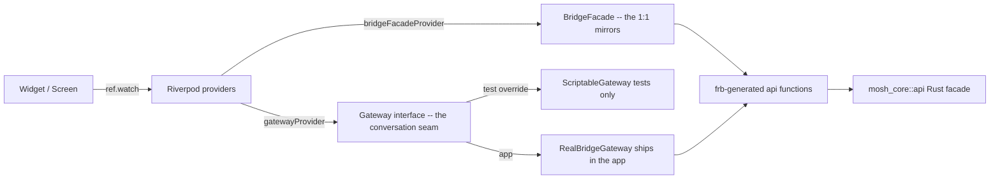

Slice one ships three providers behind the bridge providers in
`lib/src/state/session_providers.dart`: `activeSessionProvider.family`
(FutureProvider.family for a per-session snapshot, the DM screen poll),
`diagnosticsProvider` (AsyncNotifierProvider for `appDiagnostics`), and
`inviteFlowProvider` (sync NotifierProvider for the cross-screen invite-create
flow: displayName + listenPort + lastInvite). The session LIST is no longer
one of them: one family, `conversationListProvider`
(`lib/src/state/conversation_providers.dart`), serves the DM, channel and
group lists with the kind as its family arg, so the kind branch that used to
be three list providers lives in one module. The snapshot poll consumes
`gatewayProvider`, never a concrete `Gateway` (ADR 0013); the list and invite
reads consume `bridgeFacadeProvider` (ADR 0025).

That one module also owns the only kind-to-invalidate switch in the state
layer: `invalidateConversation(ref.invalidate, conversation)` re-reads the
snapshot family the kind names, and `refreshConversation` adds the DM rail
list (a DM row carries its last message, a channel and a group row carry a
name only). `unreadCountsProvider` is the same shape one level up -- one
family, one branch in `unreadCounts`, keyed by `ConversationRef.key`.

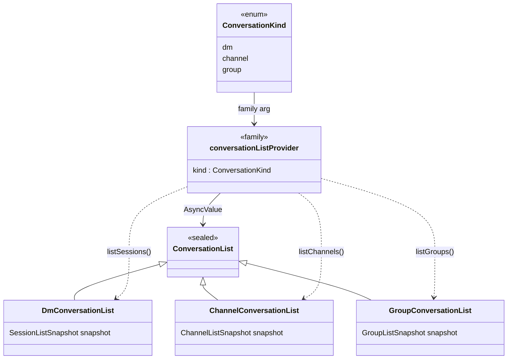

## Private DM Slice

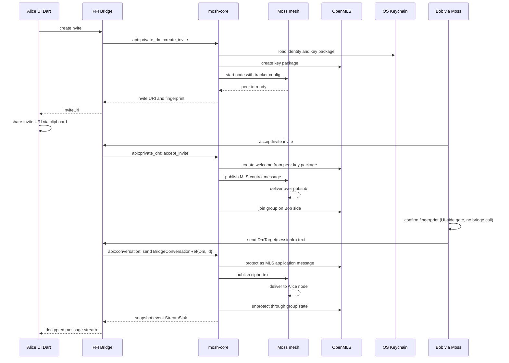

This reuses the invite / fingerprint / send flow already proven in the Tauri frontend; only the seam between UI and runtime changes from Tauri commands to the generated bridge. Snapshot delivery is a `StreamSink<T>` on the Rust side and a Dart `Stream<T>` on the UI side, replacing the old Tauri `app.emit` events (ADR 0009, ADR 0010). The fingerprint confirmation gate blocks `sendMessage` until the user confirms the safety number; this is a UI-side gate enforced by the Dart orchestration layer over the `Gateway` interface.
Slice one is poll-based, not stream-based: `api::private_dm` exposes no
`StreamSink` in slice one (the React frontend polled on `AUTO_POLL_MS`), so
the DM screen re-polls `activeSessionProvider.family`. The sequence above is
the design intent; the slice-one proof is
`integration_test/slice_one_test.dart` (see Features/private-dm.md).

## Interface Contracts

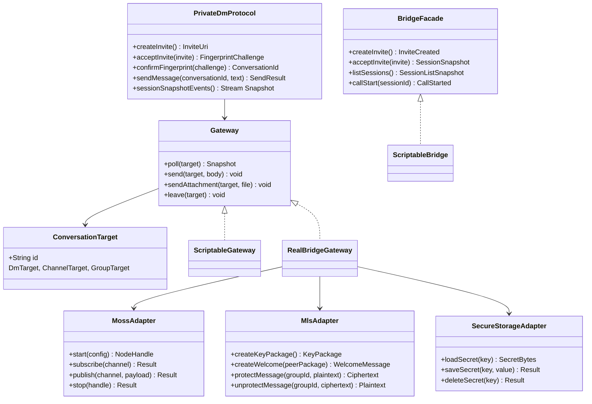

`Gateway` is the Dart seam declared in slice one (ADR 0013). `ScriptableGateway` (in `test/support/`, never shipped) is the test double that lets widget tests run without the Rust runtime; `RealBridgeGateway` wraps the generated `flutter_rust_bridge` `api` and is the production path. The Rust `api` module owns the `MossAdapter`, `MlsAdapter`, and `SecureStorageAdapter` composition; Dart never instantiates them directly. The `api` surface is the verbatim Tauri command list plus a `StreamSink<T>` function for each former Tauri event (ADR 0010), except the six shared conversation actions, for which ADR 0024 replaces the mapping with one function per operation, the conversation kind carried in the argument.
Since ADR 0025 the `Gateway` surface has 8 methods -- the conversation seam:
`poll`, `send`, `retry`, `sendAttachment`, `downloadAttachment`,
`cancelAttachment`, `dismissDmOffer` and `leave`, each taking a
`ConversationTarget` instead of coming in a DM, channel and group flavour, so
one method serves all three kinds (ADR 0017). For the six shared actions
`RealBridgeGateway` converts the target to a typed `BridgeConversationRef` and
calls one shared bridge function — the kind dispatch lives in the bridge
(ADR 0024); only `dismissDmOffer`, which a DM cannot answer, still switches in
the adapter. The other 34 former methods -- org, VPN, call, diagnostics,
session setup, the channel/group joins and lists -- mirror one
`mosh_core::api` signature 1:1, hide no decision, and left the interface:
their callers reach the concrete `BridgeFacade` (`lib/src/gateway/
bridge_facade.dart`) through `bridgeFacadeProvider`, and tests fake it with
`ScriptableBridge` only where a screen needs canned data or a scripted
failure. The two doubles share one `ScriptedConversations` state, mirroring
the single Rust runtime both Dart surfaces are views over. The voice-call
audio adapters (capture, playback, ringtone) stay outside both surfaces on
purpose: they wrap OS audio through their own factory providers and hold no
Rust domain state, so there is nothing to fake at the bridge. The
`api` facade is real for `diagnostics` + `private_dm` and stubbed for the
other five families until later slices.

## Conversation Module

One module renders and drives every conversation: the DM, the public channel
and the org group (ADR 0018). It lives in `lib/src/features/conversation/`.

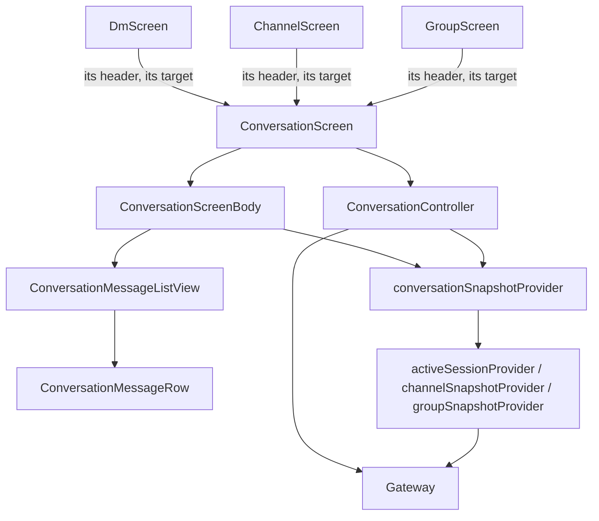

Each kind supplies its app bar and its target, and each kind's screen and app
bar live in this module beside the chrome they share, so the conversation
module imports no other conversation-shaped module. Everything below the
header is shared: one controller for send / retry / attachments / voice /
leave / peer DM, one body, one message list, one row. The screen hands the
header and the body one `ConversationChrome` -- the search text, the filter,
the mobile search panel, the peer-status drawer and the leave action -- so
neither holds a copy of the screen's state.

The one thing a conversation does not own is the call a DM can carry. It
declares what it needs from one in `conversation_call_binding.dart` and never
imports the module that answers; see Voice Call Module below.

The three generated snapshots map into one sealed view, so the shared code
reads one message shape while the kind-only surfaces — the peer-status
drawer, the group rejoin warning, the leave dialog's label — still reach
their own typed source snapshot.

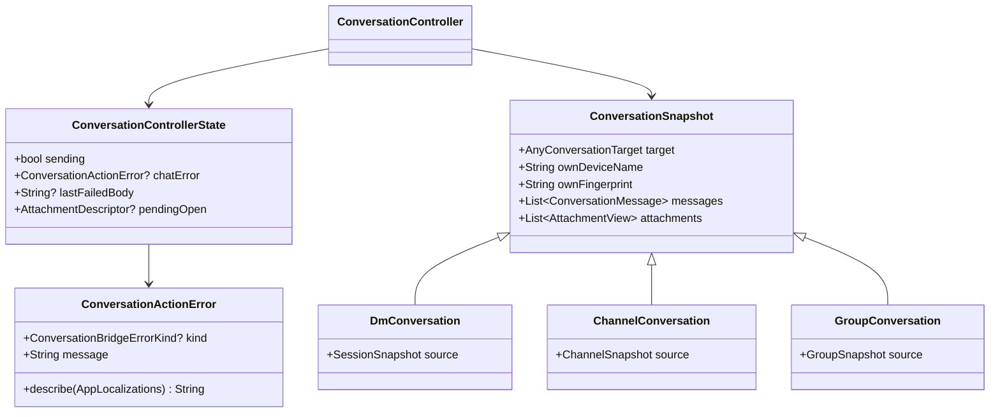

A failed shared action reaches the banner as a `ConversationActionError`: the
bridge's `ConversationBridgeErrorKind` when the seam threw one, ready-made
text otherwise. The screen picks the wording from the kind and never reads
the runtime's diagnostic sentence.

`ConversationActionError` lives in `features/shared/` because it is the one
classifier for a caught bridge error everywhere a screen acts on the bridge:
the conversation banner, the three onboarding steps, the invite paste, the
org-action toast in `org_actions.dart`, the rail's accept-offer toast, the
DM's start-call snack bar, and the voice-call layer (whose `CallError`
carries the classified cause) all catch, call
`ConversationActionError.of(error)`, and render `describe(l)`. No user-facing
path calls `toString()` or `readableError` on a `ConversationBridgeError`.
Snapshot-driven state (rejoin, revocation, retryable delivery) stays
snapshot-driven.

Every conversation action on the bridge throws that same
`ConversationBridgeError`: the six shared actions and the kind-specific ones
(DM invites and call controls, channel join and DM offers, group create/join
and DM offers, all org actions). Each facade's `ensure_runtime()` answers
`Unavailable` when its singleton cannot be driven, and the runtime's own error
maps through one `From` impl per runtime in `api/conversation_bridge.rs`. Only
the poll and list reads keep a plain `String` — a read failure is a provider
error, not something the user acted on. The generated Dart class carries a
`toString` that returns the message, for logs and test failures; every screen
renders it through the shared classifier above, never through `toString`.

`conversationSnapshotProvider` does not poll. It watches the kind provider
the app already has and maps the result, so there is one poll per
conversation and invalidating a kind provider still refreshes everything that
reads it.

The controller owns what the screen is doing; the screen owns the composer,
the search text, the filter, the drawer, and navigation. The controller never
navigates and never touches the composer: the methods that could trigger
either return a result the screen acts on.

Conversation behaviour is tested once and run over all three targets, from
`test/support/conversation_cases.dart`.

### Shared conversation code in the core

The same folding is done in `mosh-core`, where the DM, group and channel
runtimes each carried their own copy of the plumbing (ADR 0019). What they
share now lives in `mosh-core/src/conversation/`; what differs — how a frame
is encrypted and where it is published — stays with the kind.

Every kind is now the same shell with its own policy inside it. The shell is
`conversation::runtime::ConversationRuntime<S>`: the table of conversations by
id, the room each opens on the shared moss node, and the two writes that keep
them on disk. `S` is the kind's session, behind the `ConversationSession`
trait.

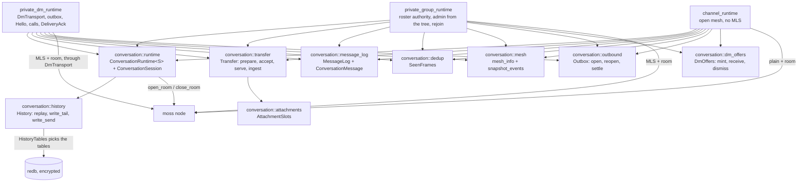

- `ConversationRuntime<S>` — the shell. It holds the sessions, opens and closes
  their rooms on the shared node, replays them at startup, and runs the two
  persist loops: `persist_tail` for what a conversation has gained, and
  `persist_send` for one message and the state of its send. The kind answers
  four questions through `ConversationSession`: what the conversation is
  called, what its messages and unsettled sends are, what record rebuilds it,
  and what else of its own goes down beside the history — an MLS snapshot for
  a DM and a group, nothing for a public channel. Two more say when a record is
  worth writing: `record_is_final` (a joiner's record is a placeholder until
  the MLS group exists) and `record_changed` (only a DM has a saved field that
  can move later — the counterpart's moss peer id).
- `Transfer` — an attachment's bytes on their way out and in. It owns the
  transfer layer, the slot table and the blob store together, because they have
  to move together. Sending a file seals it, saves this device's copy and opens
  a slot; a manifest coming in opens a slot the other way; chunks are served
  from one side and filed on the other. Publishing stays with the kind, so the
  calls hand back frames instead of putting them on the wire.
- `AttachmentSlots` — which attachment was offered, which one the user asked
  for, where the finished file landed. Held by `Transfer`, which is what the
  kinds see.
- `MessageLog<M>` — the message list plus the id generator, behind the
  `ConversationMessage` trait. The trait keeps the one real difference
  explicit: a channel or group message is matched on the sender's fingerprint,
  a DM message on the device name.
- `SeenFrames` — the capped ring that spots a repeated moss frame. Which
  frames are checked is still the kind's call; a DM skips its handshake and
  chunk traffic, where a re-send is how loss is recovered.
- `mesh::mesh_info` and `mesh::snapshot_events` — how the mesh looks and what
  the node has been doing, the part every snapshot ends with. A DM narrows the
  channel list to its own session afterwards; the rest read it as it comes.
- `outbound::Outbox` — the path out. `open` stamps a new message and files the
  attempt record that survives a restart, `reopen` prepares a re-send from that
  record, `settle` writes the result on both the message and the record. The
  kind publishes in between, its own way, and says whether the record is kept
  afterwards: a DM keeps it for the DeliveryAck and the auto re-sends, a group
  and a channel are done with it. A publish Moss refuses for want of peers
  settles as a retryable `Failed`, not as `Sent` — the frame reached nobody, so
  the record stays for the user's Retry (ADR 0021). Control frames, which
  repeat on their own, swallow that refusal through
  `MossNode::publish_room_best_effort`. A DM text takes the other door:
  `queue` files it as `Queued` with no payload, and the DM's outbox encrypts
  and publishes it later, oldest first, whenever the counterpart is reachable;
  a refusal leaves it queued, never failed (ADR 0026).
- `history::History` — what a conversation keeps on disk. `replay` reads one
  conversation back (messages, cached attachments, sends that never settled),
  `write_tail` appends only the messages gained since the last write, and
  `write_send` writes one message and the state of its send. Which tables it
  touches is a `persistence::HistoryTables` value — `DM_HISTORY`,
  `GROUP_HISTORY`, `CHANNEL_HISTORY` — so the table names are data, not three
  copies of the same code. The store counts what is already down, which is what
  keeps a message written once instead of once per poll. The shell decides
  when a record is worth rewriting, from the two answers the kind gives it.
  A send's two rows — the message and its attempt record — go down in one
  transaction (`Persistence::commit_send`), and a message that comes back
  `Pending` with no attempt behind it is failed at replay rather than left
  spinning: a send interrupted by a crash is red, never stuck (ADR 0022).
- `dm_offers::DmOffers` — the private-DM invitations a channel or a group
  carries. `mint` builds the offer to publish, and derives its id from the
  invite URI so the same invitation twice reads as one offer. `receive` keeps
  an arriving offer only when it names us, is not our own echo and is not one
  we already hold. `dismiss` drops one. A DM has no such list: it is where an
  accepted offer leads, not a place offers are shown. An org keeps its own
  list, on peer-ids and gated by the roster (ADR 0019).

### One node and the DM transport seam

The process runs one moss node (`shared_node`), and a DM reaches it through
one interface. `private_dm_runtime::transport::DmTransport` is the only door a
DM frame goes through in either direction: open and close a room, subscribe a
channel, publish a frame, ask moss to reach a peer, report how that peer is
reachable, drain what arrived. `MossDmTransport` wraps the shared node and
never keeps its handle, so the holder's refcount alone decides when moss
stops. `MemoryNet` (tests only) joins two runtimes in one process and can be
told which frames get lost and which publishes are refused. The paid mailbox
is a second implementation behind the same trait (ADR 0026).

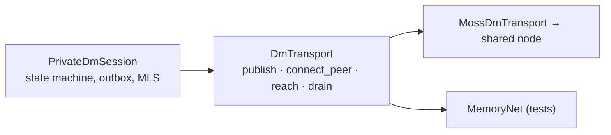

What the snapshot says about a DM is proven by the other side. `state` is
`pending` (nothing from the counterpart yet), `handshaking` (its handshake
frame arrived, or it was connected and is out of reach now) or `connected`
(an MLS-authenticated frame came back). `Hello` — the sender's moss peer id,
MLS-encrypted — is what makes the proof immediate; it repeats on the handshake
cadence until answered. `transport` is how moss reports the counterpart right
now: `direct`, `relayed` or `none`. The Dart side renders both through
`features/conversation/dm_state.dart`, one wording for the header, the rail,
the title-bar pill and the diagnostics card.

## Sessions Rail

The rail is one list of rows, not one list per conversation kind. It lives in
`lib/src/features/sessions/`: `sessions_screen.dart` composes it,
`rail_entry.dart` owns what a row is, `rail_item.dart` owns the row chrome,
and `org_actions.dart` / `sessions_rail_actions.dart` own what a tap does.

A row is a `RailEntry`: the conversation it opens plus the chrome that
conversation's kind wants. The screen builds one list of entries per paint,
in React's order (offers, sessions, groups, channels, then the orgs), and
loops over it once — a `RailDivider` goes between two non-empty neighbours.
The unread lookup, the active highlight and the clear-on-tap all come from
`RailEntry.ref.key`, so the `kind:id` grammar is written once, by
`ConversationRef`, and never by the screen.

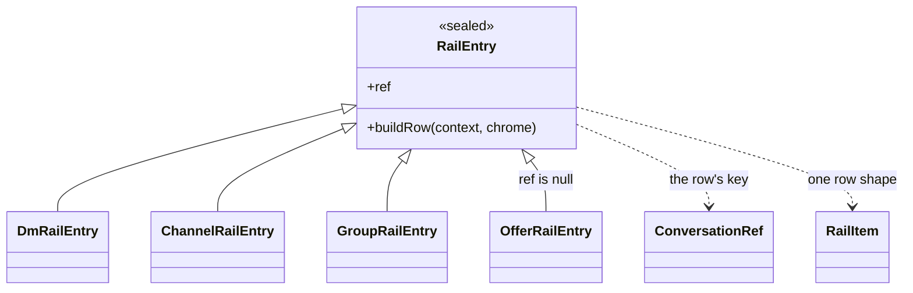

`RailRowChrome` is what the rail computes for a row and hands back: the unread
count, whether this is the open conversation, and the hook that clears the
badge. The offer row is the one row with no conversation behind it, so it gets
zero, false and null — it renders the accept affordance and the dismiss X
through the same `RailItem` every other row uses.

## Voice Call Module

One module holds the whole call pipeline. It lives in
`lib/src/features/voice_call/`.

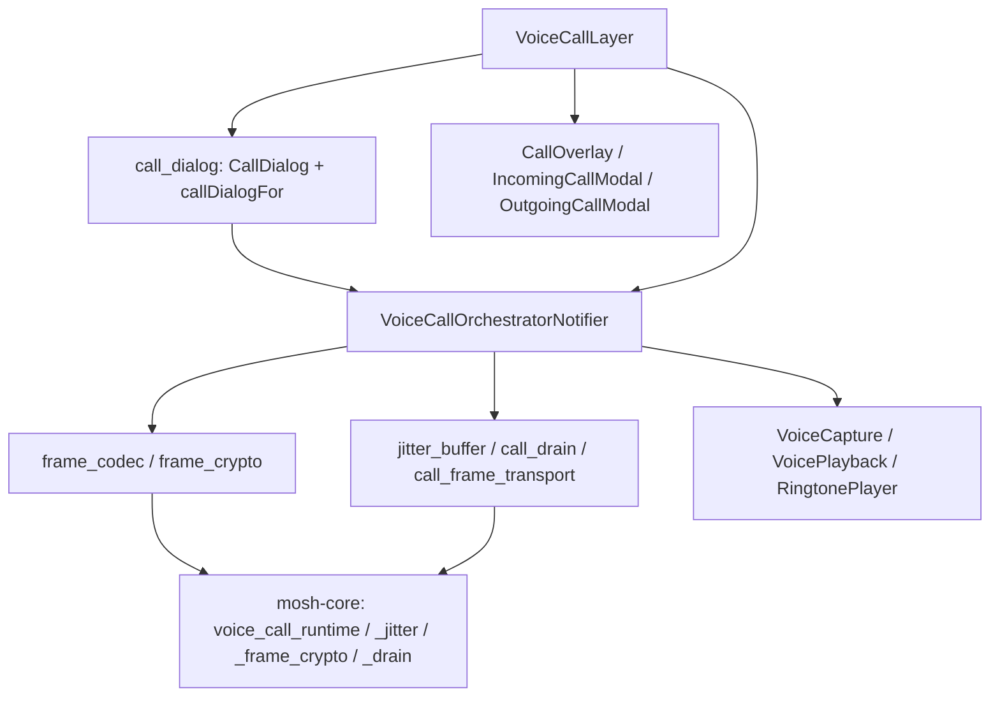

A DM is a conversation that *can carry* a call; the call is not the DM. The
pipeline used to live under `lib/src/features/dm/`, where nineteen of the
directory's twenty-two files were the call stack, two were the DM itself
(`dm_screen.dart` and `dm_screen_header.dart`), and the twenty-second — the
fingerprint badge — was DM app-bar chrome, not a call at all. Those three are
now elsewhere: the two DM files in `lib/src/features/conversation/`, with the
rest of the conversation chrome, and the fingerprint badge in
`lib/src/features/fingerprint/`, beside the fingerprint confirm surface it was
ported with. ADR 0018 already keeps the DM-specific part small: its header,
and whether the safety number has been confirmed in person.

The conversation module does not import this one. It declares what a call
needs from it — start one, and somewhere to hang the overlay — in
`conversation_call_binding.dart`; `voice_call_binding.dart` is the adapter
that answers, and `production_provider_overrides.dart` is the one place the
two meet. Nothing bound means a conversation starts no call and hangs no
overlay, which is what an unbound test gets. The ringtone travels the same
way: the layer reads `ringtonePlayerProvider` unless a test hands it one.

The Dart module name follows the Rust one. `mosh-core` already has
`voice_call_runtime`, `voice_call_jitter`, `voice_call_frame_crypto` and
`voice_call_drain`, and the `api` surface exposes `voice_call_*` operations.

`lib/src/features/dm/` no longer exists. Every importer — the two call
providers in `lib/src/state/`, the two tests in `test/state/`, and the call
tests, now under `test/features/voice_call/` — imports `features/voice_call/`
directly. No re-export shim is left behind, so the only path that resolves to
a call file is the one in the call module.

`voice_call_orchestrator_provider.dart` is the one home for call state. It
exposes a single `VoiceCallOrchestratorNotifier` (family by `sessionId`) whose
state is `dialog` (a `CallDialog` derived purely from the session snapshot),
`muted`, and `error`. `call_dialog.dart` holds the derivation itself —
`callDialogFor(SessionSnapshot)` returns `IncomingCallDialog`,
`OutgoingCallDialog`, `ActiveCallDialog` or `NoCallDialog`, and is unit-tested
without timers. `VoiceCallLayer` is a pure renderer: it reads `dialog` and shows
exactly that one modal, routes every control (accept / decline / end / mute)
back to the notifier, and surfaces `error` (a snack bar for `callControl`, the
host's `onVoiceCallError` for `audioSetup`) before `clearError()`. The old
phase-machine, the four "which modal is open" fields, and the dual error-sink
ownership protocol are gone; the no-answer timeout is a deliberate 30 s
(callee) / 45 s (caller, in `mosh-core`) pair so a real decline beats the
caller's auto-end.

## State Ownership

- Server / runtime state (sessions, messages, snapshots, diagnostics, delivery status) comes from `mosh-core` through the bridge and lives in Riverpod `AsyncNotifierProvider`s as `AsyncValue<T>`. UI consumes it with `.when(loading:, error:, data:)`. This is the direct analogue of TanStack Query server state (ADR 0010).
- Ephemeral UI state (open drawer, selected session, composer draft, modal visibility, animation controllers) lives in `StatefulWidget` state or `flutter_hooks`, never in providers. This is the direct analogue of Zustand granular stores vs local React state.
- Reads use `ref.watch(provider.select(...))` so widgets rebuild only on the slice they care about.
- There is no `useEffect + useState` analogue for fetching; `AsyncNotifier.build` is the single entry point for async state.
- Secrets (MLS keys, org root keys, the redb at-rest history key) live in `mosh-core` secure storage, never in Dart. Desktop uses the `keyring`-backed `OsSecureSecretStore`; mobile uses a Flutter platform channel into Android Keystore / iOS Keychain. The at-rest history key never touches disk in plaintext (ADR 0011).
- Private message history stores ciphertext plus minimal metadata in redb; the store is encrypted at rest.

## Port Boundary

What is in Dart vs `mosh-core`, per ADR 0012.

In Dart (UI, UI-flow orchestration, human-readable-string parsing, display computation):

1. `invite_uri.dart` (parse `mosh://invite?...#fp=...` with the same contracts and error codes as `invite-uri.ts`).
2. Clipboard invite detection via `Clipboard.getData` in a Riverpod notifier.
3. `unread.dart`, `format.dart`, content strings (to ARB).
4. Riverpod `AsyncNotifier`s consuming bridge streams; the call layer is a pure renderer of the `CallDialog` derived from the snapshot (see Voice Call Module).
5. Ringtone playback via a platform audio plugin (UI sound, not transport).

In `mosh-core` (crypto, binary wire formats, transport buffers, persistent state):

1. `voice_call_frame_crypto.rs` (AES-GCM frame seal/open; one source of truth for the wire format).
2. `voice_call_jitter.rs` (reorder buffer).
3. `voice_call_drain.rs` (drain loop as a runtime method).
4. MLS state, Moss transport, redb persistence, secure storage.

Dart never touches AES-GCM, binary frame layouts, or transport buffers directly. The bridge is the only crossing (ADR 0012).

## Build And Dependency Model

- `mosh-core` `Cargo.toml` sets `[lib] crate-type = ["lib", "cdylib", "staticlib"]` so one crate serves all six targets: desktop links the `cdylib`, Android links `cdylib`, iOS links `staticlib` (ADR 0010).
- `flutter_rust_bridge` generates typed Dart bindings from `mosh_core::api`; `rust_input: crate::api`, `rust_root: mosh-core/`, `dart_output: lib/src/rust`. Codegen runs in the build script and in CI, not manually; a drift job fails if committed bindings desync from Rust signatures (ADR 0010, plan S7).
- The `moss/` submodule stays pinned at `v0.8.14` inherited from upstream. Slice one does NOT bump the pin; any future bump is a deliberate step with its own ADR note (plan, Moss release pin).
- i18n uses Flutter's `gen-l10n`: ARB files under `lib/l10n` (`app_en.arb` template, `app_ru.arb`), `l10n.yaml` config, `AppLocalizations` output. `flutter: generate: true` in `pubspec.yaml`. A `gen-l10n`-drift CI job fails if generated output or ARB desync (ADR 0014, plan S7).
- Animation uses Flutter's own primitives (`AnimationController`, `Tween`, `AnimatedBuilder`) under a feature-local helper; no GSAP-equivalent third-party library until a concrete need forces it (ADR 0010).
- Fork version line is `0.8.0-dev`, separate from upstream `mosh` 0.7.x (ADR 0015).

## Crypto And Privacy Model

This domain context is inherited unchanged from upstream; the Flutter rewrite does not alter it.

- Moss provides P2P delivery, peer discovery, and encrypted transport sessions over the mesh.
- OpenMLS provides private DM message-layer E2EE.
- Public/default trackers are used for v1 discovery, so metadata privacy is limited.
- The UI must say private messages are content-encrypted, not anonymous.
- Public chats are planned as signed/authenticated but non-confidential messages.
- The voice-call wire frame (`[seq:u64 BE][ciphertext-with-tag]`, AES-GCM nonce `[nonce_prefix(4)][seq(8)]`, direction bit in seq) lives in `mosh-core` only, so there is one source of truth (ADR 0012).

## Slice One Scope

Slice one proved the bridge, the state stack, i18n, and the core DM flow on desktop behind a temporary fake gateway. That fake is gone: the app always runs the real bridge, and the test double lives under `test/`. Reference: [ADR 0013](ADR/0013-fork-topology-and-temporary-fake-gateway.md).
- **Status: COMPLETE.** See "Slice One Status" below.

- Onboarding (display name).
- Invite paste (`mosh://invite?...#fp=...`) parsed via ported `invite_uri.dart`; manual paste only, NO `mosh://` deep-link OS association (ADR 0015).
- Fingerprint confirm gate that blocks `sendMessage` until the safety number is confirmed.
- One DM screen (message list + composer) over the gateway seam.
- Diagnostics screen showing runtime status.
- i18n in `ru` and `en` via `gen-l10n`; `LocaleProvider` seam laid so a manual language switch can be added later as one widget.
- Desktop-only build; no mobile cross-build, no `integration_test` on devices in slice one.
- Fake gateway as the default `Gateway` behind a debug flag; real bridge swapped in at S5 with no widget changes (ADR 0013).
- Port `invite-uri.ts`, `invite-detection.ts`, `unread.ts`, `format.ts`, `private-dm.content.ts` to Dart; move `frame-crypto.ts`, `jitter-buffer.ts`, `call-drain.ts` into `mosh-core` (ADR 0012).

Out of scope for slice one: deep-link `mosh://` OS association, mobile Moss builds and mobile secure-storage platform channels, voice call / org / VPN / channels / private groups Dart UI (runtimes are bound via `api` but the UI is later slices), manual language switch UI.
## Slice One Status

Slice one is complete. Summary of the final state:

- Bridge proven end-to-end on real `mosh_core.dll` via
  `integration_test/slice_one_test.dart` (RealBridgeGateway: diagnostics,
  runtime status, session list, invite).
- Tests green: 42 Dart widget + unit tests; 28 Rust `#[test]` items across
  the voice-call files (`voice_call_frame_crypto` 10, `voice_call_jitter` 8,
  `voice_call_drain` 5, `voice_call_runtime` 5); 1 integration test.
- CI matrix of 5 jobs on `windows-latest` (`.github/workflows/ci.yml`):
  `rust-core`, `codegen-drift`, `flutter-test`, `l10n-drift`, and
  `integration-test` (needs the other four).
- No fake gateway ships: `gatewayProvider` always builds `RealBridgeGateway`,
  and tests override it with `ScriptableGateway` from `test/support/`. See
  ADR 0013, "Removal of the fake gateway". Since ADR 0025 the 1:1 mirrors
  ride `bridgeFacadeProvider` (tests: `ScriptableBridge`).
- Five slice-one screens shipped: onboarding, invite paste, fingerprint
  confirm, one DM screen, diagnostics.
- `api` facade real for `diagnostics` + `private_dm` (OnceLock singleton,
  ADR 0016); five stubs (`channel`, `private_group`, `org`, `network`,
  `vpn`) carry signatures only, bodies `todo!()`.

## Slice Two Status

Slice two (deep-link `mosh://` desktop, ADR 0015) is complete. The
slice-one screens were unreachable from the running app (`main.dart`
shipped a static `MoshHome` smoke-screen with no router), so slice two
first laid a route shell, then wired the OS deep-link into it.

- **Route shell (S2-1):** `go_router` (`lib/src/routing/app_router.dart`)
  with `/` (OnboardingScreen home), `/join` (InvitePasteScreen),
  `/diagnostics`, `/dm/:sessionId` (DmScreen). `MoshApp` is
  `MaterialApp.router(routerConfig: appRouter)`. The Join tile navigates
  to `/join`; the Group tile stays a "later slice" placeholder (1:1 with
  the React OnboardMenu); Diagnostics is an AppBar action. `MoshHome` is
  gone.
- **Windows scheme registration (S2-2):** `mosh://` registered under
  `HKCU\Software\Classes\mosh` via `win32_registry` 3.0.3
  (`lib/src/deeplink/mosh_url_scheme_windows.dart`): `URL Protocol` +
  `shell\open\command = "<exe>" "%1"`. HKCU needs no admin elevation;
  idempotent; never throws. Called from `main()` after `RustLib.init()`,
  gated `Platform.isWindows`. `app_links 7.2.1` added as a dependency
  for the intake.
- **Intake (S2-3):** `windows/runner/main.cpp` calls
  `SendAppLinkToInstance()` at the top of `wWinMain` so a `mosh://`
  click that launches a second instance forwards the URI to the
  already-running one (single window). Dart
  `lib/src/deeplink/mosh_deep_link.dart` subscribes
  `AppLinks().uriLinkStream` (covers cold-start initial + warm links),
  gates scheme `== 'mosh'`, and navigates `appRouter.go('/join', extra:
  <uri>)`. A cold-start link before the router mounts is buffered and
  replayed once via a post-frame callback; navigation is try/catch.
  `/join` reads `state.extra` and seeds `InvitePasteScreen`'s text
  field + live detection. Three widget tests cover warm / scheme-gate /
  cold-start replay.
- Single scheme `mosh://` everywhere (ADR 0009/0015); no per-fork
  variant. Mobile intent-filter / `CFBundleURLSchemes` remain deferred
  to the mobile slice (ADR 0015).
- Tests green: 48 Dart (was 42 after slice one; +6 across follow-up +
  slice two), Rust `cargo test` 215/0/5-ignored (serial), `flutter
  analyze` clean.

## References

- docs/ADR/0009-flutter-shell-replaces-tauri-frontend.md - Flutter shell replaces Tauri frontend.
- docs/ADR/0010-flutter-rust-bridge-and-state-stack.md - flutter_rust_bridge + Riverpod state stack.
- docs/ADR/0011 - secure storage and at-rest history key (referenced by glossary).
- docs/ADR/0012-port-strategy-what-goes-to-dart-vs-mosh-core.md - port boundary: Dart vs mosh-core.
- docs/ADR/0013 - temporary fake gateway and read-only reference policy for `src-tauri/` / `src/`.
- docs/ADR/0013 - Removal of the fake gateway: no fake in `lib/`, tests use `ScriptableGateway`.
- docs/ADR/0014 - i18n via `gen-l10n`, `LocaleProvider`.
- docs/ADR/0015 - fork version line `0.8.0-dev`, deep-link deferral.
- docs/ADR/0016-api-runtime-ownership-oncelock-singleton.md - api runtime ownership via OnceLock singleton.
- docs/ADR/0017-gateway-takes-the-conversation-target.md - the Dart Gateway takes the conversation target.
- docs/ADR/0025-the-gateway-is-the-conversation-seam.md - the Gateway narrows to the conversation seam; 1:1 mirrors call the bridge facade directly.
- docs/ADR/0018-one-conversation-module.md - one Conversation module for the DM, the channel and the group.
- docs/ADR/0019-shared-conversation-strata-in-the-core.md - shared conversation strata in mosh-core.
- docs/ADR/0020-one-inbox-per-owner.md - one inbound queue per owner instead of one queue for everybody.
- docs/ADR/0021-no-peers-is-not-sent.md - a publish with no peers fails retryably instead of reporting Sent.
- docs/ADR/0022-a-send-is-one-durable-fact.md - a send's message row and attempt row commit together, and an unbacked Pending comes back failed.
- docs/ADR/0023-the-tree-says-who-the-admin-is.md - a group's admin is derived from the MLS tree after every commit, not carried by an AdminHandoff frame.
- docs/ADR/0024-the-bridge-names-shared-conversation-actions.md - the bridge exposes one function per shared conversation operation with the kind in the argument, not one per kind; amends ADR 0010's Tauri-mapping clause.
- docs/flutter-fork-glossary.md - Flutter fork ubiquitous language.
- docs/Features/private-dm.md - slice-one private-DM feature flow (Mermaid sequence).
