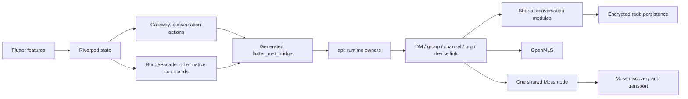
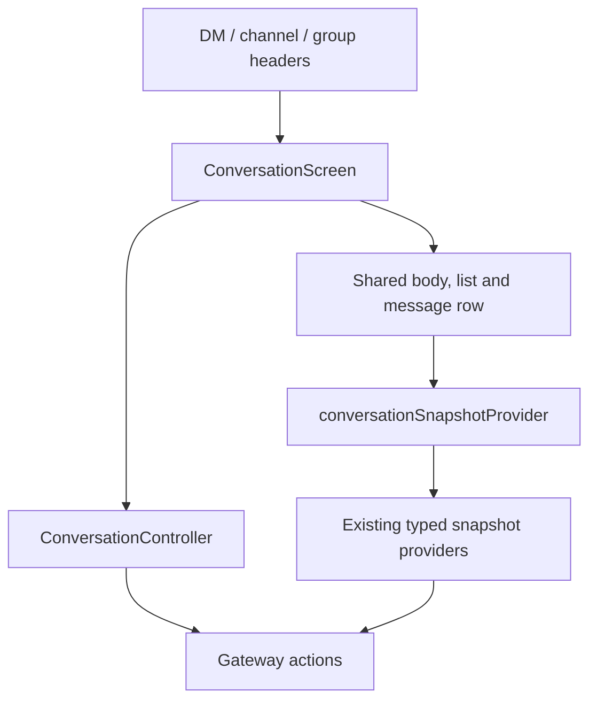

# Mosh architecture

Mosh is a desktop-first decentralized messenger built with Flutter, Riverpod,
Rust, OpenMLS and Moss. Windows and macOS are the primary desktop targets;
Android uses the same linked-device and DM runtime. Private DMs and groups use
MLS encryption. Public channels carry plaintext; new messages retain signed
author proofs while legacy messages can still have self-claimed sender IDs.
Discovery is automatic through Moss. Public trackers limit metadata privacy.

## Read the system

```mermaid
flowchart LR
    UI[Flutter features] --> State[Riverpod state]
    State --> Gateway[Gateway: conversation actions]
    State --> Facade[BridgeFacade: other native commands]
    Gateway --> Bridge[Generated flutter_rust_bridge]
    Facade --> Bridge
    Bridge --> Owners[api: runtime owners]
    Owners --> Runtime[DM / group / channel / org / device link]
    Runtime --> Shared[Shared conversation modules]
    Runtime --> MLS[OpenMLS]
    Runtime --> Node[One shared Moss node]
    Shared --> Store[Encrypted redb persistence]
    Node --> Mesh[Moss discovery and transport]
```

| Directory | Responsibility | Start here |
| --- | --- | --- |
| `lib/src/features/` | Screens, feature state and interaction | `conversation/conversation_screen.dart` |
| `lib/src/state/` | Polling, snapshots and application state | `conversation_providers.dart` |
| `lib/src/gateway/` | Typed Flutter/native adapters | `gateway.dart`, `bridge_facade.dart` |
| `mosh-core/src/api/` | Bridge functions and process runtime ownership | `runtime_owner.rs`, `shared_runtime.rs` |
| `mosh-core/src/conversation/` | Shared logs, delivery, history and transfers | `runtime.rs` |
| `mosh-core/src/private_dm_runtime/` | DM protocol and linked installations | `session.rs`, `devices/` |
| `mosh-core/src/private_group_runtime/` | MLS groups and organization admission | `lifecycle.rs`, `org_gate.rs` |
| `mosh-core/src/channel_runtime/` | Public channel protocol | `lifecycle.rs`, `session.rs` |
| `mosh-core/src/org_runtime/` | Organization roster, offers and admission | `session.rs`, `actions.rs`, `acceptance.rs`, `storage.rs` |
| `mosh-core/src/device_link/` | Signed device identities, rosters and pairing | `runtime/`, `identity.rs`, `roster.rs` |
| `mosh-core/src/persistence/` | Encrypted tables and atomic writes | `database.rs`, `schema.rs`, `outbound.rs` |
| `mosh-core/src/moss_ffi/` | Native symbols, callbacks and node operations | `symbols.rs`, `callbacks.rs`, `node.rs` |
| `mosh-core/src/mls_crypto/` | MLS setup, commits, messages and restoration | `setup.rs`, `commits.rs`, `storage.rs` |
| `mosh-probe/src/` | Headless reachability diagnostics | `cli.rs`, `dm.rs`, `group.rs`, `channel.rs` |
| `test/support/` | Scripted bridge and widget dependencies | `scriptable_gateway.dart`, `scriptable_bridge.dart` |
| `mosh-core/tests/support/` | Independent native installation fixtures | Device-link and transport harnesses |

Runtime roots preserve public Rust type paths; private implementation modules
own lifecycle, command, receive, snapshot and storage work. Generated bridge
files are checked in and generated localization files are ignored. Moss is a
pinned submodule; do not modify its source. The OpenMLS upstream mirror is
reconstructed from [a pinned archive and complete local patch](../third_party/openmls-patches/README.md).

Desktop calls use the [native audio/video owner](Features/native-call-media.md).
`mosh-core/src/native_call` owns capture, one engine, selected-peer transport and
latest frames; isolated `mosh-media/engine` and `mosh-media/capture` graphs keep
Signal/OpenMLS dependencies separate and blocked camera drivers cancellable.
The child window owns presentation only. Public negotiation uses MLS; media uses
Moss directed packets. Native builds run through the existing desktop plugin
and Xcode hooks. See [ADR 0044](ADR/0044-native-call-media-over-moss.md).

## Flutter state and conversations

`Gateway` owns typed conversation polling and common actions. `ConversationTarget`
selects the snapshot type; common commands cross the bridge once with a typed
kind/id reference. `BridgeFacade` handles command families that mirror one native
operation, including setup, lists, organizations, diagnostics and calls. Tests
replace these adapters through providers; production uses real implementations.
See [ADR 0017](ADR/0017-gateway-takes-the-conversation-target.md),
[ADR 0024](ADR/0024-the-bridge-names-shared-conversation-actions.md) and
[ADR 0025](ADR/0025-the-gateway-is-the-conversation-seam.md).

DM, channel and group screens supply headers and targets to one
`ConversationScreen`. Its controller owns send/retry, attachments, voice notes
and leave operations. The screen owns the composer, search, selection, panels
and navigation. Action methods return results instead of navigating or editing
the composer. A sealed `ConversationSnapshot` gives shared rendering one message
shape while preserving each kind's native snapshot for kind-specific controls.

The message list retains one text selection area. Row delegates expand a timed
third mouse click to the whole body; one animated menu owner shares Mosh controls
across text and attachments while retaining selection through menu focus.
See [message menus](Features/message-context-menus.md) for targeting and gestures.
`MessageSelectionHost` wraps the chat scaffold: it owns the picked messages,
swaps the header for the selection bar and runs bulk deletion. Rows and the
drag gesture read it through `MessageSelectionScope`; see
[message selection](Features/message-selection.md).

`ConversationTextSends` admits submitted drafts in FIFO order without blocking
editing or waiting for delivery. It keeps refused submissions individually for
Retry. The existing native outbox and snapshot rows own durable delivery states.
Confirmed leave freezes new submissions and drains accepted native admission
before closing the conversation. A refused leave reopens submission and retains
failed texts. Text failures have their own Retry banner, independent of other
action errors.
The screen clears each draft at submission and restores refused text only when
that draft has remained untouched; delayed completion never clears newer input.

```mermaid
flowchart TD
    Headers[DM / channel / group headers] --> Screen[ConversationScreen]
    Screen --> Controller[ConversationController]
    Screen --> Body[Shared body, list and message row]
    Body --> Snapshot[conversationSnapshotProvider]
    Snapshot --> Native[Existing typed snapshot providers]
    Controller --> Gateway[Gateway actions]
    Native --> Gateway
```

`conversationSnapshotProvider` maps existing typed providers and adds no poll.
`conversationListProvider` is one family keyed by conversation kind. Each
notifier serializes reads, skips overlapping background ticks and coalesces
post-mutation refreshes. Answers from an older provider lifetime are discarded.
`invalidateConversation` owns kind dispatch for snapshots; `refreshConversation`
also updates the corresponding recent-chat list. `unreadCountsProvider` uses
`ConversationRef.key` consistently for badges and clear-on-open behavior.

`ForegroundPoller` pauses Android UI reads while hidden and refreshes immediately
on resume. Desktop UI polling retains its cadence. Protocol service threads keep
native handshakes and retries running independently of visible Flutter widgets.

`ConversationAttachment` interprets transfer direction, progress, previews,
usable paths and allowed controls for cards, file lists and opening. Failed or
cancelled transfers override stale paths. Unknown totals show indeterminate
progress. Voice playback consumes a queued request only after success and checks
its lifetime before starting after an asynchronous load.

The sessions rail builds one sorted list of `RailEntry` values from the existing
snapshots. `RailActivity` computes previews and participants in one scan. Search
and kind filters are local. Shared geometry lives in `app/mosh_shapes.dart`;
`ConversationKindStyle` shares accents, labels and glyphs. Conversation details
reuse one widget between the third desktop column and narrow modal layouts.
On desktop `RailPane` sizes the rail from `railLayoutProvider` and collapses it
to an avatar strip that `RailCompactScope` announces to the rail widgets.
See [conversation behavior](Features/chat-redesign.md),
[visual consistency](Features/chat-visual-consistency.md) and
[chat list layout](Features/chat-list-layout.md).

Transient confirmations and failures go through the app's one toast stack,
`Toaster` rendered by `ToastHost`; see [toasts](Features/toasts.md).

With no conversation open the chat pane shows the start menu and its four
steps in place; see [start menu](Features/start-menu.md).

Ordinary modal routes share `MoshDialog` and `showMoshDialog` for compact layout,
cancellation, focus and reduced-motion-aware transitions. VPN consent uses the
same dialog content above the Navigator and retains its consent owner.
See [dialogs](Features/dialogs.md).

Caught conversation errors become `ConversationActionError` and use localized
wording derived from `ConversationBridgeErrorKind`. Runtime diagnostic strings
are for logs. Poll/list failures remain provider errors. Rejoin, revocation and
delivery state come from native snapshots, not guessed UI flags.

## Native ownership and durability

`api::runtime_owner::RuntimeOwner<T>` initializes and caches the DM, group,
channel and organization owners once, including initialization errors. Each
owner retains its own mutex; device linking and audio keep their existing owners.
`shared_runtime` supplies one Moss node, encrypted persistence and attachment
store per installation. Device signing keys, transport identity and MLS signing
keys stay separate. Runtime creation restores saved network binding before
starting the shared node.

`ConversationRuntime<S>` owns the session table and durability work. Each
`ConversationSession` supplies its message/record types, log, pending attempts,
transfer state and optional MLS snapshot. Kind modules own wire formats,
authorization and publication.

| Shared module | Owns |
| --- | --- |
| `message_log` | Message ids, history rows and delivery metadata |
| `dedup` | Bounded repeated-frame tracking |
| `outbound` | Admission, retry and settlement records |
| `history` | Replay, tail writes and atomic message/attempt saves |
| `runtime_writes` | Refused writes retained until durable acceptance |
| `transfer` / `attachments` | Blob preparation, chunk scheduling and transfer slots |
| `dm_offers` | Private-DM invitations offered in channels and groups |
| `message_deletion` | Signed message targets, durable erasure, receipts and recovery |
| `mesh`, `typing`, `read_events` | Shared diagnostics and presence interpretation |

History table names are `HistoryTables` data, so DM/group/channel storage shares
one implementation. A send's message and attempt rows commit together. Replay
fails a provisional pending message without a backing attempt. Refused state
writes remain pending and do not block reads or other conversations.
Group/channel admission must persist before publication. A refused save after
publication retains the actual transport outcome and retries persistence, rather
than prompting another send. DM and group creation save their record and MLS
state before exposing the session. Channel creation retains its insert-then-save
ordering; a joining DM persists its MLS snapshot after Welcome. See
[ADR 0022](ADR/0022-a-send-is-one-durable-fact.md) and
[ADR 0037](ADR/0037-conversation-write-acceptance.md).

Organization offers keep their resolution state in encrypted org records.
`org_runtime/acceptance.rs` retains the original offer and private join state
until the native conversation is durable. The bridge prepares a join, saves
its recovery intent, then publishes and polls; refused registration sends no
key package. Publication refusal restores the visible offer without deleting
the durable backup. Restart restores unfinished offers; retry reuses their
original keys so a cached Welcome can still admit them.
`persistence/org_acceptances.rs` retires the matching kind, conversation ID and
local signer in the same transaction as its native record and MLS snapshot.
Org writes merge stored resolutions so an old runtime cache cannot undo them.
Dismissals resolve immediately. No pre-Welcome native session row is added.

Persistence's `database` owns DEK acquisition and encrypted row operations;
`schema` retains the table definitions. `history` and `conversation_records`
share kind-based lifecycle operations. `outbound` owns atomic message/attempt
acceptance; `records` and `group_commits` isolate identity and organization
evidence. Attachment scheduling handles priority slots, timed retry gaps and
sequential cursor requests in that order.

DM text starts as durably admitted queued work. The outbox encrypts and publishes
oldest first after local MLS readiness. Moss `NoPeers` leaves DM work queued;
group/channel sends report retryable failure when no frame left. Delivery means
the counterpart acknowledged it. Read receipts use their own persisted metadata.

A DM uses `DmTransport`; production answers with `MossDmTransport`, and focused
protocol tests use `MemoryNet`. Transport owns room membership, publication,
reachability and inbox drains. Voice media has a separate inbox/lock.
One `SharedMossNode` serves all conversations. Opening a room rolls back its node
reference on failure; leaving unsubscribes before releasing the room and node.
See [ADR 0020](ADR/0020-one-inbox-per-owner.md) and
[ADR 0026](ADR/0026-one-node-a-transport-seam-and-a-dm-outbox.md).

DM connection state requires an authenticated counterpart frame. Moss's direct,
relayed or absent peer route is a separate fact; gossip can deliver with no direct
peer row. Handshake/Hello retries and keepalives refresh that authenticated state.
Attachment streams use direct routes and fall back to room publication on refusal;
blob subscriptions remain active. Restored encrypted manifests preserve offered
attachments after restart. See [ADR 0027](ADR/0027-attachments-ride-moss-streams.md)
and [ADR 0028](ADR/0028-durable-attachment-offers.md).

Personal-chat invitations retain their encrypted session and MLS material while
hidden from recent chats. Explicit opening or validated counterpart admission
durably exposes the chat. The first counterpart's signer and cached Welcome
commit with the MLS transition before publication. Replacement changes only the
signed admission token and preserves the route and keys. Native snapshots expose
`invite_available`; Flutter uses it for Copy and Replace actions. Compact links
retain both ownership signatures and legacy imports. See
[invitations](Features/invitations.md) and
[ADR 0042](ADR/0042-durable-compact-dm-invitations.md).

Image offers include a JPEG miniature bounded to 2 KiB of base64 and a separate
signed preview descriptor. The shared transfer owner automatically downloads
clear previews with bounded concurrency, independently of original downloads.
Both manifests restore from encrypted history and both cache references follow
parent deletion. Flutter observes a preview path separately from original-file
availability. See [ADR 0041](ADR/0041-attachment-previews.md).

Message deletion preserves empty cursor rows and an encrypted monotonic journal.
Personal deletions hide rows and synchronize through the existing device-link
owner. Shared deletions require verified authorship or current group admin rights;
only a durable receipt from another participant confirms delivery. Existing
services recover missing deletion pages without advancing MLS application
ratchets. Tombstones also guard history/outbox writes and queue app-owned cache
cleanup after the last reference. See [ADR 0040](ADR/0040-message-deletion.md).

## Device linking and recovery

`DeviceLinkController` is shared by setup and Devices settings. Its state keeps
native proof, errors and one action/navigation lock. Polls cannot overwrite
pending actions, and disposed/rebuilt controller lifetimes cannot publish stale
answers. Generated calls remain in feature-local `DeviceLinkCommands`.

Native `DeviceLinkRuntime` owns the local signing identity, verified roster and
pairing exchange. It borrows shared Moss and persistence. Pairing uses directed
stream 3. New v2 invitations expire after five minutes; authorizer consent binds
the trusted descriptor, candidate and base roster to the human confirmation code.
Only the active authorizer QR screen receives the invitation URI. New v1 imports
are refused; already pinned legacy exchanges can finish.

Each linked device becomes a separate MLS client within the same DM. Signed
rosters authorize installation membership; existing contacts bind counterpart
identity. Admission evidence and delivery journals persist with the session.
Initial history imports semantic text from an authorized source using durable
manifests/cursors. Live and imported rows share ids. Returning installations
replay verified missing commits in epoch order, then import text through the same
atomic history operation. Source switching opens a new durable recovery round.

Retained Add evidence signs its original admission time. Recovery verifies the
same group, next epoch, authorized original author and timestamp before using
OpenMLS's scoped historical validation clock. Normal admission uses the actual
clock. Package/leaf signatures and lifetime-range checks remain active.
Signed roster removal persists before delivery; identity writes compare exact
prior bytes within the transaction. The DM owner applies MLS removal and reports
pending/applied state. See [ADR 0029](ADR/0029-private-desktop-device-linking.md),
[ADR 0030](ADR/0030-linked-desktop-dm-clients.md),
[ADR 0031](ADR/0031-linked-desktop-dm-history.md),
[ADR 0032](ADR/0032-dm-offline-recovery.md) and
[ADR 0033](ADR/0033-dm-device-revocation.md).

Android loads its own user-presence-gated Keystore DEK before opening encrypted
records. Backup/transfer excludes keys and identity storage; copied installations
cannot inherit another device's identity. The release manifest includes network
access. See [ADR 0034](ADR/0034-android-linked-text-dm.md).

Personal DM/channel names live in an encrypted account register and synchronize
through the existing device-link owner. Shared group names use authenticated MLS
metadata, current admin authority, atomic history events and durable pending
state. Flutter resolves display names independently of conversation addresses.
See [ADR 0039](ADR/0039-chat-names.md).

## Setup, settings and voice

Interface language defaults to Flutter's system resolution, including changes
to the OS's preferred locales. Profile settings can persist an explicit English
or Russian choice in `interface-language`, a non-secret Dart preference independent
of setup and encrypted history. A refused atomic save retains the previous choice;
missing/invalid data returns to System, with English as the unsupported-locale
fallback. Both the unlocked app and the startup lock surface read this preference.
The macOS runner updates existing menu item labels by stable XIB identifiers;
Cocoa retains their actions, shortcuts and OS-owned submenu contents.

`FirstRunGate` delays router mounting and conversation polling until setup saves
completion. Existing conversation/device history bypasses the wizard. Buffered
invites survive setup. `FirstRunStore` keeps versioned non-secret profile and step
preferences in the application support directory. Setup reuses device-link and
network owners. See [ADR 0036](ADR/0036-first-run-gate-and-local-profile.md).

Settings is a route above the chat shell, preserving drafts and scroll position.
Its feature owns responsive section navigation; shared cards/disclosures provide
layout. `NetworkChoiceController` serializes saving and restarting, retaining
restart knowledge beyond an individual screen lifetime. Settings reads saved
consent; setup also inspects live binding. A changed binding takes effect on the
next launch. Windows can relaunch automatically; other platforms explain restart.
Missing adapters fall back to default routing while retaining the saved choice.
Audio picks persist independently and use system defaults for disconnected
hardware. See [settings behavior](Features/settings-redesign.md).

The conversation declares `ConversationCallBinding`; production binds its start
command. `VoiceCallHost` lives above the router, below the first-run gate. It
selects the originating call from the app-wide DM list, so navigation does not
replace or dispose the audio owner. Capture, playback and ringtone retain their
independent factory providers. Audio replacement waits for the previous startup
and teardown, and cancelled work cannot send or play frames.

Desktop call controls run in a separate process of the same executable. This
isolates each renderer and lets the parent terminate an unresponsive child. Stdio
carries presentation metadata and commands without listening ports. The child
starts only the shared view and ordinary window plugins, without initializing
Rust or storage. Display metadata contains no call keys or audio handles; commands
carry both session and call IDs. Main-process state remains authoritative.
An application-level strip keeps messaging usable and can restore the window.
Ringtone and no-answer timeout belong to the call state. The supplied PCM recording
uses CPAL's selected output device. See [voice calls](Features/voice-calls.md).

Dart seals and opens call frames with the existing cryptography package and
reorders playback with its jitter buffer. Raw bytes cross `BridgeFacade` every
20 ms. Rust's `CallMedia` hub publishes/drains active calls through a separate lock,
so audio does not wait on the DM owner. Native Opus/CPAL handle encoding and
playback. Playback buffers 60 ms, emits silence on underrun, and jitter skips a
gap once three later frames wait. Rust owns call signaling and mirrors active
calls into the hub. The wire is `[seq:u64 BE][ciphertext+tag]`, with AES-GCM nonce
`[prefix:4][seq:8]` and a direction bit in the sequence.

Accepted video-call ownership lives in [ADR 0043](ADR/0043-one-device-per-user-in-a-call.md)
and [ADR 0044](ADR/0044-native-call-media-over-moss.md). The
[issue 46 plan](Proposals/issue-46-video-calls.plan.md) defines stages and acceptance.
The target uses one native audio/video engine over Moss. The voice pipeline above remains current.

## Security, builds and checks

History is encrypted with AES-256-GCM under an installation DEK. Windows/Linux
use OS credential storage; macOS uses a permission-restricted file inside the app
container; Android injects its own Keystore key. Device and transport identity
records are encrypted. Security UI displays real runtime snapshots. Read
[ADR 0011](ADR/0011-secure-storage-and-threat-model.md) for the storage threat model.

Org control uses signed envelopes and roster-bound MLS credentials
([ADR 0004](ADR/0004-org-credential-identity-is-moss-peer-id.md),
[ADR 0007](ADR/0007-signed-envelope-over-gossip.md)). Group text, typing,
attachments and DM offers bind the Moss author to the full MLS sender key through
one transcript signed by both keys. DM offers encrypt their invitation with MLS,
prove its creator owns the DM key and pin the intended recipient before
publication. Org-carried DM offers use the same owner and target checks.
Targeted admission verifies the recipient's Moss and DM keys;
Welcome verifies the creator's pinned key. All group clients must upgrade
together; unsigned application frames are rejected. Manual invitations without
a target retain capability-based admission. Existing history and public channel
author labels gain no retrospective authentication. See
[ADR 0038](ADR/0038-authenticated-group-senders-and-dm-offers.md).

Crash reporting is opt-in. Consent and a scrub salt live in a non-secret file.
No configured DSN means no reporting. Rust captures panics; Dart scrubs/sends
eligible events. Native stack memory remains a documented limitation. See
[ADR 0035](ADR/0035-opt-in-crash-reporting.md).

Use the versions in `rust-toolchain.toml` and `.github/actions/setup/action.yml`.
`node scripts/moss-prepare.mjs` builds Moss and prepares OpenMLS. Direct Cargo or
bridge-codegen use on a fresh checkout needs `node scripts/openmls-prepare.mjs`.
Flutter native builds and CI prepare it automatically. Prepared/cached source
supports offline use; a new checkout needs the pinned archive or network access.

`flutter_rust_bridge_codegen generate` regenerates the committed Rust/Dart bridge;
CI checks drift. Flutter `gen-l10n` generates English/Russian localizations from
ARB files. Cargokit links the same core as desktop/Android dynamic libraries and
iOS static libraries. Windows integration tests require debug; Android builds
require `--target-platform android-arm64`. macOS releases prepare universal Moss
and Opus libraries before packaging; the reusable build workflow owns signing and
DMG generation.

Required checks live in [AGENTS.md](../AGENTS.md). Native runtime tests use real
Moss and independent processes because Moss's keystore is process-global.
`node scripts/moss-test.mjs` starts a local tracker and runs the core suite;
`--native-ui` exercises the real Flutter linking flow. Widget tests use scripted
adapters from `test/support/`. The [documentation index](README.md) links current
feature behavior; ADRs retain decision history and [the archive](Archive/README.md)
retains completed plans.
