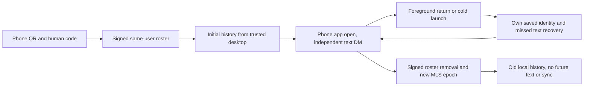

# Android linked text DM

An Android installation can link to a desktop user, import an existing text
DM and continue it with the contact while the original desktop is off.
Keep Android's app open for sending, receiving and visible recovery. Pairing
and direct P2P sync are free and need no wallet.

On the fresh phone, open Settings, Devices, give it a name and choose Link
this device to an existing user. On the trusted desktop, import a screenshot
of the phone's QR or privately copy its link into the Devices section. Read
the code from that phone and enter it on the trusted desktop to approve.
Keep both online until approval and initial history finish. No camera plugin
is required. QR links expire after five minutes and must stay private.

The phone keeps independent signing, Moss and MLS keys. Android Keystore
protects its own storage key; PIN or biometric authentication is required.
A normal cold launch restores the same installation and its saved history.
Android backup and system device transfer are disabled for installation data;
a replacement phone must use a fresh confirmed link.

When the phone returns to the foreground, the UI refreshes immediately while
the existing native runtime continues recovery. The original desktop recovers
missed messages from an available admitted holder when it comes back online.
Message ids deduplicate simultaneous live delivery and imported history.

Remove the phone in Settings, Devices on a remaining installation. Pending
waits for remaining DM participants to save the new MLS epoch. Applied marks
that durable boundary. The phone then cannot send, decrypt new text or request
new history; already received history stays readable. A fresh QR and human
confirmation are required to regain access. See [device removal](device-linking.md).



## Run the physical acceptance scenario

Use a local checkout with Flutter, Dart, Rust, Node, Go, Android SDK/NDK and
`adb`. Prepare Opus using `scripts/opus-prepare-android.sh` on Linux or
`third_party/build-opus-android.ps1` on Windows. Run
`node scripts/moss-prepare.mjs` for the desktop runtime. Connect a physical
arm64 Android phone through USB, enable USB debugging, enroll a screen lock
and leave it unlocked. The phone and desktop must have a working Moss
discovery/network path. The runner does not configure transport host/port.

```sh
adb devices
dart run scripts/android_linked_dm.dart DEVICE_SERIAL
```

Accept the Android PIN/biometric prompts when requested. The runner checks
physical arm64, builds the real desktop workers, then executes two Android
process phases. It uses `app.mosh.mosh.linked_dm_test`, a separate debug test
installation. It never clears `app.mosh.mosh`. A prior test installation is
refused; explicitly uninstall only the test package before a fresh run.
The test installation remains on the phone afterwards for inspection.

The automated assertions cover QR creation, wrong-code refusal, approval,
same-user identity with independent keys/peer-ids, initial history, simultaneous
sends, messaging with the desktop off, connection interruption and foreground
return, desktop recovery
without duplicate ids, phone cold-start identity/history, missed-text recovery,
phone removal, refused sends, old-QR refusal and retained local history without
post-removal text. The normal DM screen runs its production polling interval;
incoming text must render without manual refresh, and replies use its composer.
The host sends Home, restarts the contact to break the surviving phone's Moss
connection, then returns to the test Activity before checking reconnection and
incoming text. It force-stops only the test
app between phases without clearing its data.
The native revocation suite independently proves actual MLS decryption refusal
and denied synchronization at the signed protocol boundaries.

To check the shared scenario here without claiming Android results:

```sh
dart run scripts/android_linked_dm.dart --host
```

Host mode allocates and disposes the composer's idle recorder through a channel
stub because the Flutter host tester has no microphone plugin. DM screens,
polling, encrypted storage, bridge calls and Moss remain real. Android uses
its registered plugins.

## Evidence still required

- Physical phone model, Android version and arm64 ABI.
- Passing output from both physical phases with real Moss runtime.
- A manual release-APK pass of the QR screenshot/import and same-DM flow.
- Confirmation that ordinary desktop scenarios still pass.

The server can build arm64 APKs and execute the real desktop/control scenario.
The user's physical phone is unavailable to this server, so a host-mode pass
does not complete physical Android acceptance. Background/suspended delivery,
push, iOS, subscriptions/storage, attachments, groups/channels and calls need
separate slices. Recovery requires an available authorized holder; it cannot
restore text that every installation deleted.
