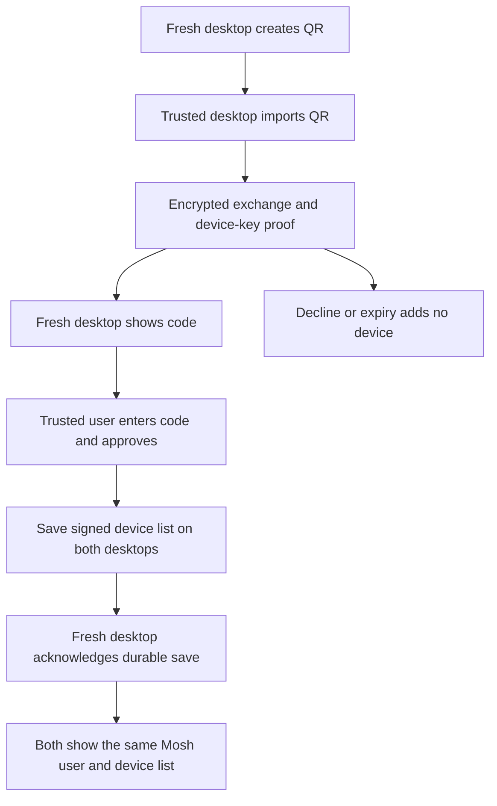
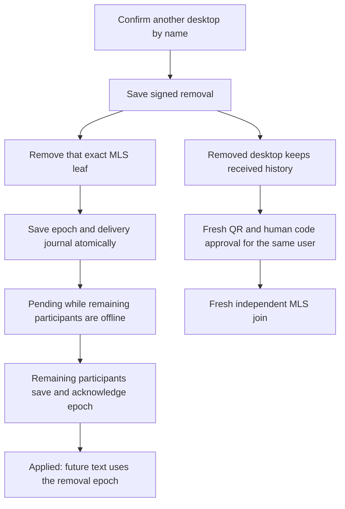

# Device linking

Open Settings, Devices on both desktops. On the fresh desktop, enter its name
and choose Link this desktop to an existing user. On the trusted desktop,
import an image of that QR or paste its link. Read the 12-character code from
the fresh desktop and enter it on the trusted desktop to approve the device.
Both desktops must stay online until the trusted desktop shows Device linked.
The QR expires after five minutes. Keep it private.

The QR renderer uses whole pixel modules so a desktop screenshot stays
readable. The importer decodes its image off the UI thread and rejects files
over 10 MiB or images over 16 megapixels.

The existing desktop keeps its Moss peer-id, contacts, MLS state and history.
The linked desktop keeps its own signing key, Moss identity and connections.
The list restores after restart. An installation with existing conversations
cannot join another user; it can approve a fresh desktop instead.

Pairing is free and needs no wallet. Linked installations join existing text DMs
with independent MLS keys, import available history and recover missed epochs
and text after reconnecting. See [Private DM](private-dm.md) and the
[Android foreground flow and physical verification](android-linked-dm.md).

## Remove a linked desktop

Choose Remove beside another desktop and confirm its name. The signed roster
removal is saved before delivery. Affected DMs remove that installation's
exact MLS leaf and retry the same durable transition to remaining participants.
Pending means a remaining participant has not saved its removal epoch; Applied
means all affected remaining participants have acknowledged that save. An
offline participant must reconnect to apply it. The removed desktop need not
acknowledge the transition.

The removed desktop keeps already received history readable and cannot send
or request new sync in those DMs. This does not erase its local history. Old
QRs, approvals and signed roster prefixes cannot restore access. Request
access again on that desktop to obtain a fresh QR; the trusted desktop must
approve its new code. Its old history stays under its own storage key, and
its DM joins use new MLS keys. Retained conversations cannot be used to join
a different user. See [ADR 0033](../ADR/0033-dm-device-revocation.md).

## Failures and recovery

Wrong codes do not authorize a device. Expired, cancelled, substituted and
replayed requests cannot add another device. A whole replaced QR names a
different device; approve only a code read from the intended desktop.
An interrupted exchange reports a connection error. An unused QR needs to be
created again after restart. Once both desktops have exchanged their proof,
the new desktop restores that pending request until its five-minute expiry.
Once approval is saved, it cannot be cancelled
as though it never happened. The core retries the saved authorization until
the new desktop acknowledges its save. Removing an approved entry uses the
separate signed removal flow above.
If the new desktop never receives that approval before its request expires,
the trusted desktop keeps the approved entry and reports incomplete delivery.
It cannot silently undo a signed authorization.
Cancellation records that request until expiry, so losing its rejection packet
does not let the trusted desktop accept that QR again. Starting a conversation
on a desktop waiting to join cancels its pending request and keeps its own user.
The online trusted desktop receives that rejection and cannot approve its code.

The list is signed and sent only through an encrypted directed Moss stream.
It is never published through gossip. The local record uses the installation's
existing encrypted redb store. See [ADR 0029](../ADR/0029-private-desktop-device-linking.md)
for the exact authorization and verification rules.

## Tests

- `node scripts/moss-test.mjs --test device_link_flow`
  runs separate installations with real Moss, independent signing/transport
  keys and databases. It checks approval, refusal, QR mutation/replay, restart
  and an existing text DM with a third installation. Automatic discovery uses
  a real local tracker. The wrapper installs its pinned tool outside the repo.
- `cargo test --manifest-path mosh-core/Cargo.toml --test device_link_identity`
  proves persistent identity and unchanged old history/transport records.
- `cargo test --manifest-path mosh-core/Cargo.toml device_link::protocol_tests`
  checks strict signed membership, authorized delegation, packet integrity,
  ciphertext confidentiality, removal authority and expiry at the byte-decoding boundaries.
- `cargo test --manifest-path mosh-core/Cargo.toml --lib fresh_approval_completes`
  proves a signed roster notice arriving before the matching fresh approval
  cannot interrupt that approval or revive a consumed request after removal.
- `flutter test test/features/device_link/qr_image_test.dart` renders a real
  QR and decodes its image with the desktop importer.
- After `cargo build` and the real-process tests above,
  `node scripts/moss-test.mjs --native-ui` drives the actual Devices
  screen through linking, removal cancellation, confirmed removal and fresh
  approval on the revoked installation using
  the native bridge and a separate Moss process. No bridge or
  service doubles are used. CI runs this in its independent Windows native
  linking job, with the same real tracker as the independent-process checks.
  This job builds the Rust library and peer without compiling the desktop app;
  the separate desktop integration job still builds and tests slice one.
- `flutter test native_test/native_peer_io_test.dart` checks the test helper
  with a real subprocess: background stdout must not prevent progress between
  requests, and exiting before a reply must report the existing EOF error.

New production code requires 80% line coverage; branch coverage is required
where the toolchain provides it. Windows/macOS installers need their own
hosts; Linux verifies the native bridge and protocol here.

To probe the live public Moss network, run the same suite directly with
`cargo test --manifest-path mosh-core/Cargo.toml --test device_link_flow`.
That probe depends on public tracker and relay availability. Neither mode
manually connects peers in the public bridge scenario. The local tracker
override only exists in debug builds.
The UI probe can also run directly with
`flutter test native_test/device_link_test.dart`.
