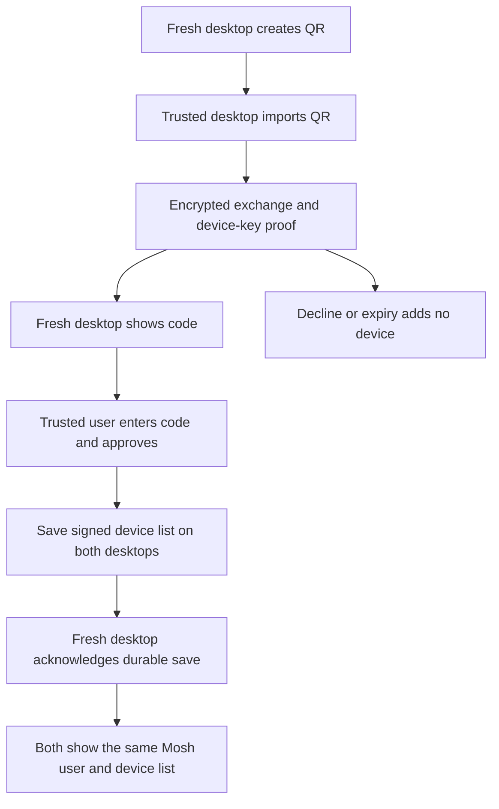

# Desktop device linking

Open Settings, Devices on both desktops. On the fresh desktop, enter its name
and choose Link this desktop to an existing user. On the trusted desktop,
import an image of that QR or paste its link. Read the 12-character code from
the fresh desktop and enter it on the trusted desktop to approve the device.
Both desktops must stay online until the trusted desktop shows Device linked.
The QR expires after five minutes. Keep it private.

The QR renderer uses whole pixel modules so a desktop screenshot stays
readable. The importer decodes its image off the UI thread and rejects files
over 10 MiB or images over 16 megapixels.

The existing desktop keeps its Moss peer-id, contacts, MLS state and history.
The linked desktop keeps its own signing key, Moss identity and connections.
The list restores after restart. An installation with existing conversations
cannot join another user; it can approve a fresh desktop instead.

Pairing is free and needs no wallet. This release only links identities.
Live DM sync, history transfer, catchup, revocation and Android delivery are
separate issues 24 through 28. A linked desktop does not yet display the old
desktop's conversations. The screen states this after successful linking.

## Failures and recovery

Wrong codes do not authorize a device. Expired, cancelled, substituted and
replayed requests cannot add another device. A whole replaced QR names a
different device; approve only a code read from the intended desktop.
An interrupted exchange reports a connection error. An unused QR needs to be
created again after restart. Once both desktops have exchanged their proof,
the new desktop restores that pending request until its five-minute expiry.
Once approval is saved, it cannot be cancelled
as though it never happened. The core retries the saved authorization until
the new desktop acknowledges its save. Revocation is a later feature.
If the new desktop never receives that approval before its request expires,
the trusted desktop keeps the approved entry and reports incomplete delivery.
It cannot silently undo a signed authorization.
Cancellation records that request until expiry, so losing its rejection packet
does not let the trusted desktop accept that QR again. Starting a conversation
on a desktop waiting to join cancels its pending request and keeps its own user.

The list is signed and sent only through an encrypted directed Moss stream.
It is never published through gossip. The local record uses the installation's
existing encrypted redb store. See [ADR 0029](../ADR/0029-private-desktop-device-linking.md)
for the exact authorization and verification rules.

## Tests

- `cargo test --manifest-path mosh-core/Cargo.toml --test device_link_flow`
  runs separate installations with real Moss, independent signing/transport
  keys and databases. It checks approval, refusal, QR mutation/replay, restart
  and an existing text DM with a third installation.
- `cargo test --manifest-path mosh-core/Cargo.toml --test device_link_identity`
  proves persistent identity and unchanged old history/transport records.
- `cargo test --manifest-path mosh-core/Cargo.toml device_link::protocol_tests`
  checks strict signed membership, authorized delegation, packet integrity,
  ciphertext confidentiality and expiry at the byte-decoding boundaries.
- `flutter test test/features/device_link/qr_image_test.dart` renders a real
  QR and decodes its image with the desktop importer.
- After `cargo build` and the real-process tests above,
  `flutter test native_test/device_link_test.dart` drives the actual Devices
  screen through the native bridge and a separate Moss process. No bridge or
  service doubles are used. CI runs this in its Windows native test lane.

New production code requires 80% line coverage; branch coverage is required
where the toolchain provides it. Windows/macOS installers need their own
hosts; Linux verifies the native bridge and protocol here.
