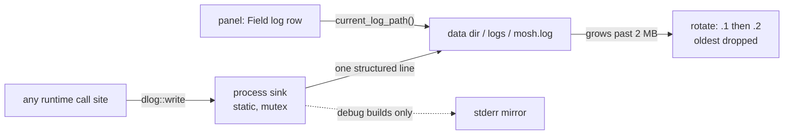

# Field log

Feature doc for the field log (spec #4): the one plain file the core
writes its operating events to, so a release Windows build — no console,
stderr lost — still leaves an answer to "what happened". Reference:
[Architecture](../Architecture.md).

## The flow



## The shape of a line

One event, one line, five fields:

```
2026-09-20T14:03:02Z warn verify session-1 dropping unverifiable typing hint
```

`timestamp level kind context message` — UTC ISO-8601 to the second,
lowercase level, a slug from the kind vocabulary, the conversation or
call-site id, and the message. Newlines inside messages are flattened:
one event stays one line, so the file is greppable.

## The kinds vocabulary

Call sites pick from `diagnostics_log::kinds` instead of inventing
spellings; one vocabulary keeps the file filterable. The slugs so far:

`rehydrate` `persist` `identity` `publish` `verify` `offer` `room`
`frame` `connect` `announce` `outbox` `handshake` `delivery` `resend`
`call` `commit` `kick` `resync` `voice` `stream` `test`

The `stream` kind carries the attachment chunk carrier (spec #8): the
room-wire fallback note and frames that arrive on the reserved inbox
channel but do not deframe.

## Rotation policy

- The live file is `<data dir>/logs/mosh.log`; a write that would push
  it past 2 MB rolls it: `mosh.log` → `mosh.log.1` → `mosh.log.2`, and
  the previous `.2` is dropped. Two rotated copies, freshest first.
- Renames run with the file closed, so rotation works on Windows where
  an open handle cannot be renamed.
- Call sites never decide path or rotation policy; the sink owns both.

## Failure contract

The log must never break the app. Every filesystem failure (a directory
that cannot be created, a file that cannot be opened, a write that
fails) is silently ignored and the next line retries; a poisoned lock is
recovered, not honored. Debug builds mirror each line to stderr, so a
developer run still sees the old console output.

## current_log_path

`dlog::current_log_path()` answers the live file's path once a write has
opened it — `None` before the first write or while the file could not be
created, so the app offers the file only when it exists. The panel's
Field log row shows it, so a bug report can be pointed at the exact
file.

## Proof

Unit tests in `mosh-core/src/diagnostics_log.rs` (the `diagnostics_log`
test filter):

- `writes_one_structured_line_per_event` — the five-field line shape,
  the empty-context case.
- `rotates_and_keeps_every_line_across_three_files` — nothing dropped
  until the second rotation, oldest lands in `.2`, the size cap holds.
- `reopens_and_appends_across_instances` and
  `a_full_file_rotates_on_reopen` — the sink is per-process state, and a
  full file rotates even across a restart.
- `never_panics_when_the_log_file_cannot_be_created` — the failure
  contract: an occupied file path reports no path and drops lines.
- `the_global_sink_reports_the_resolved_path` — `current_log_path`
  agrees with the resolved data dir.
- The panel path is pinned in `api/diagnostics.rs`
  (`moss_library_info_reports_the_loaded_library`): the first
  `moss_library_info` call files the library version under the
  `identity` kind with the `moss_library_info` context, so a bug report
  carries what was running.
