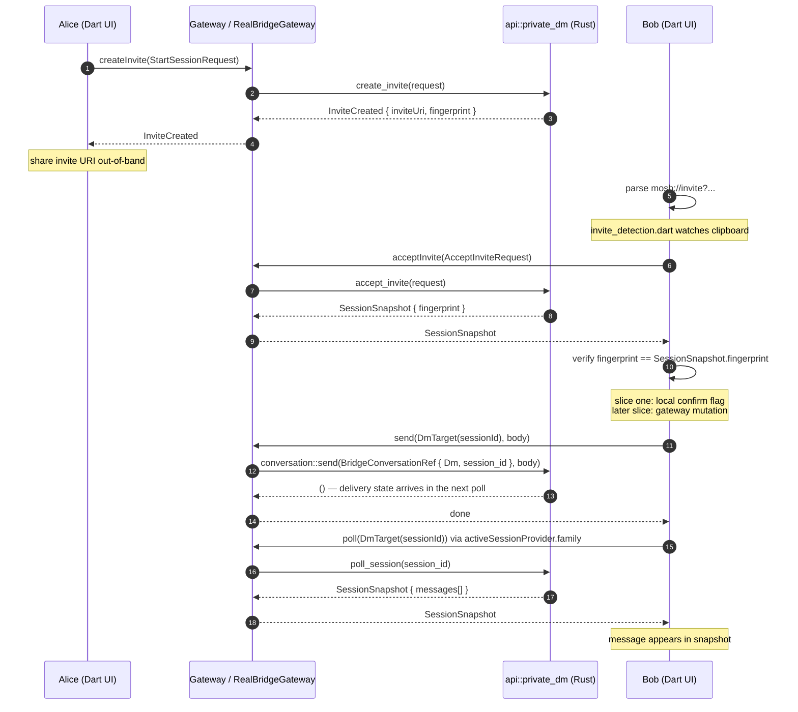
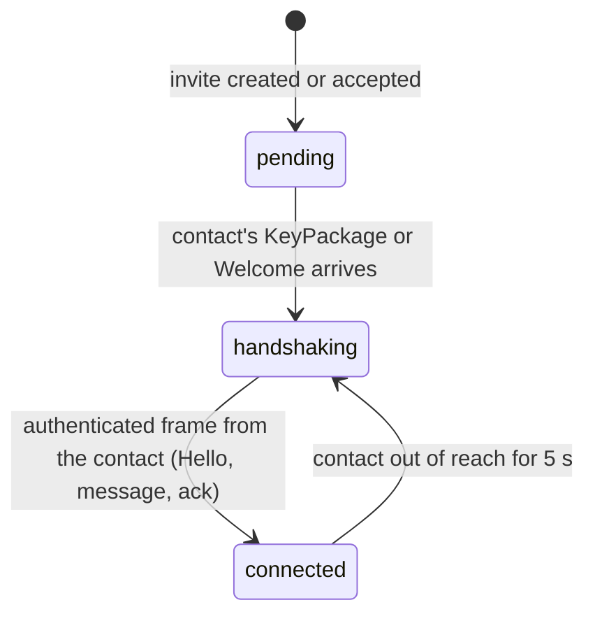
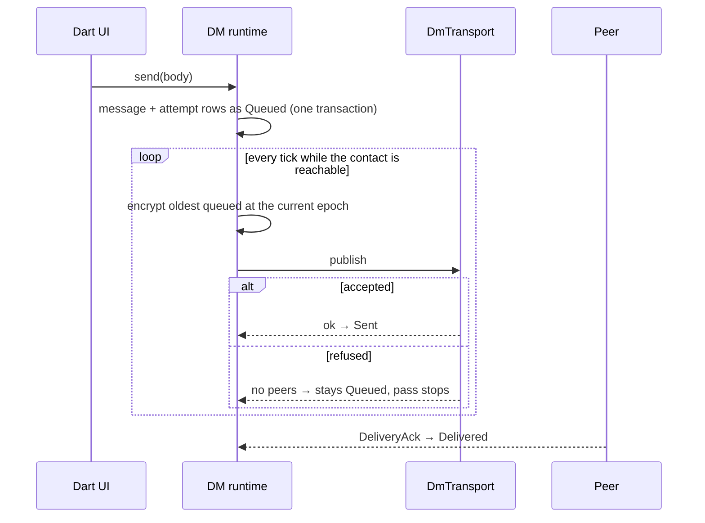

# Private DM (slice one)

Feature doc for the slice-one private-DM flow under the Flutter + Rust bridge.
Scope: invite create -> paste -> accept -> fingerprint confirm -> send ->
snapshot poll. Reference: [ADR 0013](../ADR/0013-fork-topology-and-temporary-fake-gateway.md),
[Architecture](../Architecture.md).

The flow runs through the `Gateway` seam. The app always runs
`RealBridgeGateway` (real `mosh_core` via `flutter_rust_bridge`); widget tests
override the provider with `ScriptableGateway` from `test/support/`. The
sequence below is the real path.

## Invite -> confirm -> send (Real path)

## What the chat header says

The snapshot carries a three-value state the runtime only moves on evidence
from the other side (ADR 0026). The header, the rail badge, the title-bar pill
and the diagnostics card all render it through `dm_state.dart`.

| state | header | rail badge |
|---|---|---|
| `pending` | Waiting for your contact | Waiting for your contact |
| `handshaking` | Contact is offline. Messages will be delivered when you are both online | Contact is offline |
| `connected` | Connected · direct / relayed by the network | Connected |

## A text on its way out

A DM text is filed as `Queued` before the transport is asked anything, so it
survives a restart. The runtime's tick sends queued texts oldest first while
the contact is reachable; a refusal leaves the text queued. The row shows a
clock while queued, one tick once the transport took it, two once the contact
acknowledged it. Only an attachment can fail and offer Retry.

## Slice-one boundaries

- Poll-based, no streams. `api::private_dm` exposes no `StreamSink` in slice
  one (the React frontend polled on `AUTO_POLL_MS`); the Dart DM screen
  re-polls via `activeSessionProvider.family`.
- Fingerprint confirm is a UI-side gate in slice one: the Dart orchestration
  blocks `Gateway.send` until the user confirms the safety number. Later
  slices move the confirmation to a gateway mutation.
- `mosh://invite?...#fp=...` is parsed by ported `invite_uri.dart`; manual
  paste only, no OS deep-link association (ADR 0015).
- Sessions list and per-session snapshot come from the DM entry of
  `conversationListProvider` and `activeSessionProvider.family`; both consume
  `gatewayProvider`, never a concrete `Gateway` (ADR 0013).

## Proof

The Real path is proven end-to-end by
`integration_test/slice_one_test.dart` against a real `mosh_core.dll`:
`appDiagnostics`, `nativeRuntimeStatus`, `listSessions`, and `createInvite`
all run through `RealBridgeGateway`. See ADR 0013 Final Status.
