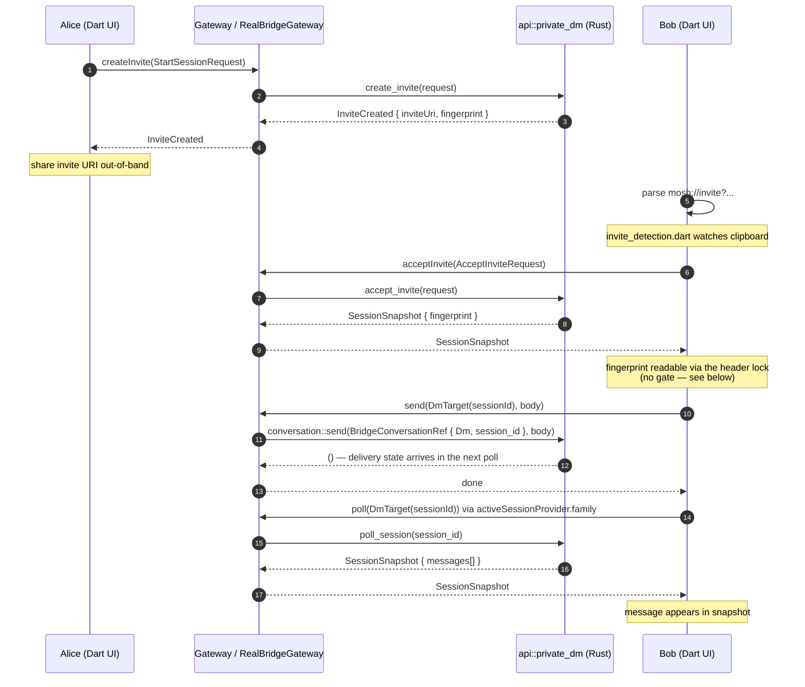
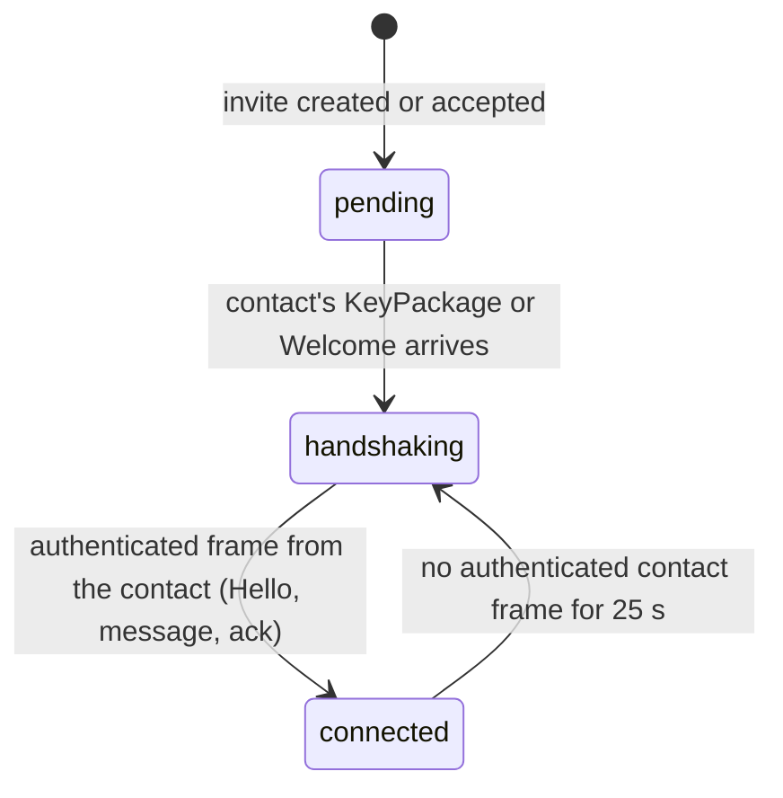
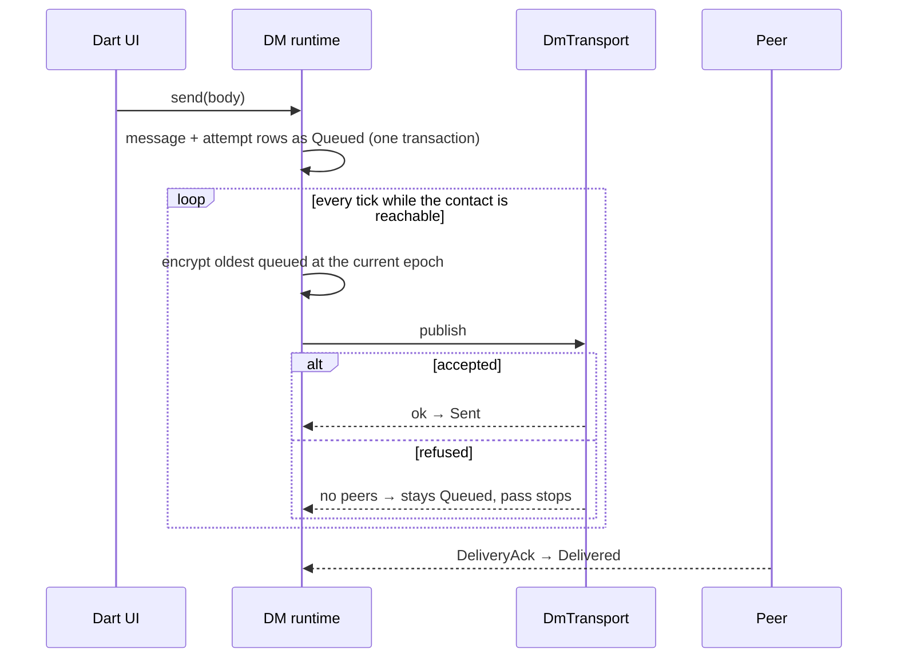
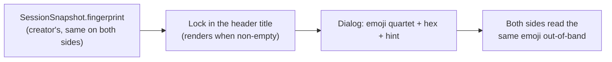
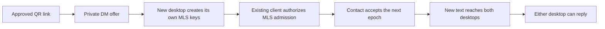

# Private DM (slice one)

Feature doc for the slice-one private-DM flow under the Flutter + Rust bridge.
Scope: invite create -> paste -> accept -> send ->
snapshot poll. Reference: [ADR 0013](../ADR/0013-fork-topology-and-temporary-fake-gateway.md),
[Architecture](../Architecture.md).

The flow runs through the `Gateway` seam. The app always runs
`RealBridgeGateway` (real `mosh_core` via `flutter_rust_bridge`); widget tests
override the provider with `ScriptableGateway` from `test/support/`. The
sequence below is the real path.

## Invite -> send (Real path)

```mermaid
sequenceDiagram
    autonumber
    participant Alice as Alice (Dart UI)
    participant GW as Gateway / RealBridgeGateway
    participant Api as api::private_dm (Rust)
    participant Bob as Bob (Dart UI)

    Alice->>GW: createInvite(StartSessionRequest)
    GW->>Api: create_invite(request)
    Api-->>GW: InviteCreated { inviteUri, fingerprint }
    GW-->>Alice: InviteCreated
    Note over Alice: share invite URI out-of-band
    Bob->>Bob: parse mosh://invite?...#fp= via invite_uri.dart
    Note over Bob: invite_detection.dart watches clipboard
    Bob->>GW: acceptInvite(AcceptInviteRequest)
    GW->>Api: accept_invite(request)
    Api-->>GW: SessionSnapshot { fingerprint }
    GW-->>Bob: SessionSnapshot
    Note over Bob: fingerprint readable via the header lock<br/>(no gate — see below)
    Bob->>GW: send(DmTarget(sessionId), body)
    GW->>Api: conversation::send(BridgeConversationRef { Dm, session_id }, body)
    Api-->>GW: () — delivery state arrives in the next poll
    GW-->>Bob: done
    Bob->>GW: poll(DmTarget(sessionId)) via activeSessionProvider.family
    GW->>Api: poll_session(session_id)
    Api-->>GW: SessionSnapshot { messages[] }
    GW-->>Bob: SessionSnapshot
    Note over Bob: message appears in snapshot
```

## What the chat header says

The snapshot carries a three-value state the runtime only moves on evidence
from the other side (ADR 0026). The header, the rail badge, the title-bar pill
and the diagnostics card all render it through `dm_state.dart`.

```mermaid
stateDiagram-v2
    [*] --> pending: invite created or accepted
    pending --> handshaking: contact's KeyPackage or Welcome arrives
    handshaking --> connected: authenticated frame from the contact (Hello, message, ack)
    connected --> handshaking: no authenticated contact frame for 25 s
```

| state | header | rail badge |
|---|---|---|
| `pending` | Waiting for your contact | Waiting for your contact |
| `handshaking` | Contact is offline. Messages will be delivered when you are both online | Contact is offline |
| `connected` | Connected · direct / relayed by the network | Connected |

## A text on its way out

A DM text is filed as `Queued` before the transport is asked anything, so it
survives a restart. The runtime's tick sends queued texts oldest first while
the contact is reachable; a refusal leaves the text queued. The row shows a
clock while queued, one tick once the transport took it, two once the contact
acknowledged it. Only an attachment can fail and offer Retry.

```mermaid
sequenceDiagram
    participant UI as Dart UI
    participant RT as DM runtime
    participant T as DmTransport
    participant Peer
    UI->>RT: send(body)
    RT->>RT: message + attempt rows as Queued (one transaction)
    loop every tick while the contact is reachable
        RT->>RT: encrypt oldest queued at the current epoch
        RT->>T: publish
        alt accepted
            T-->>RT: ok → Sent
        else refused
            T-->>RT: no peers → stays Queued, pass stops
        end
    end
    Peer-->>RT: DeliveryAck → Delivered
```

## The fingerprint lock

The DM fingerprint is the **creator's** fingerprint: Alice's runtime
derives it from her key (`create_invite`), the invite carries it, and
Bob's session stores the invite's value — so both sides read the same
string. Because both sides see the same value, there is nothing to
"confirm": a local confirm flag would gate nothing and lie about
having verified anything. The old confirm pill, its dead full-screen
confirm page and the confirmed/unverified subtitle are gone.

What remains is Telegram-style and read-only:

- a small **lock** next to the peer name in the chat header (hover:
  "End-to-end encrypted"), and
- tapping it opens one shared **dialog**: the 4-emoji fingerprint
  (Telegram's 333-emoji pool, deterministic from the fingerprint
  string — `fingerprint_emoji.dart`), the hex string, and a hint to
  compare the emoji over a call or in person. Groups show the same
  dialog fed `creator_fingerprint`, with a "compare with the creator"
  hint; channels stay as they are (open groups, no shared value).

```mermaid
flowchart LR
    Snap["SessionSnapshot.fingerprint<br/>(creator's, same on both sides)"]
    Lock["Lock in the header title<br/>(renders when non-empty)"]
    Dialog["Dialog: emoji quartet + hex + hint"]
    Compare["Both sides read the<br/>same emoji out-of-band"]
    Snap --> Lock --> Dialog --> Compare
```

A swapped invite shows up here: the two sides' emoji differ, and no
local state ever marked anything "verified".

## Slice-one boundaries

- Poll-based, no streams. `api::private_dm` exposes no `StreamSink` in slice
  one (the React frontend polled on `AUTO_POLL_MS`); the Dart DM screen
  re-polls via `activeSessionProvider.family`.
- The fingerprint surface is read-only (the lock + dialog above); the
  runtime has no confirm-fingerprint call, and the UI keeps no
  confirmed-fingerprint state.
- `mosh://invite?...#fp=...` is parsed by ported `invite_uri.dart`; manual
  paste only, no OS deep-link association (ADR 0015).
- Sessions list and per-session snapshot come from the DM entry of
  `conversationListProvider` and `activeSessionProvider.family`; both consume
  `gatewayProvider`, never a concrete `Gateway` (ADR 0013).

## Linked desktops

After QR linking, the existing desktop privately offers its DM to the approved
desktop. The new desktop creates its own MLS keys. An existing authorized
client adds it to the same MLS group. The contact accepts that admission,
then both desktops receive new text in the same conversation. The invite,
contact name and fingerprint stay the same.

```mermaid
flowchart LR
    Pair[Approved QR link] --> Offer[Private DM offer]
    Offer --> Keys[New desktop creates its own MLS keys]
    Keys --> Add[Existing client authorizes MLS admission]
    Add --> Contact[Contact accepts the next epoch]
    Contact --> Text[New text reaches both desktops]
    Text --> Reply[Either desktop can reply]
```

Texts sent on one desktop also appear on its linked desktop, with the same
message id and author. Each installation stores its own MLS state and keeps
working after restart. The linked desktop can exchange text with the contact
while the original is off. A receipt from a sibling stops retries to that
device. Only a receipt from the contact marks the text delivered.

After admission, the linked desktop automatically imports available text
history from the authorizing desktop. Original message ids, authors and send
times stay intact. Each installation encrypts its own imported history with
its local storage key. Interrupted transfers resume after reconnect or restart;
repeated batches and concurrent live text appear once. A waiting notice asks
the user to bring the source online, and an importing notice disappears only
after durable completion. See [ADR 0031](../ADR/0031-linked-desktop-dm-history.md)
for the semantic record format, authorization and replay protocol.

When an admitted desktop returns after being offline, it automatically
recovers missing text from an available participant, including the contact
while its original desktop is off. Missed admission epochs are applied in
order to that desktop's own MLS state before recovery completes. Receipts
settle delivery attempts without erasing text or epoch evidence needed by an
offline installation. A replacement source resumes through a new manifest;
retries, restart and concurrent live text preserve one copy of each message.
If every holder is unavailable, the conversation waits and resumes when one
returns. See [ADR 0032](../ADR/0032-dm-offline-recovery.md).

Retained epoch evidence includes the original author's signed admission time.
Recovery can apply a package that has since expired if it was valid at that
time. Signature, group, epoch and maximum lifetime checks still apply. Normal
admission uses the current clock. Older evidence with no authenticated time
cannot establish historical validity after expiry.

Revocation is issue 27. Joining requires the new installation and an existing
client of the other user to durably accept the new epoch. Device
association is visible to the participants. Network traffic anonymity is not
part of this feature. See [ADR 0030](../ADR/0030-linked-desktop-dm-clients.md)
for authorization, persistence and test details.

The real-process tests in `mosh-core/tests/multi_device_dm_flow.rs` use three
independent installations with real Moss, OpenMLS and encrypted stores. They
prove admission, sender-device sync, simultaneous sends, the original being
off, restart and default discovery through public bridge calls. The companion
`mosh-core/tests/dm_controls/` flow checks real contact typing and read receipts,
then proves sibling activity cannot make an offline contact appear online.
The `mosh-core/tests/dm_history/` flows prove pre-link semantic history,
interruption, live text during import, restart and large UTF-8 text transfer.
The `mosh-core/tests/dm_recovery/` flows prove offline recovery, source switching,
unavailable holders and ordered missed epochs with real independent clients.
Run
`cargo test --manifest-path mosh-core/Cargo.toml --test multi_device_dm_flow`.

## Single-device proof

The Real path is proven end-to-end by
`integration_test/slice_one_test.dart` against a real `mosh_core.dll`:
`appDiagnostics`, `nativeRuntimeStatus`, `listSessions`, and `createInvite`
all run through `RealBridgeGateway`. See ADR 0013 Final Status.
